# VPR Osnabrück — Visual Place Recognition auf Mapillary-Bildern

[Schnellstart](#schnellstart) ·
[Ergebnisse](#ergebnisse) ·
[Pipeline](#pipeline) ·
[Daten](#daten) ·
[Reproduzierbarkeit](#reproduzierbarkeit) ·
[Befehle](#befehlsreferenz) ·
[`experiments/`](experiments/README.md) ·
[Lizenz](#lizenz)

[](https://github.com/nbomers/VisualPlaceRecognition/actions/workflows/check.yml)
[](#voraussetzungen)
[](#voraussetzungen)
[](#konzeptioneller-aufbau)
[](LICENSE)
[](NOTICE.md)

[](#ergebnisse)
[](#recall-benchmark-protokoll)
[](#sechs-städte)
[](#daten)
[](#daten)
[](#konzeptioneller-aufbau)
[](#fremd-repositories-und-gewichte)

Projekt im Rahmen des Programmierpraktikums an der **Universität Osnabrück**.

Ein Foto rein, ein Ort raus: das System vergleicht das Anfragebild mit
48.321 Referenzbildern aus Osnabrück und gibt die Koordinate des ähnlichsten
zurück. Der Eigenanteil ist nicht das Modell — die Encoder kommen fertig
vortrainiert — sondern der **Benchmark**: ein sequenzbasierter Split ohne
Leakage, vier Ground-Truth-Definitionen, eine Zufallsbasis, Fingerabdrücke
gegen vertauschte Artefakte, Konfidenzintervalle über Fahrten statt über
Bilder, und 39 vergleichbare Zeilen über fünf Encoder und ihre Varianten.

**Eingabe:** ein Straßenfoto aus dem Stadtgebiet
**Ausgabe:** geschätzte Koordinate, eine Konfidenz, und die ähnlichsten
Referenzbilder — `python locate.py foto.jpg`

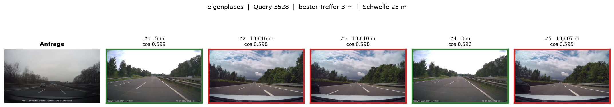

<sub>Links die Anfrage, rechts die fünf ähnlichsten Referenzbilder; grün =
innerhalb 25 m. Bilder von [Mapillary](https://www.mapillary.com), CC BY-SA 4.0,
Urheber je Bild in [QUELLEN.md](results/osnabrueck/figures/demo/QUELLEN.md).</sub>

---

## Inhaltsverzeichnis

- [Schnellstart](#schnellstart)
- [Ergebnisse auf einen Blick](#ergebnisse-auf-einen-blick)
- [Über das Projekt](#über-das-projekt)
- [Ziel](#ziel)
- [Pipeline](#pipeline)
- [Konzeptioneller Aufbau](#konzeptioneller-aufbau)
- [Daten](#daten)
- [Projektstruktur](#projektstruktur)
- [Voraussetzungen](#voraussetzungen)
- [Installation](#installation)
- [Fremd-Repositories und Gewichte](#fremd-repositories-und-gewichte)
- [Konfiguration](#konfiguration)
- [Nutzung](#nutzung)
- [Reproduzierbarkeit](#reproduzierbarkeit)
- [Ergebnisse](#ergebnisse)
  - [Recall, volle Referenz](#recall-volle-referenz) ·
    [Benchmark-Protokoll](#recall-benchmark-protokoll) ·
    [Unsicherheit](#unsicherheit) ·
    [Sechs Städte](#sechs-städte)
  - [Lokalisierung](#lokalisierung) ·
    [Referenzdichte](#referenzdichte) ·
    [Stadtteile](#stadtteile) ·
    [Ablehnung](#ablehnung) ·
    [Schwierigkeit je Anfrage](#schwierigkeit-je-anfrage) ·
    [Struktur der Fehler](#struktur-der-fehler)
  - [Die Fahrt als Pfad](#die-fahrt-als-pfad) ·
    [Geometrische Verifikation](#geometrische-verifikation) ·
    [Laufzeit und Speicher](#laufzeit-und-speicher) ·
    [Abbildungen](#abbildungen)
- [Mögliche Erweiterungen](#mögliche-erweiterungen)
- [Befehlsreferenz](#befehlsreferenz)
- [Team](#team)
- [Credits](#credits)
- [Lizenz](#lizenz)

---

## Schnellstart

Von null bis zur Vergleichstabelle. Voraussetzung: conda, ein
Mapillary-Token, rund 60 GB Platz für Bilder und 25 GB je vollständigem
Encoder-Satz. Erst die Umgebung:

```bash
git clone https://github.com/nbomers/VisualPlaceRecognition.git && cd VisualPlaceRecognition
conda env create -f environment.yml && conda activate vpr
nbstripout --install --attributes .gitattributes
cp .env.example .env
```

Dann in `.env` den `MAPILLARY_TOKEN` eintragen und rechnen: Fremd-Repos und
Gewichte holen, 02 bis 08 mit dem Encoder aus `config.yaml`, zuletzt die
Tabelle mit Konfidenzintervallen.

```bash
python setup_external.py
python run.py
python compare.py --ci
```

Die Blöcke enthalten bewusst keine Kommentare: zsh, die Standard-Shell auf
macOS, reicht ein `# …` in eingefügten Zeilen als Argument an den Befehl
weiter, statt es zu ignorieren. Jeder Block lässt sich über das Kopiersymbol
oben rechts vollständig übernehmen.

`run.py` überspringt jede Stufe, deren Ergebnis schon vorliegt und zur
`config.yaml` passt. Die Metadaten und der Split liegen im Git, 01 läuft
deshalb nicht mit. Beim ersten Lauf dauert 03 (Bilddownload, 332.868
Bilder) Stunden, 04 (Encodieren) je nach Encoder und Rechner zwischen einer
halben Stunde und einer Nacht. Alles danach sind Minuten.

Wer nur die Ergebnisse sehen will, braucht nichts davon: die JSONs unter
`results/` liegen im Git, und `python compare.py` liest sie direkt. `pytest
tests/` prüft in weniger als einer Minute, dass Auswertung, Split und
Ergebnisse zueinander passen.

## Ergebnisse auf einen Blick

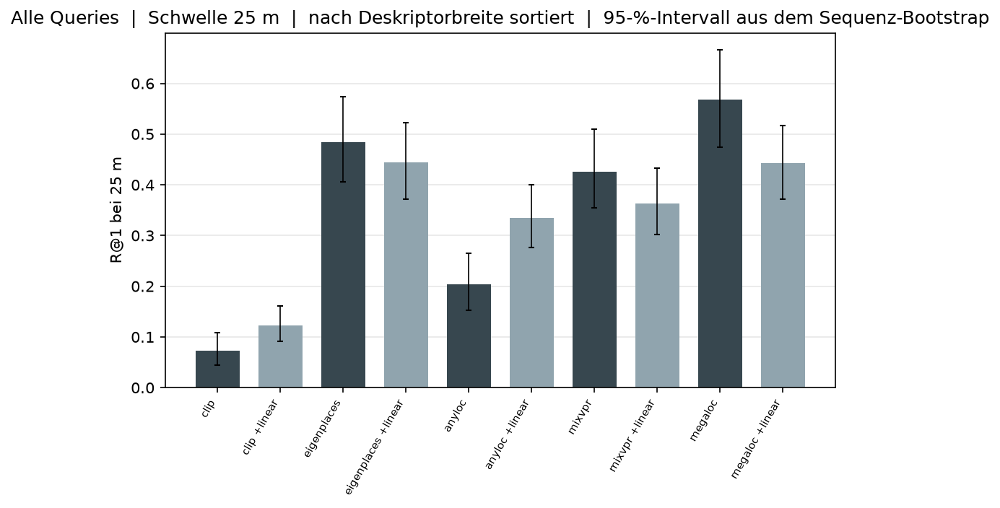

<p align="center">
  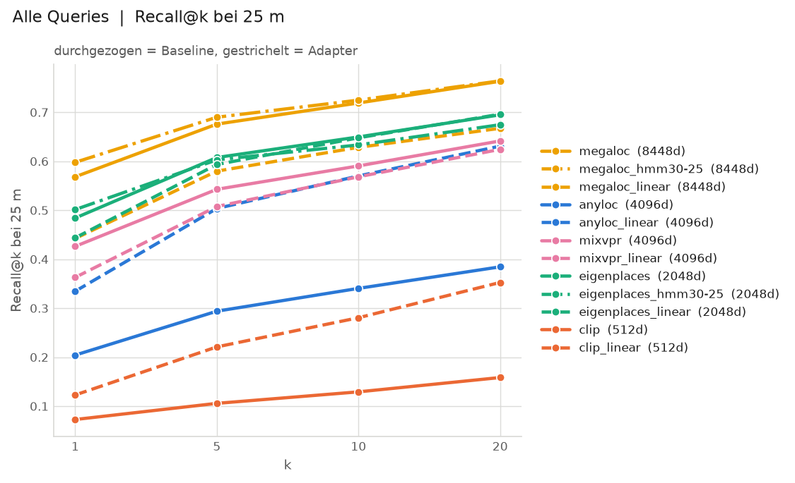
  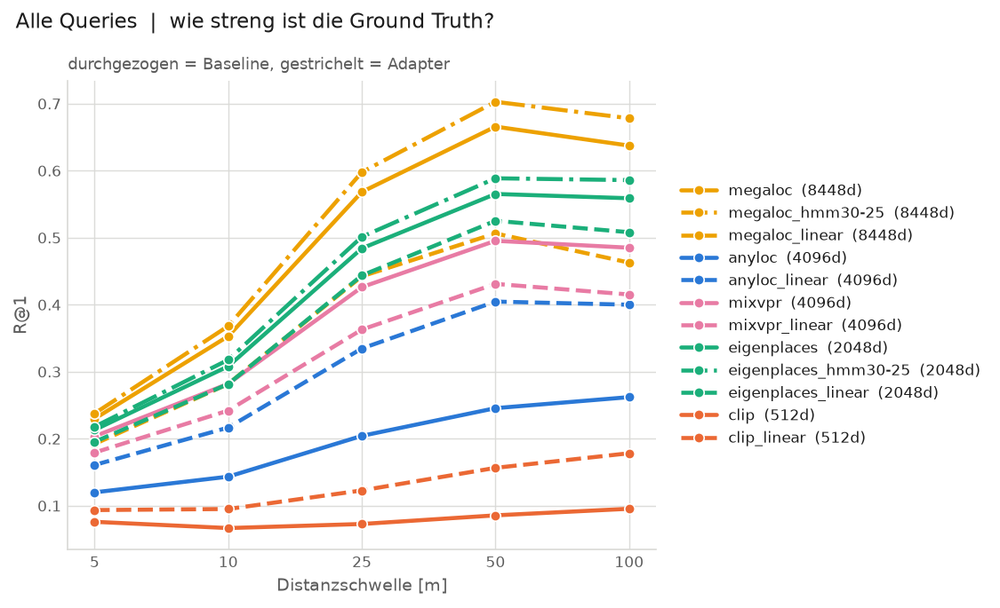
</p>

Zwei Protokolle, dieselben 53.414 Anfragen aus **Osnabrück** (fünf weitere
Städte weiter unten). **Volle Referenz**: alle
279.453 Bilder außerhalb der Anfragen als Datenbank — das, was ein System
mit dem ganzen Material leistet. **Benchmark**: nur 15 % der Sequenzen als
Datenbank — das strengere Protokoll, auf dem alle 39 Zeilen inklusive
Adapter und Varianten verglichen werden. R@1 bei 25 m über die lösbaren
Anfragen (90,2 % bzw. 63,9 %); klein dahinter das 95-%-Intervall aus 1.000
Ziehungen der 198 Query-Fahrten, fett der Bestwert je Spalte. Raten trifft
0,05 %.

| | Encoder | Dim | R@1 · volle Referenz | R@1 · Benchmark |
|---|---|---:|---:|---:|
| **Bester Encoder** | MegaLoc | 8448 | **0.798** <sub>[0.739, 0.848]</sub> | 0.568 <sub>[0.475, 0.666]</sub> |
| **Bei 1/16 der Breite** | MegaLoc, PCA-Whitening auf 512 | 512 | 0.778 <sub>[0.716, 0.831]</sub> | 0.541 <sub>[0.451, 0.636]</sub> |
| **Verkettung** | EigenPlaces + MegaLoc, gewhitent | 1024 | 0.778 <sub>[0.714, 0.832]</sub> | **0.572** <sub>[0.482, 0.666]</sub> |
| **Bester Recall je Byte Index** | EigenPlaces, PCA-Whitening auf 512 | 512 | 0.715 <sub>[0.646, 0.777]</sub> | 0.507 <sub>[0.426, 0.595]</sub> |
| **Schwächster** | CLIP ViT-B/32 (nicht für VPR trainiert) | 512 | 0.232 <sub>[0.144, 0.349]</sub> | 0.073 <sub>[0.044, 0.108]</sub> |

> [!NOTE]
> **Wie genau diese Zahlen sind.** Die Intervalle sind breit, weil die
> Stichprobe aus 198 Fahrten besteht, nicht aus 53.414 Bildern — sieben
> Fahrten stellen 19 % aller Anfragen. Absolute Zahlen sind deshalb nur auf
> eine Nachkommastelle belastbar. **Unterschiede zwischen zwei Zeilen** sind
> es dagegen auf drei: sie werden gepaart über dieselben Fahrten gemessen,
> und dort fällt heraus, was für alle Encoder gleich schwer ist. Die
> Verkettung liegt deshalb nicht „vor" MegaLoc: +0.004 [−0.005, +0.014].

Acht Befunde, jeder gemessen, sechs davon mit Intervall belegt:

1. **Der Encoder ist der größte Hebel.** CLIP → MegaLoc ist Faktor 7,8,
   +0.496 [+0.405, +0.590]. Jedes Nachbarpaar der Rangfolge clip < anyloc <
   mixvpr < eigenplaces < megaloc schließt 0 aus, auf voller Breite wie auf
   512 gewhitent.
2. **Die Referenz ist der zweitgrößte.** 36 % der Anfragen haben in der
   15-%-Datenbank kein Bild im Umkreis von 25 m. Mit allen 279.453
   Referenzbildern steigt MegaLoc von 0.568 auf 0.798 und EigenPlaces von
   0.484 auf 0.701 — ohne dass sich am Modell ein Bit ändert. Je Anfrage
   zerlegt ([Schwierigkeit je Anfrage](#schwierigkeit-je-anfrage)): was
   zählt, ist **ein Nachbar, der in dieselbe Richtung schaut** (0.653 gegen
   0.071 ohne). Zeitabstand und Nachbarzahl wirken schwächer und nicht
   monoton — über ein Jahr 0.473, 8–30 Tage 0.819, aber 0–7 Tage nur 0.575;
   erst ab 51 Nachbarn klar mehr (0.781). Auf Stadtteil-Ebene ist mit
   „Bilder je km²" nichts davon sichtbar (ρ = 0.27) — die Referenz muss an
   der Straße der Anfrage stehen, nicht im Stadtteil.
3. **Ein trainierter linearer Adapter fügt nichts hinzu, was ein festes
   Whitening nicht schon liefert.** Ohne Whitening hilft er CLIP (+0.050)
   und AnyLoc (+0.130); nach Whitening schließen beide Gewinne 0 ein
   (+0.009 [−0.002, +0.021], −0.029 [−0.074, +0.012]). Den VPR-trainierten
   Encodern schadet er in allen zwölf Paaren sicher (−0.037 bis −0.127).
   Einzige Einschränkung: auf `anyloc_pcaw512` bleibt +0.045 [+0.009,
   +0.088] — 512 gewhitente Komponenten holen aus VLAD weniger heraus als
   4096.
4. **Die Rangfolge hängt nicht an der Deskriptorbreite.** Auf 512
   Dimensionen bleibt sie identisch; MegaLoc verliert von 8448 auf 512 per
   PCA 0.023 [0.017, 0.031], mit Whitening 0.028 [0.020, 0.038]. Der
   Adapterschaden bei MegaLoc ist auf 8448 und 512 gleich groß (−0.126 /
   −0.127) — die Intervalle decken sich, ein Beweis für Gleichheit ist das
   nicht.
5. **Nachbearbeitung holt wenig, und was sie holt, zahlt sie anderswo.**
   Schwerpunkt, Clustering, zwei Hybride, Sequenz-Aggregation über
   Nachbarframes (−0.009 [−0.017, −0.001]) und semantisches Re-Ranking mit
   Mapillary-Detections — alle gemessen, alle schlechter oder gleich. Auch
   die Verkettung schlägt MegaLoc nicht: +0.004 [−0.005, +0.014]. Die
   einzige Ausnahme ist das **Sequenz-HMM**, das die Fahrt als Pfad liest
   statt als Folge von Einzelentscheidungen: R@1 steigt bei MegaLoc von
   0.568 auf 0.598 (+0.030 [+0.020, +0.041]) und bei EigenPlaces von 0.484
   auf 0.501 (+0.017 [+0.006, +0.030]) — beides gepaart belegt. Umsonst ist
   das nicht — bei EigenPlaces fällt R@10 dabei von 0.650 auf 0.633, weil ein
   Re-Ranking die Liste nur umsortiert: was nach oben rutscht, verdrängt
   anderes. Details unter [Die Fahrt als Pfad](#die-fahrt-als-pfad). Der
   zweite Kandidat, die [geometrische Verifikation](#geometrische-verifikation),
   ist gebaut; ihre Läufe über alle Anfragen stehen noch aus.
6. **Fehler sind bimodal.** Unter den 14.726 Fehlgriffen von MegaLoc liegen
   45 % unter 100 m (dieselbe Straße, knapp jenseits der Schwelle) und
   44 % über 1 km (ein anderes Viertel); nur 11 % dazwischen. Ein Median
   beschreibt das schlecht. Die groben Verwechslungen sitzen in
   Wohnstraßen, nicht auf der Autobahn ([Struktur der Fehler](#struktur-der-fehler)).
7. **Die Ähnlichkeit des besten Treffers ist eine brauchbare Konfidenz.**
   Darf MegaLoc die unsichersten 20 % der Anfragen ablehnen, steigt die
   Präzision von 0.568 auf 0.689; bei cos ≥ 0.30 sind 82 % der Antworten
   richtig. Marge und Geschlossenheit der Treffer taugen weniger
   ([Ablehnung](#ablehnung)).
8. **Eine Zahl aus einer Stadt ist keine Zahl über das Verfahren.**
   Dieselbe Pipeline über sechs Städte: R@1 spannt 0.336 bis 0.651, die
   gepaarte Encoder-Differenz nur +0.072 bis +0.132. Und die Ground Truth
   selbst wandert mit dem Datensatz — der „Hard"-Filter kostet zwischen
   0.010 und 0.204 R@1, je nachdem, wie stark ein System Beinahe-Dubletten
   über das hinaus nutzt, was der Datensatz erzwingt. Die Zerlegung dieses
   Abschlags ist der einzige Zusammenhang im Städtevergleich, der über alle
   sechs exakt aufgeht ([Sechs Städte](#sechs-städte)).

## Über das Projekt

**Problemstellung.** Visual Place Recognition (VPR): einem Bild ohne
Metadaten den Ort zuordnen, an dem es entstand — indem man es mit einer
Datenbank verorteter Referenzbilder vergleicht. Die Forschung misst das auf
Standarddatensätzen wie Pittsburgh-30k oder MSLS. Die Frage hier: **wie gut
funktionieren die veröffentlichten Verfahren auf einer Stadt, die keiner
von ihnen je gesehen hat, mit Bildern, die niemand für sie kuratiert hat?**

**Motivation.** Drei Dinge wollten wir wissen: wie nah kommt man mit
Open-Source-Encodern an die Zahlen aus den Papern; welche Faktoren
begrenzen ein VPR-System in der Praxis — Modell, Daten, Deskriptor,
Nachbearbeitung; und wie baut man einen Vergleich so, dass die Zahlen etwas
bedeuten. Die dritte Frage wurde die wichtigste.

**Abgrenzung.** Kein Encoder wird trainiert. Alle fünf — CLIP, AnyLoc,
MixVPR, EigenPlaces, MegaLoc — kommen mit den Gewichten ihrer Autoren. Was
trainiert wird, ist ein linearer Adapter obendrauf, und der wird als
Vergleichszeile geführt, nicht als Beitrag. Osnabrück ist die Hauptstadt des
Projekts — alle Varianten, Adapter und Nebenuntersuchungen laufen dort;
fünf weitere Städte (Fürth, Karlsruhe, Kaiserslautern, Würzburg, Jena)
dienen der Frage, was sich überträgt, und sind nur mit den Baselines
gerechnet. Das System ist ein Benchmark und eine Demo, kein Produkt.

## Ziel

Am Ende sollte ein Vergleichsprotokoll stehen, das dieselbe Frage an fünf
Encoder und ihre Varianten stellt und Antworten liefert, die man
gegeneinander halten kann — und daraus eine Antwort auf „woran scheitert
Open-Source-VPR auf einer fremden Stadt".

**Erfolgskriterien**, so wie sie sich am Ende eingelöst haben — alle sechs
erfüllt:

- **Reproduzierbarer Split ohne Leakage** zwischen train, database und
  query. Sequenzen sind die Split-Einheit, Split-Listen und Metadaten liegen
  im Git, ein Test rechnet den Split aus dem Seed nach.
- **Jede Zeile der Tabelle unter identischen Bedingungen.** Fingerabdrücke
  prüfen jedes Artefakt gegen die config, ein zweiter Rechenweg reproduziert
  jede 07-Zahl.
- **Recall gegen mehrere Ground-Truth-Definitionen**, nicht nur eine:
  Standard, Hard (anderer Fotograf oder > 180 Tage), Blickrichtung, dazu
  eine Zufallsbasis.
- **Unterschiede statistisch belegt** — Sequenz-Bootstrap mit gepaarten
  Differenzen für 38 Vergleiche.
- **Ergebnisse erklären, nicht nur berichten** — Dichtekurve,
  Whitening-Vergleich, Fehlerstruktur, Stadtteilkarte, Verwechslungsatlas,
  sechs Negativergebnisse.
- **Ein System, das man vorführen kann** — [`locate.py`](locate.py) und
  [`demo/demo.ipynb`](demo/demo.ipynb): ein eigenes Foto durch jeden Encoder
  inklusive PCA-, Whitening- und Verkettungsvarianten, mit Konfidenz und
  Karte.

## Pipeline

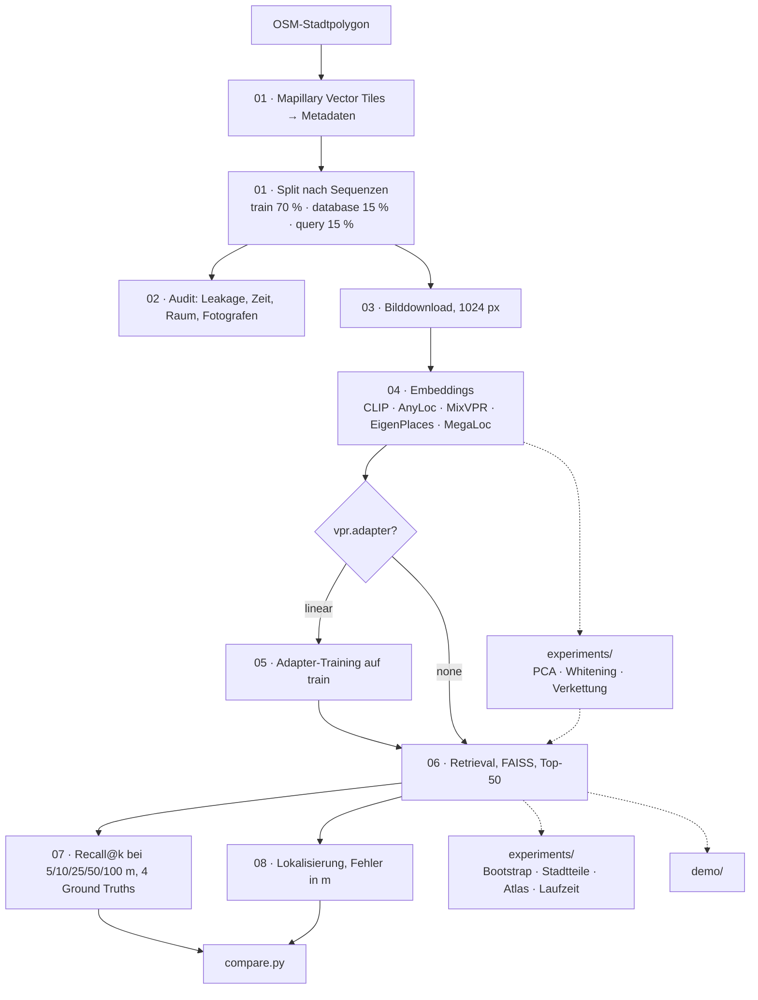
```mermaid
flowchart TD
    A[OSM-Stadtpolygon] --> B[01 · Mapillary Vector Tiles → Metadaten]
    B --> C[01 · Split nach Sequenzen<br/>train 70 % · database 15 % · query 15 %]
    C --> D[02 · Audit: Leakage, Zeit, Raum, Fotografen]
    C --> E[03 · Bilddownload, 1024 px]
    E --> F[04 · Embeddings<br/>CLIP · AnyLoc · MixVPR · EigenPlaces · MegaLoc]
    F --> G{vpr.adapter?}
    G -- linear --> H[05 · Adapter-Training auf train]
    H --> I
    G -- none --> I[06 · Retrieval, FAISS, Top-50]
    F -.-> X[experiments/<br/>PCA · Whitening · Verkettung]
    X -.-> I
    I --> J[07 · Recall@k bei 5/10/25/50/100 m, 4 Ground Truths]
    I --> K[08 · Lokalisierung, Fehler in m]
    J --> L[compare.py]
    K --> L
    I -.-> M[experiments/<br/>Bootstrap · Stadtteile · Atlas · Laufzeit]
    I -.-> N[demo/]
```

01 und 03 laufen einmal je Stadt; ihre Ergebnisse (Metadaten, Split,
Bilder) sind die Grundlage für alles Weitere. 04 bis 08 laufen je Encoder
und Variante.

Der Split in Schritt 01 läuft über **Sequenzen**, nicht über Bilder: eine
Fahrt landet vollständig in einem Topf. Würfelte man je Bild, stünde zu
fast jedem Query-Bild ein train-Bild vom selben Meter — aus derselben
Fahrt, Sekundenbruchteile später. Der Recall maße dann das Wiederfinden
desselben Fotos, nicht das Wiedererkennen eines Ortes.

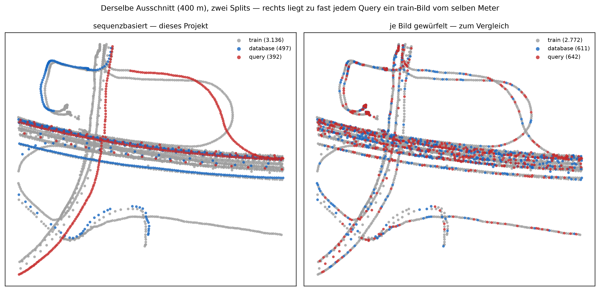

<sub>Derselbe 400-m-Ausschnitt, zwei Splits. Links liegt jede Fahrt
vollständig in einem Topf; rechts, je Bild gewürfelt, steht zu fast jedem
Query-Bild ein train-Bild vom selben Meter. Auf der ganzen Stadt sehen beide
gleich aus — sichtbar wird der Unterschied erst im Ausschnitt.</sub>

## Konzeptioneller Aufbau

Vier Schichten, jede mit einer klaren Zuständigkeit:

**[`config.yaml`](config.yaml)** ist der einzige Schalter. Stadt, Split, Encoder, Radien,
Adapter-Training, Lokalisierung — alles steht dort, versioniert. Wer einen
Wert ändert, ändert den Fingerabdruck der betroffenen Artefakte, und die
Pipeline rechnet genau diese neu.

**[`src/`](src/)** ist der Code, der von allem geteilt wird:

| Modul | Zuständigkeit |
|---|---|
| [`config.py`](src/config.py) | Projektwurzel finden, config lesen, `VPR_METHOD`/`VPR_ADAPTER` aus der Umgebung übernehmen, Embedding-Namen bilden |
| [`paths.py`](src/paths.py) | alle Ablageorte für die konfigurierte Stadt — `data/<stadt>`, `results/<stadt>`, Bildordner (`VPR_IMAGE_ROOT`, `VPR_IMAGE_PATH`) |
| [`run_guard.py`](src/run_guard.py) | Fingerabdrücke schreiben und prüfen, `validate_config` beim Laden, Code-Kennung für Ergebnis-JSONs |
| [`split.py`](src/split.py) | der Sequenz-Split: Listen übernehmen oder mit Seed würfeln |
| [`pairs.py`](src/pairs.py) | Bildpaare aus den Metadaten — Anchor/Positive für 05, Query/Datenbank für 02 |
| [`evaluation.py`](src/evaluation.py) | die Recall-Auswertung mit vier Ground-Truth-Varianten — dieselbe für 07 und jedes Experiment |
| [`retrieval.py`](src/retrieval.py) | Trefferlisten laden, „lösbar" und „Treffer unter Top-k" je Anfrage, Sequenz-Aggregation |
| [`sequence_hmm.py`](src/sequence_hmm.py), [`verification.py`](src/verification.py) | Nachbearbeitung der Top-k: Fahrt als Pfad (HMM), Umsortieren nach gespeicherten Inliern der geometrischen Verifikation |
| [`locate.py`](src/locate.py) | der Inferenz-Einstieg: Foto → Encoder → FAISS → Koordinate mit Konfidenz; nutzt Demo und `locate.py` |
| [`districts.py`](src/districts.py) | OSM-Stadtteile, dieselbe Gliederung für 01 und die Experimente |
| [`geo.py`](src/geo.py) | Haversine, Kompassdifferenz, UTM-Projektion |
| [`device.py`](src/device.py) | cuda / mps / cpu |
| [`mapillary.py`](src/mapillary.py) | API-Token aus `.env`, Sessions mit Wiederholung, Vector-Tile-Dekodierung für 01 |
| [`quellen.py`](src/quellen.py) | Namensnennung je Mapillary-Bild für jede gespeicherte Abbildung (`QUELLEN.md`) |
| [`adapter_training.py`](src/adapter_training.py) | fit/val-Split, Triplet-Dataset mit Hard Negatives, Trainingsschleife, val-Metrik — 05 ist damit ein kurzes Notebook |
| [`models/`](src/models/) | ein Modul je Encoder, gemeinsame Basis (`base.py`), Adapter, `derived.py` für PCA-/Whitening-/Verkettungsvarianten, und `factory.py`, das aus einem Namen jeden Encoder baut |

**[`notebooks/01–08`](notebooks/)** sind die Pipeline. Jedes Notebook beginnt mit
denselben vier Zeilen, liest die config, prüft die Fingerabdrücke seiner
Eingaben und schreibt sein Ergebnis mit eigenem Fingerabdruck. `run.py`
führt sie der Reihe nach aus und überspringt, was passt.

**[`experiments/`](experiments/)** stellt je Skript eine Frage und beantwortet sie mit
denselben Bausteinen — abgeleitete Encoder werden so geschrieben, wie 04 es
täte, und laufen danach durch die normale Pipeline; Trefferlisten werden mit
`src/evaluation.py` bewertet, damit die Zeile in `compare.py` vergleichbar
ist. Ergebnisse und Zahlen stehen in [`experiments/README.md`](experiments/README.md).

**[`tests/`](tests/)** hält fest, was nicht mehr kaputtgehen darf: die Auswertung
gegen eine handgerechnete Erwartung, der Split gegen die versionierten
Listen, die Config gegen typische Tippfehler, und der Bootstrap gegen jede
07-Zahl. `pytest tests/` läuft ohne Torch und ohne Bilder — auch im CI.

Die Encoder selbst: **CLIP** (ViT-B/32, generischer Bild-Text-Encoder,
512 d), **AnyLoc** (DINOv2 ViT-G, Patch-Merkmale mit VLAD zu 49.152 d
aggregiert, per PCA auf 4096 d), **MixVPR** (ResNet-50 mit MLP-Mixer,
4096 d), **EigenPlaces** (ResNet-50, 2048 d) und **MegaLoc** (DINOv2-basiert,
8448 d). Die letzten drei sind überwacht auf Place Recognition trainiert,
die ersten zwei nicht — dieser Unterschied erklärt am Ende, wie sie auf
Adapter und Whitening reagieren.

## Daten

<!-- BEISPIELBILDER: Abbildung und Bildunterschrift hier ersetzt die Ausgabe von
       python experiments/beispielbilder.py --szenen
       python experiments/beispielbilder.py --ids "ID:Text" "ID:Text" ...
     Die Bildunterschrift nennt dann den Anteil jedes Szenentyps am Datensatz
     (steht in der Ausgabe von --szenen), damit die Auswahl nicht mehr
     Vielfalt verspricht, als der Datensatz hat. -->
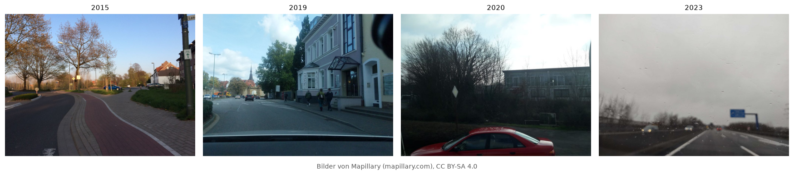

<sub>Bilder von [Mapillary](https://www.mapillary.com), CC BY-SA 4.0:
[Fußgängerzone](https://www.mapillary.com/app/?pKey=1391533835065315) ·
[Autobahn](https://www.mapillary.com/app/?pKey=1452480101753239) ·
[Park](https://www.mapillary.com/app/?pKey=3796249137169638) ·
[Am Wasser](https://www.mapillary.com/app/?pKey=1120224498685697) ·
[Wohnstraße](https://www.mapillary.com/app/?pKey=500860001925774) ·
[Hauptstraße](https://www.mapillary.com/app/?pKey=775519696297537)</sub>

<p align="center">
  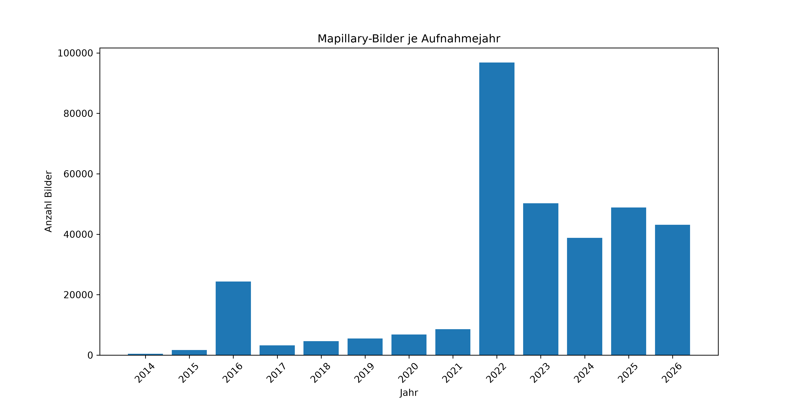
  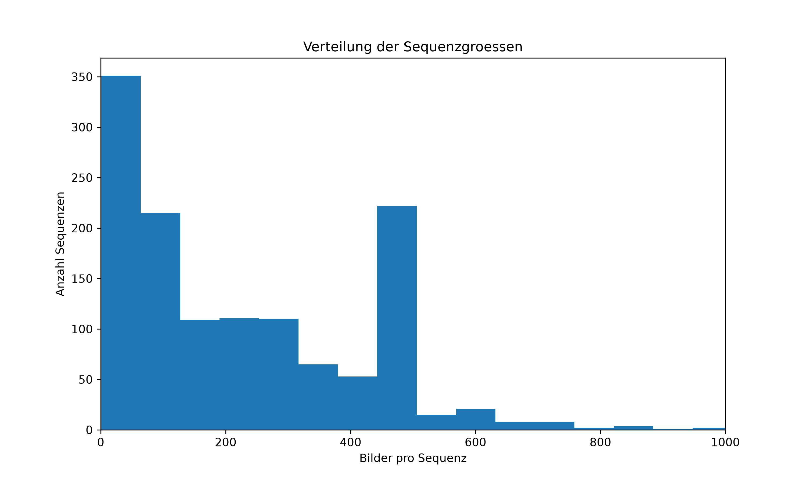
</p>
<p align="center">
  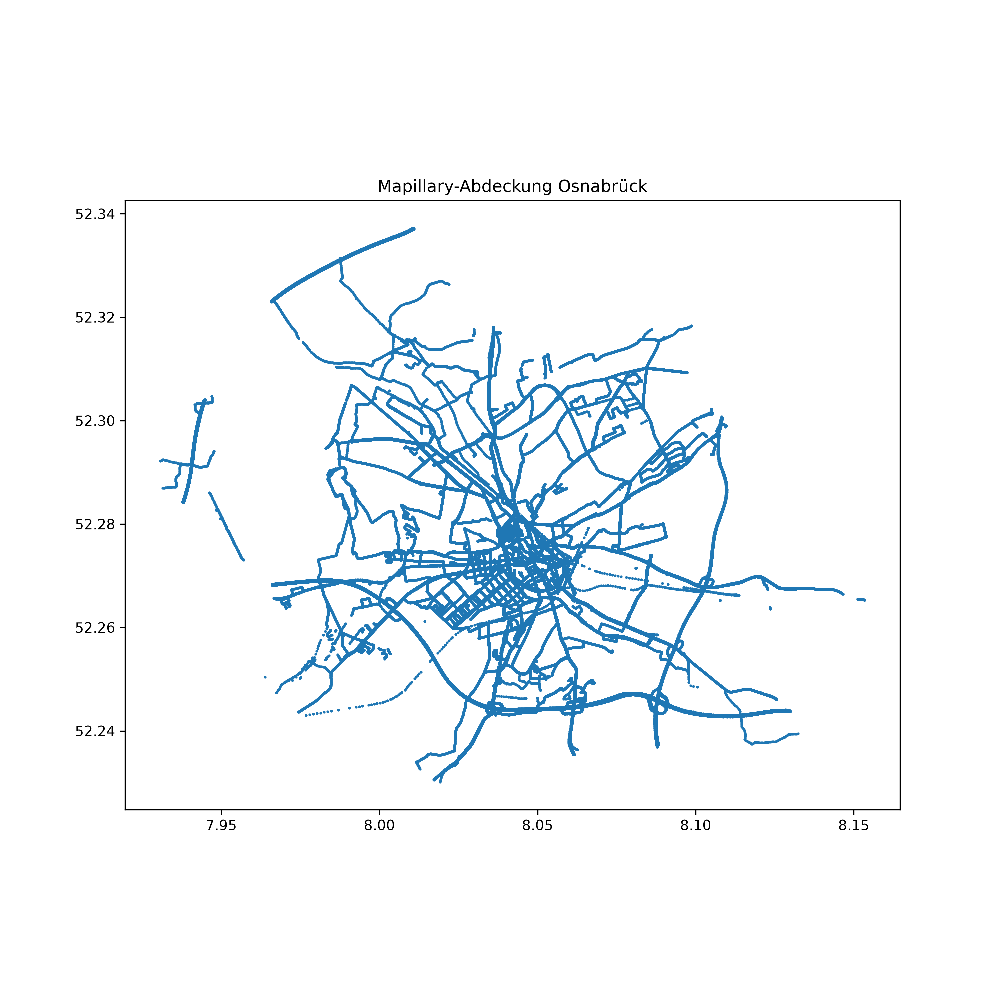
  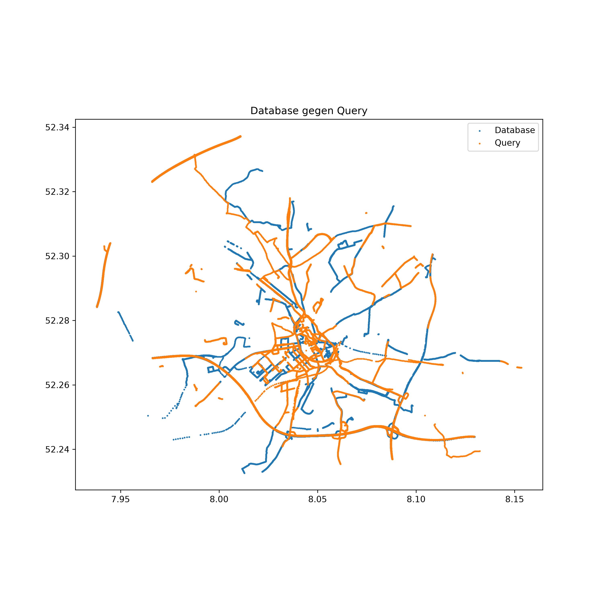
</p>

<sub>Alle vier aus `02_dataset_audit`. Links oben die Aufnahmejahre, rechts
oben die Länge der Fahrten; unten die räumliche Abdeckung und die Lage von
Referenz- gegen Anfragebildern.</sub>

| | |
|---|---|
| **Quelle** | [Mapillary](https://www.mapillary.com) — Straßenbilder von Nutzern, per Vector Tiles (Zoom 14) über das OSM-Stadtpolygon von Osnabrück ermittelt, Thumbnails mit 1024 px Breite |
| **Lizenz** | CC BY-SA 4.0; Gesichter und Kennzeichen sind von Mapillary automatisch unkenntlich gemacht |
| **Umfang** | 332.868 Bilder aus 120 km² Stadtgebiet, alle innerhalb der administrativen Grenze. Ein Bild ist auf dem einen Rechner beim Download gescheitert, zwei auf dem anderen — deshalb hat MegaLoc zwei `train`-Bilder weniger als die übrigen Encoder (siehe [Reproduzierbarkeit](#reproduzierbarkeit)) |
| **Aufteilung** | nach **Sequenzen** (Fahrten), nie nach Einzelbildern: train 231.133 · database 48.321 · query 53.414 (70 / 15 / 15 %). Keine Sequenz in zwei Splits, keine Panoramen, keine fehlenden Werte |
| **Query-Struktur** | 198 Sequenzen, Median 176 Bilder, die längste 3.156; 0,17 s und 3,3 m zwischen Frames |
| **Fotografen** | 57; einer stellt 47,8 % aller Bilder, die drei größten zusammen 65,2 % |
| **Aufnahmejahre** | 2014 bis 2026; 2022 allein 29 %, 2016 ein zweiter Schwerpunkt |
| **Nähe zur Referenz** | 63,9 % der Anfragen haben ein Datenbankbild im Umkreis von 25 m (Median 22 Nachbarn, Median 107 Tage Abstand); 9,3 % davon eines vom selben Fotografen am selben Tag, 83,3 % eines von einem anderen Fotografen |
| **Ground Truth** | ein Datenbankbild zählt als richtig, wenn es höchstens 25 m entfernt liegt (Standard); Varianten: anderer Fotograf oder > 180 Tage Abstand („Hard"), Kompassabweichung ≤ 90° („Blickrichtung"; eine unbekannte Blickrichtung schließt nicht aus — Mapillary kodiert sie als −1, und roh verglichen läse sich das als 359°) |
| **Beschaffung** | `01` holt Metadaten und würfelt den Split, `03` lädt die Bilder nach `image_root/<stadt>` (Standard `~/Downloads/mapillary/osnabrueck`; je Rechner per `VPR_IMAGE_ROOT`) und legt daneben `test/` für eigene Fotos an. Metadaten und Split-Listen liegen im Git |
| **Speicher** | Bilder rund 50 GB, Embeddings 0,7 bis 11,3 GB je Encoder (`Bilder × Dimension × 4 Byte`); für die 36 Varianten mit eigenen Embeddings zusammen (HMM und seq3 sortieren nur um) ergibt die Formel rund 84 GB. Ergebnisse 1,1 GB |

**Warum 25 Meter.** Die Schwelle muss über dem GPS-Rauschen der Aufnahmen
liegen, sonst misst der Recall die Ortung der Kamera statt die Leistung des
Encoders. Mapillary-Bilder kommen überwiegend von Smartphones und Dashcams;
deren Einzelmessung streut im Stadtgebiet — Mehrwegeausbreitung an
Hausfassaden, enge Straßenschluchten — typisch 5 bis 15 m, einzelne Punkte
deutlich weiter. Bei 10 m zählte derselbe korrekt wiedererkannte Ort je nach
Rauschen mal als Treffer und mal nicht; bei 50 m fängt die Schwelle schon die
Nachbarstraße ein. 25 m liegt darüber und unter der typischen Blocklänge, und
es ist die Größenordnung, die MSLS und Pittsburgh-30k ebenfalls verwenden.
Weil das eine Setzung bleibt, berichtet `07` jede Zahl zusätzlich bei 5, 10,
50 und 100 m (`python compare.py --threshold 5`) — die Wahl ist damit
nachprüfbar, nicht nur begründet. Der Wert steht an genau einer Stelle:
`vpr.uncertain_radius_m` in der `config.yaml`.

Der Split ist bewusst sparsam auf der Datenbankseite: 15 % der Sequenzen
als Referenz heißt, dass 36 % der Anfragen kein Referenzbild im Umkreis von
25 m haben. Diese Anfragen zählen im Recall nicht mit („lösbar" = 34.112),
aber die Dichtekurve unter [Referenzdichte](#referenzdichte) zeigt, was mehr
Referenz bringen würde. Alle Zahlen dieser Tabelle stehen in
[`results/osnabrueck/dataset_audit.json`](results/osnabrueck/dataset_audit.json) (aus `02`).

## Projektstruktur

Zwei Bäume: was ein Klon enthält, und was erst beim Rechnen entsteht. Code,
Pipeline und Messungen stehen getrennt von ihren Ergebnissen; `<stadt>` ist
der Slug aus `city` in der `config.yaml` (`Osnabrück, Germany` →
`osnabrueck`), gerechnet sind sechs.

**Im Repository**

```text
.
├── README.md  NOTICE.md  LICENSE
├── config.yaml                 alle Projektparameter, der einzige Schalter
├── run.py                      Pipeline 01–08 am Stück, überspringt fertige Stufen
├── compare.py                  Vergleichstabelle und -abbildungen über alle Verfahren
├── locate.py                   ein Foto verorten
├── setup_external.py           Fremd-Repos, Gewichte und Vokabular holen
├── environment.yml             conda-Umgebung
├── requirements.txt            dasselbe für uv/pip; .lock.txt = eine geprüfte Auflösung
├── .env.example                Vorlage für den Mapillary-Token
├── ruff.toml  .github/         Linter; CI: ruff und pytest bei jedem Push
│
├── notebooks/                  die Pipeline, in Reihenfolge
│   ├── 01_mapillary_coverage   Kacheln laden, Split festlegen, Stadtteile
│   ├── 02_dataset_audit        Konsistenz und Kennzahlen des Datensatzes
│   ├── 03_image_download       Bilder holen und prüfen
│   ├── 04_embeddings           Encoder → Embeddings
│   ├── 05_adapter              linearen Adapter trainieren
│   ├── 06_retrieval            nächste Nachbarn je Anfrage
│   ├── 07_evaluation           Recall, vier Ground-Truth-Varianten
│   └── 08_localization         aus der Trefferliste eine Koordinate
├── src/                        geteilter Code, siehe Konzeptioneller Aufbau
├── tests/                      pytest, ohne Torch und ohne Bilder
├── demo/                       demo.ipynb: Trefferreihen, Karten, Encoder-Vergleich,
│                               eigenes Foto; testordner.png fürs README
│
├── experiments/                je Skript eine Frage; Zahlen in experiments/README.md
│   ├── pca_reduce  concat_embeddings                     abgeleitete Encoder
│   ├── full_reference  bootstrap_ci                      zweites Protokoll, Intervalle
│   ├── recall_by_difficulty  recall_by_district
│   │   confusion_atlas  rejection_curve
│   │   database_density                                  woran es scheitert
│   ├── localization_aggregation  sequence_retrieval
│   │   sequence_hmm  geometric_verification
│   │   detection_rerank  detection_probe                 Nachbearbeitung der Top-k
│   ├── city_coverage  city_comparison                    Städte auswählen, vergleichen
│   ├── timing  beispielbilder                            Laufzeit; Bilder fürs README
│   └── results/<stadt>/        ihre JSONs und Abbildungen
│
├── data/<stadt>/processed/     metadata.parquet und die drei Split-Listen
├── results/<stadt>/
│   ├── dataset_audit.json      aus 02
│   ├── evaluation/             Recall-JSONs aus 07 und aus den Experimenten
│   ├── localization/           Lokalisierungs-JSONs aus 08
│   └── figures/                evaluation, localization, dataset, coverage,
│                               demo (mit QUELLEN.md für die Bildrechte)
└── cache/detections.jsonl      Mapillary-Detections für die Detection-Experimente
```

**Entsteht beim Rechnen** — gitignored, je Rechner, über Fingerabdrücke
gegen die `config.yaml` geprüft:

```text
data/<stadt>/raw/                   Kachel-Rohdaten aus 01
data/<stadt>/embeddings/<name>/     Embeddings aus 04, auch die abgeleiteten, mit <name>_pca.npz
results/<stadt>/retrieval/<name>/   Trefferlisten aus 06; Inlier der geometrischen Verifikation
weights/adapter/<stadt>/            trainierte Adapter
weights/mixvpr/                     MixVPR-Checkpoint
external/                           AnyLoc und MixVPR, geklont von setup_external.py
cache/                              OSMnx-Antworten, Kontaktabzüge der Beispielbilder
<image_root>/<stadt>/  …/test/      die Bilder und eigene Fotos, außerhalb des Repos
~/.cache/torch/hub/                 EigenPlaces, MegaLoc (Code), DINOv2
~/.cache/huggingface/hub/           MegaLoc-Gewichte, CLIP
```

Alle Ablageorte kommen aus [`src/paths.py`](src/paths.py). Eine weitere
Stadt heißt: `city` umstellen (oder `VPR_CITY` setzen), 01 und 03 laufen
lassen, dann wie gewohnt — nichts überschreibt die erste. Der Weg im
Einzelnen steht unter [Mögliche Erweiterungen](#mögliche-erweiterungen).

## Voraussetzungen

| | |
|---|---|
| **Python** | ab 3.11 (`src/config.py` prüft es beim Laden der config). Entwickelt wird mit 3.14; unter 3.11 läuft die Testsuite ebenfalls durch, und beide Versionen laufen im CI |
| **Paketmanager** | conda (empfohlen) oder uv |
| **GPU** | nicht nötig, aber: 04 encodiert jedes Bild der Stadt — in Osnabrück 332.868, in Jena 699.120. Auf einem M1 Pro sind CLIP, MixVPR und EigenPlaces in Stunden fertig; AnyLoc (ViT-G, 1,14 Mrd. Parameter) und MegaLoc gehören auf eine CUDA-GPU, dort mit `fp16` und kleinen Batches auf 8 GB VRAM |
| **Arbeitsspeicher** | hängt an der Stadt, nicht am Projekt: ein Encodersatz ist `Bilder × Dimension × 4 Byte` groß. Bei MegaLoc (8448 d) sind das in Osnabrück 11,2 GB, in Jena 23,6 GB. 16 GB reichen für Osnabrück durchgehend; für eine Stadt in Jenas Größe braucht 05 rund 16 GB frei, 04 und die Experimente arbeiten blockweise und kommen mit 8 GB aus. Zahlen und Messung unter [Laufzeit und Speicher](#laufzeit-und-speicher) |
| **Speicherplatz** | 50 GB Bilder + 3 bis 25 GB je Encoder-Satz + 1 GB Ergebnisse |
| **Mapillary-Token** | kostenloser Developer-Account, siehe [Konfiguration](#konfiguration) |

## Installation

Empfohlen wird **conda** ([Miniconda](https://www.anaconda.com/docs/getting-started/miniconda/main)),
alternativ **uv**.

```bash
conda env create -f environment.yml
conda activate vpr
nbstripout --install --attributes .gitattributes
pytest tests/
```

`nbstripout` hält Zellenausgaben aus dem Git und wird einmal je Rechner
eingerichtet; `pytest` prüft die Installation, ohne Torch zu laden.

`environment.yml` holt alles mit kompilierten Abhängigkeiten (faiss, GDAL
hinter geopandas) über conda-forge und den Rest — torch und was darauf
aufbaut — über pip; die pip-Wheels wählen CUDA auf Linux und MPS auf dem
Mac von selbst. `conda install --file requirements.txt` funktioniert
**nicht**, mehrere Pakete gibt es nur über pip; `requirements.txt` ist für
die uv-Variante da:

```bash
uv venv --python 3.14 && source .venv/bin/activate && uv pip install -r requirements.txt
```

Die passende PyTorch-Variante (CUDA, MPS, CPU) nennt der
[Konfigurator von PyTorch](https://pytorch.org/get-started/locally/).

**Welche Versionen.** `requirements.txt` und `environment.yml` nennen untere
Grenzen, keine festen Versionen — so löst dieselbe Datei auf beiden
Plattformen auf und veraltet nicht. Welche Kombination tatsächlich
nachgemessen ist, steht im Kopf von `requirements.txt`; gemessen wurde unter
anderem, dass der Fingerabdruck (`pd.util.hash_pandas_object`) unter pandas
2.2 bis 3.0 denselben Wert liefert — ein Major-Sprung entwertet die
vorhandenen Artefakte also nicht. Wer eine exakte Umgebung will:

```bash
uv pip install -r requirements.lock.txt
```

`requirements.lock.txt` ist die eingefrorene Auflösung **eines** Laufs, in
dem Tests, Linter und Pipeline nachweislich durchliefen. Sie ist nicht die
Umgebung, in der die Zahlen unter `results/` entstanden sind — die entstanden
auf zwei anderen Rechnern, siehe [Reproduzierbarkeit](#reproduzierbarkeit).

## Fremd-Repositories und Gewichte

AnyLoc und MixVPR werden aus ihren Original-Repos importiert und liegen
deshalb nicht im Git-Repo. Ein Skript holt sie auf die Commits, gegen die
hier entwickelt wurde:

```bash
python setup_external.py
```

EigenPlaces und MegaLoc brauchen das nicht: ihr Code kommt beim ersten Lauf
über `torch.hub` nach `~/.cache/torch/hub`, die MegaLoc-Gewichte lädt dessen
`hubconf.py` von [Hugging Face](https://huggingface.co/gberton/MegaLoc) nach
`~/.cache/huggingface/hub`. Anders als AnyLoc und MixVPR sind beide **nicht
auf einen Commit festgelegt** — `torch.hub` holt den Stand, den das Projekt
beim ersten Lauf auf einem Rechner gerade hat.

**Die MixVPR-Gewichte holt das Skript selbst** (per `gdown` von Google Drive)
und prüft die Datei gegen eine hinterlegte SHA-256-Summe — Drive liefert bei
Überlastung gern eine HTML-Fehlerseite statt der Datei.

**Das AnyLoc-Vokabular holt es ebenfalls selbst** — AnyLocs eigene
OneDrive-Links sind tot, die HuggingFace-Space des Projekts hält dieselben
Dateien. Die Cluster-Zentren landen dort, wo die Konfiguration sie erwartet:

```
external/AnyLoc/cache/vocabulary/dinov2_vitg14/l31_value_c32/urban/c_centers.pt
```

Der Pfad wird aus `vpr.anyloc` gebaut — änderst du `vocabulary_domain`,
`num_clusters`, `desc_layer` oder `desc_facet`, prüft das Skript an der
passenden Stelle und meldet, wenn der Cache dafür nichts enthält.

Ohne dieses Vokabular fittet AnyLoc die Cluster-Zentren selbst auf den
Trainingsbildern. Das läuft, ist dann aber nicht mehr mit den Zahlen aus dem
Paper vergleichbar — für die Vergleichstabelle also vorher besorgen.

Beides ist nur nötig, wenn du das jeweilige Verfahren auch benutzt. Unter
welcher Lizenz jede dieser Komponenten steht — und dass SuperPoint in der
geometrischen Verifikation nur nichtkommerziell genutzt werden darf —,
steht in [NOTICE.md](NOTICE.md).

## Konfiguration

Alle Parameter stehen in `config.yaml` — Stadt, Split-Anteile, Encoder,
Radien, Adapter-Training. Die Datei ist versioniert; wer sie ändert, ändert
die Fingerabdrücke, und die betroffenen Stufen rechnen beim nächsten Lauf neu.
`validate_config` prüft sie beim Laden gegen Widersprüche (Anteile, Radien,
Tippfehler in `source`, `top_k`-Grenzen), bevor eine Stufe Stunden rechnet.

Für den Bilddownload braucht es einen Mapillary-Developer-Token
([kostenloser Account](https://www.mapillary.com/developer)). Zugangsdaten gehören in
eine lokale `.env`-Datei und **niemals ins Repository**.
Als Vorlage dient [`.env.example`](.env.example):

```bash
cp .env.example .env
```

Die Schlüssel, die man am ehesten anfasst:

| Schlüssel | Bedeutung |
|---|---|
| `vpr.method`, `vpr.adapter` | welcher Encoder, mit oder ohne linearen Adapter — `run.py --method/--adapter` überschreibt beides |
| `vpr.models` | Namen aller Encoder; abgeleitete Varianten haben darunter einen Block mit `source` (PCA) oder `sources` (Verkettung), die PCA-Blöcke teilen sich ihre Werte über YAML-Anker |
| `vpr.uncertain_radius_m` | die 25 m der Ground Truth — auch die Standardschwelle von `compare.py --threshold` |
| `vpr.max_heading_diff_deg` | die 90° der Blickrichtungs-Auswertung |
| `retrieval.top_k`, `k_values`, `thresholds` | wie viele Nachbarn 06 speichert, welche R@k und Schwellen 07 berichtet |
| `localization.top_k`, `eps_m`, … | Top-k für 08 und die Aggregationsverfahren in `experiments/localization_aggregation.py` |
| `city` | Stadt für Kacheln, Stadtgrenze, Stadtteile — und der Slug für alle Ablageorte; je Prozess per `VPR_CITY` überschreibbar |
| `max_missing_images_frac` | wie viele Bilder fehlen dürfen, bevor 03 und 04 abbrechen (Standard 0,01 = 1 %) |
| `verify_all_images` | `true` prüft in 03 den gesamten Bildbestand statt nur der neu geholten |
| `vpr.max_images` | Obergrenze für 04, nur zum Ausprobieren — `null` = alle |
| `image_root` | Wurzel der Bildordner (`<image_root>/<stadt>`, `<image_root>/test`); je Rechner per `VPR_IMAGE_ROOT` oder `VPR_IMAGE_PATH` überschreibbar |
| `osm.overpass_url` | Overpass-Endpunkt für Straßennetz und Stadtteile (ohne `/interpreter`); je Rechner per `VPR_OVERPASS_URL` überschreibbar |
| `osm.timeout_s` | Zeitlimit je Overpass-Abfrage — gilt für die HTTP-Anfrage **und** das `[timeout:…]` im Overpass-Skript (osmnx-Standard 180 ist für ein Stadt-Straßennetz oft zu knapp) |
| `osm.rate_limit` | vor jeder Abfrage den Serverstatus lesen und auf einen freien Slot warten — langsamer, aber ohne 429 mitten im Lauf |

## Nutzung

```bash
python run.py
```

Führt die Notebooks 01 bis 08 der Reihe nach aus. Eine Stufe wird
übersprungen, wenn ihr Ergebnis vorliegt **und** laut Fingerabdruck zur
`config.yaml` passt — nach einer Config-Änderung laufen also genau die
betroffenen Stufen neu. 07 und 08 tragen zusätzlich eine Kennung des
Auswertungscodes; ändert sich `src/evaluation.py`, werden sie neu
gerechnet. Ausnahmen: 01 bis 03 werden nur auf Existenz ihres Ergebnisses
geprüft (01 würde sonst den Split neu würfeln und alle Embeddings
entwerten; 02 und 03 hängen nicht am Verfahren), und 05 entfällt, solange
`vpr.adapter` auf `"none"` steht. Die Varianten des Aufrufs — anderer
Encoder, alle Encoder, ab einer Stufe, alles neu — stehen kopierbar in der
[Befehlsreferenz](#befehlsreferenz).

`--method` und `--adapter` erreichen die Notebooks über die
Umgebungsvariablen `VPR_METHOD` und `VPR_ADAPTER`; die `config.yaml` wird
nicht angefasst. Wer ein Notebook direkt in Jupyter öffnet, bekommt den
Wert aus der Datei.

Dasselbe gilt für die Stadt: **`VPR_CITY`** sticht `city` aus der Datei,
für ein Notebook in Jupyter ebenso wie für `run.py`:

```bash
VPR_CITY="Kaiserslautern, Germany" jupyter lab notebooks/01_mapillary_coverage.ipynb
```

```bash
VPR_CITY="Kaiserslautern, Germany" python run.py --bestand
```

Das ist nicht nur Bequemlichkeit: die Notebooks lesen `config.yaml` bei
**jeder** Zellenausführung neu. Die Datei umzustellen, während ein `run.py`
läuft, würde dem laufenden Durchgang die Stadt unter den Füßen wechseln —
die nächste Stufe schriebe nach `results/<andere stadt>/` und fände ihre
Eingaben nicht. Über die Umgebung bleiben beide Läufe getrennt, und die
versionierte Datei bleibt unangetastet.

Nach demselben Muster sticht **`VPR_OVERPASS_URL`** den Endpunkt aus
`osm.overpass_url`. Der Standard `overpass-api.de` ist ein öffentlicher,
geteilter Dienst; wenn er zumacht, hilft ein Spiegel, ohne dass die
versionierte Datei sich ändert:

```bash
VPR_OVERPASS_URL="https://overpass.kumi.systems/api" python run.py
```

`--method` und `--adapter` nehmen auch Kommalisten oder `all`. Dann rechnet
`run.py` eine Kombination nach der anderen: 01 bis 03 laufen dabei nur einmal,
weil sie nicht am Verfahren hängen, und eine Kombination, die abbricht, reißt
die übrigen nicht mit — am Ende steht, welche gescheitert sind.

### Ergebnisse vergleichen

Jeder Durchlauf von 07 legt seine Recall-Tabellen unter
`results/<stadt>/evaluation/<name>.json` ab. Daraus baut `compare.py` die
Vergleichstabelle über alle Verfahren, hier mit Konfidenzintervallen:

```bash
python compare.py --ci
```

Andere Schwelle, strengere Ground Truth, das zweite Protokoll, die
abgeleiteten Encoder und die Abbildungen: [Befehlsreferenz](#befehlsreferenz).

### Nebenuntersuchungen

Jedes Skript unter [`experiments/`](experiments/) beantwortet eine Frage auf
vorhandenen Artefakten und schreibt sein Ergebnis dorthin, wo `compare.py`
es findet, oder nach `experiments/results/<stadt>/`. Welche es gibt, steht
in der [Befehlsreferenz](#befehlsreferenz), was sie ergeben, unter
[Ergebnisse](#ergebnisse) und ausführlich in
[`experiments/README.md`](experiments/README.md).

### Ein eigenes Foto verorten

Eigene Fotos gehören in den Ordner `test/` neben den Stadtordnern, bei
Standardeinstellung also `~/Downloads/mapillary/test`:

<p align="center">
  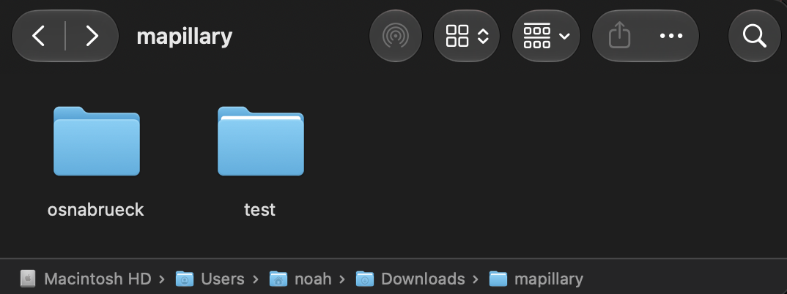
</p>

<sub>`osnabrueck/` ist der Bildbestand aus 03, `test/` der Ordner für eigene
Fotos. Wo beide liegen, bestimmt `image_root` in der `config.yaml`, je Rechner
auch `VPR_IMAGE_ROOT`.</sub>

Ein einzelnes Foto, mit dem Encoder aus der `config.yaml`:

```bash
python locate.py foto.jpg
```

Den ganzen Ordner auf einmal:

```bash
python locate.py ~/Downloads/mapillary/test
```

`--method` wählt einen anderen Encoder (etwa `eigenplaces_megaloc_concat`),
`--k` die Zahl der Treffer, `--json` gibt dasselbe maschinenlesbar aus.

`locate.py` baut den Encoder über die Factory — auch die PCA-, Whitening-
und Verkettungsvarianten, deren Projektion neben den Embeddings liegt —,
sucht im FAISS-Index über die Datenbank und gibt Koordinate, Konfidenz (die
Ähnlichkeit des besten Treffers, siehe [Ablehnung](#ablehnung)) und die
Top-k zurück. Auch AnyLoc und seine Varianten: 04 legt die angepasste PCA
als `anyloc_pca.npz` neben die Embeddings, die Factory lädt sie.
[`demo/demo.ipynb`](demo/demo.ipynb) nutzt denselben Weg und zeigt dazu
Trefferreihen, Karten auf dem Straßennetz und alle Encoder am selben
Anfragebild.

<p align="center">
  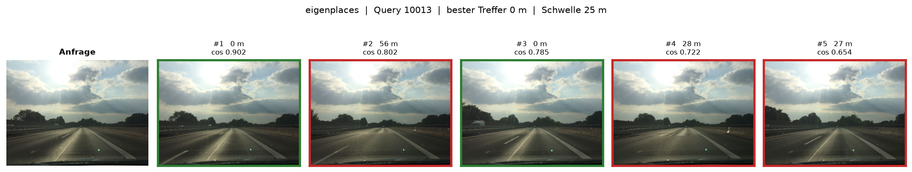
</p>
<p align="center">
  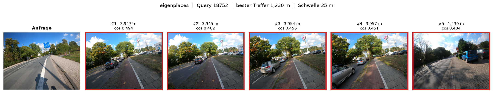
</p>
<p align="center">
  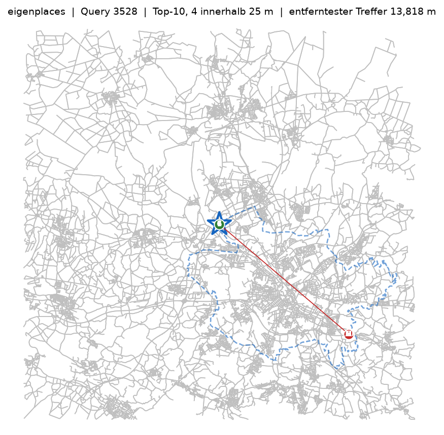
  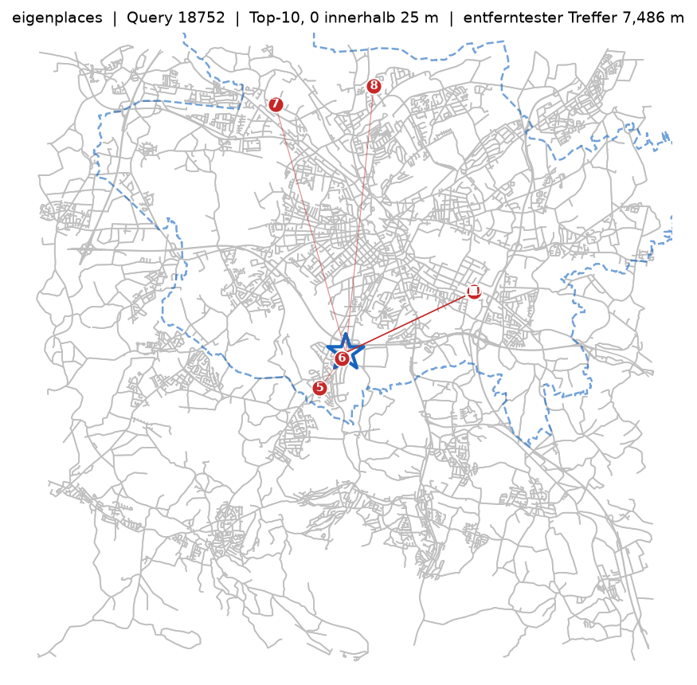
</p>

<sub>Oben eine gelöste, darunter eine gescheiterte Anfrage — grün umrandet
heißt innerhalb 25 m. Unten dieselben Treffer auf dem Straßennetz: links
zerfallen sie in zwei Gruppen, rechts liegen sie geschlossen am falschen Ort.
Der zweite Fall ist der, den keine Aggregation rettet. Bilder von
[Mapillary](https://www.mapillary.com), CC BY-SA 4.0, Urheber je Bild in
[QUELLEN.md](results/osnabrueck/figures/demo/QUELLEN.md).</sub>

Und dasselbe Anfragebild durch alle fünf Encoder:

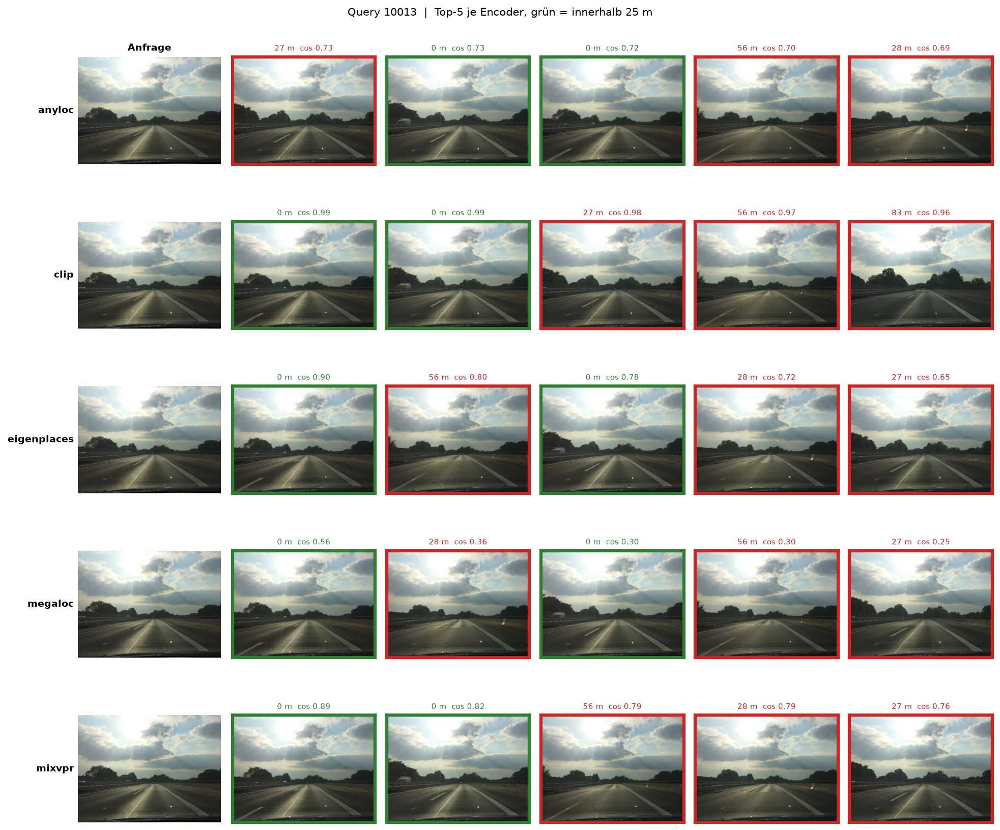

<sub>Eine Zeile je Encoder. Bilder von [Mapillary](https://www.mapillary.com),
CC BY-SA 4.0, Urheber je Bild in
[QUELLEN.md](results/osnabrueck/figures/demo/QUELLEN.md).</sub>

### Tests

```bash
pytest tests/
```

14 Dateien, unter einer Minute, für fast alle kein Torch: die Recall-Auswertung gegen eine
handgerechnete Erwartung (Standard, Hard, Blickrichtung, Panorama), der Split gegen
die versionierten Listen, die Paarbildung, `validate_config` gegen die
echte `config.yaml` und gegen Tippfehler, die PCA-Projektion gegen sklearn,
`localizable` gegen die volle Distanzmatrix, und die versionierten
Ergebnis-JSONs gegen beide Bootstraps. Ein Test prüft außerdem, dass der in
jeder Ergebnis-JSON vermerkte Commit im Repository auffindbar ist — sonst ist
die Kennung wertlos. Dazu die Schutzmechanismen selbst: dass eine geänderte
`config.yaml` den Fingerabdruck wirklich zum Abbruch bringt und den
abweichenden Schlüssel nennt, und dass ein Encoder aus einer anderen Stadt
auffällt.

Dieselben Tests laufen bei jedem Push ([`.github/workflows/check.yml`](.github/workflows/check.yml)), unter
Python 3.11 **und** 3.14. `faiss-cpu` ist dort installiert, obwohl es das
schwerste Paket ist: ohne es übersprünge der CI das blockweise FAISS-Merging
still, und das ist die Stelle, an der ein Fehler falsche Zahlen statt eines
Absturzes ergäbe. Zwei Dateien überspringt der CI bewusst, weil sie Torch
bzw. OSMnx brauchen — `test_adapter_training.py` und `test_districts.py`;
`pytest -rs` nennt sie in jedem Lauf. Sie laufen nur lokal in der vollen
Umgebung mit, also vor einem Push dort einmal `pytest tests/`.

Ein weiterer Test prüft, dass kein versioniertes Notebook Zellausgaben
enthält — die Absicherung dafür, dass `nbstripout` auf jedem Rechner
eingerichtet ist.

## Reproduzierbarkeit

**Ein Seed für alles.** `vpr.split_seed: 42` in der `config.yaml` steuert
den Sequenz-Split in 01, die fit/val-Aufteilung und das Negative-Sampling
im Adapter-Training, die Stichproben der PCA-Anpassung, die Zufallsbasis in
07 und 08, den Bootstrap und die Stichproben aller Experimente.

**Metadaten und Split im Git.** `data/<stadt>/processed/metadata.parquet` (5 bis 17 MB je Stadt)
und die drei Split-Listen liegen versioniert; ein Test rechnet den Split
aus den Metadaten und dem Seed nach und vergleicht ihn mit den Listen. 01
läuft nur noch für eine neue Stadt oder einen neuen Split — Mapillary
ändert sich über die Zeit, ein frischer Lauf ergäbe einen anderen
Schnappschuss. Bildpaare für Audit und Adaptertraining werden aus den
Metadaten abgeleitet (`src/pairs.py`), nichts davon muss versioniert werden.

**Die Auswertung rechnet exakt, aber sparsam.** `src/evaluation.py` holt
Kandidaten innerhalb der größten Schwelle aus einem KDTree und rechnet die
Haversine-Distanz nur für diese Paare und die Trefferliste — dieselben
Zahlen wie mit der vollen Distanzmatrix (gegen alle gespeicherten JSONs
geprüft), aber Sekunden statt Minuten, auch bei 279.453 Referenzbildern.

**Fingerabdrücke statt Vertrauen.** Neben jedem Artefakt liegt eine
`.fingerprint.json` mit allem, was seinen Inhalt bestimmt — Encoder,
Modellkonfiguration, Split-Parameter, Hash der Metadaten. Jede Stufe prüft
ihre Eingaben dagegen und bricht ab, statt mit einer Datei aus einem anderen
Lauf falsche Zahlen zu rechnen. `run.py` nutzt dieselben Fingerabdrücke, um
zu entscheiden, was übersprungen werden darf. Die Ergebnis-JSONs aus 07 und
08 tragen zusätzlich den Fingerabdruck ihrer Trefferliste und eine Kennung
des Auswertungscodes (Git-Commit und Hash von `src/evaluation.py`).

**Zwei Rechner, ein Ergebnis.** Die Zahlen entstanden auf einem MacBook Pro
M1 Pro (16 GB, MPS) für CLIP, MixVPR und EigenPlaces samt Adaptern, und auf
einem Linux-Rechner mit RTX 3070 (8 GB) für AnyLoc und MegaLoc. AnyLoc läuft
dort mit fp16-Modell und Batch 4, sonst reicht der VRAM nicht. Alle
Ergebnis-JSONs und Abbildungen wandern über git; Embeddings und
Trefferlisten sind gitignored und wurden per `rsync` zusammengeführt.

Eine Folge davon, die man kennen sollte: **auf verschiedenen Rechnern
gerechnete Encoder halten dieselben Bilder in verschiedener
Zeilenreihenfolge**, und MegaLoc hat zwei `train`-Bilder weniger (Download
dort gescheitert). Für 07 und 08 ist das egal, jeder Encoder ist in sich
konsistent. Alles, was Encoder nebeneinanderlegt — die Verkettung, der
Encoder-Vergleich in der Demo, der Bootstrap — richtet deshalb über die
`image_id` aus, nie über die Zeilennummer.

**Was nicht bitidentisch reproduziert.** Die randomisierte SVD der
PCA-Varianten rundet auf anderem BLAS minimal anders; die Fingerabdrücke
prüfen die Konfiguration, nicht den Inhalt. Wer die exakten Zahlen aus
`results/` reproduzieren will, nimmt die Embeddings, mit denen sie
gerechnet wurden.

**Gewichte.** Trainierte Adapter unter `weights/adapter/`, der
MixVPR-Checkpoint unter `weights/mixvpr/`, EigenPlaces und MegaLoc über
`torch.hub` in `~/.cache/torch/hub` (die MegaLoc-Gewichte von Hugging Face in
`~/.cache/huggingface/hub`), das AnyLoc-Vokabular unter
`external/AnyLoc/cache/`. AnyLoc und MixVPR holt `setup_external.py` auf
festen Commits, EigenPlaces und MegaLoc laden sich beim ersten Lauf selbst —
ungepinnt, siehe [Fremd-Repositories und Gewichte](#fremd-repositories-und-gewichte).

## Ergebnisse

Jeder Zahlenblock nennt darunter seine Herkunft: entweder die **wörtliche
Ausgabe** eines Befehls oder ein **Auszug** aus einer versionierten JSON,
aus der Datei erzeugt und nicht abgetippt. In den Blöcken stehen Zahlen so,
wie die Programme sie drucken (Dezimalpunkt, Tausenderkomma). Im Text gilt:
Kennzahlen zwischen 0 und 1 — Recall, Differenzen, ρ, p — mit Punkt,
Prozente und Größen mit Einheit mit Komma.

### Recall, volle Referenz

```text
Alle Queries  |  Schwelle 25 m  |  48,177 loesbare Queries  |  Referenz: 279,453 Bilder (database + train)

Encoder       Variante     Dim        R@1          95-%-KI     R@5    R@10    R@20
----------------------------------------------------------------------------------
anyloc        none        4096      0.435  [0.343, 0.533]   0.512   0.549   0.588
clip          none         512      0.232  [0.144, 0.349]   0.288   0.318   0.353
eigenplaces   none        2048      0.701  [0.630, 0.765]   0.775   0.801   0.824
megaloc       none        8448      0.798  [0.739, 0.848]   0.858   0.876   0.888
mixvpr        none        4096      0.653  [0.575, 0.724]   0.723   0.751   0.777
----------------------------------------------------------------------------------
Zufall        (Raten)              0.0005                   0.0022  0.0043  0.0088

Intervall: Sequenz-Bootstrap, 2,5- und 97,5-Perzentil (experiments/bootstrap_ci.py). Fuer den Vergleich zweier Zeilen gilt die gepaarte Differenz dort, nicht die Ueberlappung.
```

<sub>Wörtliche Ausgabe von `python compare.py --reference full --ci`.</sub>

Nur Encoder ohne Adapter: der Adapter wurde auf `train` trainiert, `train`
als Referenz wäre für ihn Leakage. Alle 18 Zeilen mit PCA-, Whitening- und
Verkettungsvarianten: `--derived`. **Die Rangfolge ist dieselbe wie im
Benchmark-Protokoll, jede Zahl liegt rund 0.2 höher.** MegaLoc auf 512
gewhitent (0.778) und die Verkettung (0.778) liegen gleichauf, MegaLoc auf
voller Breite 0.020 darüber — der Preis der Reduktion, bei einem
Sechzehntel des Index.

### Recall, Benchmark-Protokoll

```text
Alle Queries  |  Schwelle 25 m  |  34,112 loesbare Queries  |  Referenz: 48,321 Bilder (database)

Encoder       Variante     Dim        R@1          95-%-KI     R@5    R@10    R@20
----------------------------------------------------------------------------------
anyloc        none        4096      0.204  [0.153, 0.265]   0.294   0.340   0.384
anyloc        linear      4096      0.335  [0.277, 0.400]   0.504   0.570   0.631
clip          none         512      0.073  [0.044, 0.108]   0.106   0.129   0.158
clip          linear       512      0.123  [0.092, 0.161]   0.221   0.281   0.353
eigenplaces   none        2048      0.484  [0.405, 0.574]   0.608   0.650   0.695
eigenplaces   hmm30-25    2048      0.501  [0.415, 0.596]   0.603   0.633   0.675
eigenplaces   linear      2048      0.444  [0.372, 0.523]   0.593   0.648   0.696
megaloc       none        8448      0.568  [0.475, 0.666]   0.676   0.719   0.763
megaloc       hmm30-25    8448      0.598  [0.500, 0.699]   0.690   0.725   0.764
megaloc       linear      8448      0.442  [0.372, 0.517]   0.580   0.628   0.667
mixvpr        none        4096      0.426  [0.354, 0.509]   0.543   0.590   0.642
mixvpr        linear      4096      0.363  [0.302, 0.433]   0.508   0.568   0.624
----------------------------------------------------------------------------------
Zufall        (Raten)              0.0006                   0.0028  0.0047  0.0098

Intervall: Sequenz-Bootstrap, 2,5- und 97,5-Perzentil (experiments/bootstrap_ci.py). Fuer den Vergleich zweier Zeilen gilt die gepaarte Differenz dort, nicht die Ueberlappung.
```

<sub>Wörtliche Ausgabe von `python compare.py --ci`.</sub>

Spalte „Variante": `none` = Encoder wie veröffentlicht, `linear` = mit
trainiertem linearem Adapter, `hmm30-25` = Trefferlisten einer Fahrt über
ein HMM umsortiert (β = 30, σ = 25 m). `--derived` zeigt alle 39 Zeilen:
Namen mit `_pca512` sind per PCA auf 512 reduziert, `_pcaw512` zusätzlich
gewhitent, `_pcaw4096` / `_pcaw2048` gewhitent ohne Reduktion, `_concat`
verkettet, `seq3` = Trefferlisten über ±3 Nachbarframes aufsummiert.

Weitere Sichten: `--threshold 5` bis `100`, `--split "Hard: …"` und
`--split "Blickrichtung: …"` für die strengeren Ground Truths. Bei MegaLoc
etwa: 0.568 Standard, 0.543 Hard, 0.621 Blickrichtung — die letzte Zahl ist
höher, weil dort 4.945 Anfragen wegfallen, deren einzige nahe Nachbarn in
die andere Richtung schauen.

### Unsicherheit

Die 53.414 Anfragen stammen aus 198 Fahrten, und aufeinanderfolgende
Frames scheitern gemeinsam. Der Bootstrap zieht deshalb 1.000-mal die
Fahrten mit Zurücklegen, nicht die Bilder. Ergebnis: **die 95-%-Halbbreite
einer einzelnen R@1-Zahl liegt bei ±0.03 (CLIP) bis ±0.10 (MegaLoc)** — der
binomiale Standardfehler hätte ±0.005 behauptet. Gepaarte Differenzen
zwischen zwei Encodern sind dagegen eng (±0.005 bis ±0.05), weil dieselben
Fahrten für beide schwer sind. „belegt" heißt: das Intervall schließt 0 aus.

```text
Vergleich (a → b)                             ΔR@1   95-%-Intervall     belegt
-----------------------------------------------------------------------------
eigenplaces → eigenplaces_pca512            -0.003   [-0.008, +0.002]   nein
eigenplaces → eigenplaces_pcaw512           +0.022   [+0.011, +0.039]   ja
eigenplaces → eigenplaces_pcaw2048          -0.025   [-0.042, -0.010]   ja
anyloc → anyloc_pcaw4096                    +0.117   [+0.078, +0.162]   ja
megaloc → eigenplaces_megaloc_concat        +0.004   [-0.005, +0.014]   nein
megaloc → megaloc_hmm30-25                  +0.030   [+0.020, +0.041]   ja
megaloc → megaloc_linear                    -0.126   [-0.179, -0.073]   ja
clip_pcaw512 → clip_pcaw512_linear          +0.009   [-0.002, +0.021]   nein
```

<sub>Auszug aus [`experiments/results/osnabrueck/bootstrap_ci.json`](experiments/results/osnabrueck/bootstrap_ci.json),
erzeugt von `python experiments/bootstrap_ci.py`. Dort stehen alle 38 Paare,
auch für R@5 bis R@20.</sub>

### Sechs Städte

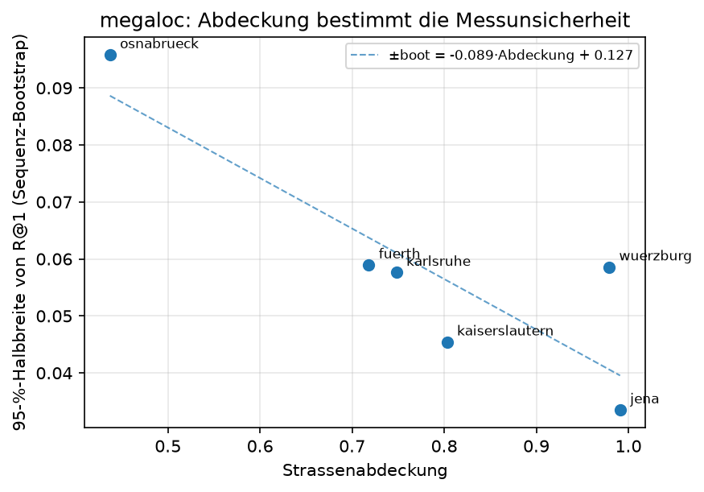

Dieselbe Pipeline, derselbe Split-Seed, zwei Encoder, sechs Städte. Die
Städte wurden aus 50 nach Mapillary-Metadaten vorausgewählt
([`experiments/city_coverage.py`](experiments/city_coverage.py)), bevor ein
einziges Bild geladen war.

```text
Encoder megaloc  |  R@1 bei 25 m  |  6 Staedte

Stadt              Abd  loesbar   Pano   Dubl   Tage   Alle    Hard   voll   ±boot
----------------------------------------------------------------------------------
osnabrueck        0.44    63.9%   0.0%  11.8%    317  0.568  -0.025  0.798   0.096
fuerth            0.72    62.0%   3.0%  39.6%    291  0.549  -0.141  0.699   0.059
karlsruhe         0.75    70.8%  17.9%  15.4%    408  0.419  -0.057  0.640   0.058
kaiserslautern    0.80    85.6%   0.3%  35.8%    279  0.651  -0.204  0.810   0.045
wuerzburg         0.98    45.5%   8.7%  17.9%    627  0.336  -0.034  0.476   0.059
jena              0.99    52.9%   0.3%  24.1%   2188  0.417  -0.010  0.622   0.033
```

<sub>Wörtliche Ausgabe von `python experiments/city_comparison.py`, erster
Teil. Abd = Straßenabdeckung, Pano = Panoramaanteil, Dubl = Anteil der
korrekten Top-1-Treffer vom selben Konto aus demselben Zeitfenster, Tage =
Median zwischen Anfrage und korrektem Treffer, Hard = Abschlag durch den
Hard-Filter, voll = volle Referenz, ±boot = halbe Breite des
95-%-Intervalls.</sub>

Vier Aussagen, nach Härte getrennt.

**Erklärt: der Hard-Abschlag ist die Differenz zweier Dublettenmaße.** Der
Hard-Filter (anderer `creator_id` **oder** > 180 Tage Abstand) kostet je
nach Stadt 0.010 bis 0.204 R@1. Lange stand hier „belegt, aber unerklärt" —
der Dublettenanteil allein sagt den Abschlag nämlich nicht vorher
(ρ = −0.54, p = 0.30). Er sagt ihn deshalb nicht vorher, weil zwei
verschiedene Größen denselben Namen tragen:

- **d** — Anteil der korrekten **Treffer**, die Dubletten sind
- **1−r** — Anteil der lösbaren **Anfragen**, deren einzige Referenz eine
  Dublette war: die *strukturelle* Abhängigkeit des Datensatzes

Der Filter streicht beides zugleich, Zähler und Nenner. Daraus folgt eine
Identität, kein Zusammenhang:

```math
\mathrm{R@1}_{\text{hard}} = \frac{n_{\text{korrekt}}\,(1-d)}{L_{\text{hard}}}
\qquad\Longrightarrow\qquad
\frac{\text{Abschlag}}{\mathrm{R@1}} = -\,\frac{d-(1-r)}{r}
```

```text
Hard-Abschlag zerlegt   rel. Abschlag = -(d - (1-r)) / r
  d   = Anteil der korrekten Treffer, die Dubletten sind
  1-r = Anteil der loesbaren Anfragen, die NUR durch Dubletten loesbar waren
Stadt                 d    1-r   d-(1-r)  rel.Absch    Rest
-----------------------------------------------------------
osnabrueck        11.8%   7.7%    +0.041     -0.044  +0.000
fuerth            39.6%  18.7%    +0.209     -0.257  -0.000
karlsruhe         15.4%   2.0%    +0.134     -0.137  +0.000
kaiserslautern    35.8%   6.6%    +0.292     -0.313  +0.000
wuerzburg         17.9%   8.6%    +0.093     -0.102  +0.000
jena              24.1%  22.3%    +0.018     -0.023  +0.000
  Groesster Rest 0.0000 -- die Zerlegung traegt.
```

<sub>Wörtliche Ausgabe von `python experiments/city_comparison.py`, zweiter Teil.</sub>

Jena ist der Fall, der es zeigt: mittlerer Dublettenanteil, praktisch kein
Abschlag — weil dort 22 % der Anfragen ohne Dubletten unlösbar *wären* und
24 % der Treffer welche *sind*. Das System nimmt, was der Datensatz
hergibt, nicht mehr. Kaiserslautern dagegen braucht Dubletten nur bei 6,6 %
der Anfragen, holt sich aber 36 % seiner Treffer von dort — Überausnutzung,
und entsprechend der größte Abschlag.

**Der Hard-Abschlag misst also nicht, wie sehr ein System auf Dubletten
beruht, sondern wie sehr es sie über das hinaus nutzt, was der Datensatz
erzwingt.** Die Identität gilt in allen sechs Städten auf
Maschinengenauigkeit (Spalte `Rest`); dass Rangkorrelation ρ = −1.00 und
p = 0.0028 herauskommen, ist Folge der Algebra, nicht ein zweiter Befund.

Geprüft wurde das vorab: Osnabrücks Dublettenanteil ließ sich aus der
Auswertungs-JSON **vorhersagen, bevor** `recall_by_difficulty.py` dort lief
— vorhergesagt 11,8 %, gemessen 11,8 %.

**Korrigiert: Panoramen kosten viel, aber nicht überall gleich viel.** Hier
stand bis 2026-09-18 ein Befund, der auf einem Rechenfehler beruhte. Die
Strafe war als *Recall-Differenz geteilt durch Panoramaanteil* geschätzt,
wobei der Anteil aus `city_coverage.json` stammte — dem Anteil an **allen
Kachelbildern**, nicht an den **lösbaren Anfragen**. Beide Auswertungen aus
07 erlauben stattdessen die exakte Rechnung:

```math
\mathrm{R@1}_{\text{pano}} = \frac{\mathrm{R@1}_{\text{alle}}\cdot L - \mathrm{R@1}_{\text{ohne}}\cdot L_{\text{ohne}}}{L - L_{\text{ohne}}}
```

```text
Panorama-Anfragen   R@1 getrennt, exakt aus beiden Auswertungen von 07
Stadt                  n  R@1 Pano  R@1 ohne   Strafe    +-SE
-------------------------------------------------------------
karlsruhe          8,024     0.220     0.449    0.229   0.005
wuerzburg          2,412     0.170     0.352    0.182   0.008
kaiserslautern       253     0.055     0.654    0.599   0.014
fuerth               192     0.208     0.553    0.345   0.029
jena                  85     0.235     0.417    0.182   0.046
  Ueber die 2 Staedte mit mindestens 1.000 Panorama-Anfragen: Strafe 0.182 bis 0.229
```

<sub>Wörtliche Ausgabe von `python experiments/city_comparison.py`, dritter Teil.</sub>

Die alte Behauptung lautete: ~~Die Strafe reproduziert sich über zwei
Städte (0.168 und 0.184) und ist damit eine Eigenschaft des Encoders.~~
Beides fällt: Karlsruhes echter Wert ist 0.229, nicht 0.168 — und die
frühere Übereinstimmung entstand nur, weil Würzburgs Kachelanteil (8,7 %)
zufällig fast genau seinem Anfragenanteil (8,8 %) entspricht, Karlsruhes
aber nicht (17,9 % gegen 13,0 %). Die Reproduktion war ein Artefakt der
falschen Bezugsgröße.

Was bleibt: **Panoramen sind schwer.** R@1 auf ihnen liegt bei 0.06 bis
0.24, gegen 0.35 bis 0.65 auf den übrigen Anfragen. Die Größenordnung ist
robust, der genaue Wert ist datensatzabhängig und variiert selbst zwischen
den beiden Städten mit vierstelligen Fallzahlen um den Faktor 1,26.

**Widerlegt, dann wieder unklar: die Straßenabdeckung als Vorhersage der
Messunsicherheit.** Mit vier Städten war der Zusammenhang perfekt monoton
(ρ = −1.00). Die fünfte wurde mit vorher festgelegter Vorhersage gerechnet
— ±boot ≤ 0.045 — und lieferte 0.059. Mit der sechsten sieht es wieder
besser aus:

```text
n = 4:  rho = -1.00   p = 0.083
n = 5:  rho = -0.40   p = 0.517
n = 6:  rho = -0.83   p = 0.058
```

<sub>n = 4 und 5 aus den früheren Läufen mit weniger Städten, n = 6 aus der
aktuellen Ausgabe von `city_comparison.py`. p exakt über alle Permutationen.</sub>

Das ist die eigentliche Lehre: **bei diesen Stichprobengrößen schwankt eine
Rangkorrelation wild**[^p], und die einzige vorab festgelegte Vorhersage
hat sie verfehlt. Hinzu kommt eine Konfundierung, die sich mit sechs
Städten nicht auflösen lässt: die Zahl der Fahrten liefert exakt dasselbe
ρ = −0.83 und ist theoretisch der bessere Kandidat, weil der Bootstrap über
Fahrten zieht. Jena hat die meisten Fahrten (677) **und** die höchste
Abdeckung. Welche der beiden Größen wirkt, ist hier nicht entscheidbar.

Würzburg zeigt außerdem, warum `abdeckung_gesamt` ohnehin die falsche Größe
misst: es hat die **höchste Abdeckung und den niedrigsten lösbaren Anteil**.
Die Kennzahl zählt den Gesamtbestand gegen das Straßennetz, die Datenbank
sind aber 15 % der Sequenzen — eine Straße mit nur einer Befahrung liegt zu
70 % in `train` und zählt trotzdem als abgedeckt. Der lösbare Anteil selbst
sagt die Intervallbreite auch nicht vorher (ρ = −0.09).

**Was sich überträgt.** Der absolute R@1 spannt 0.336 bis 0.651. Die
gepaarte Differenz EigenPlaces → MegaLoc spannt +0.072 bis +0.132 — rund
siebenmal stabiler, aber nicht konstant: die Extreme (Kaiserslautern volle
Referenz +0.077, Karlsruhe volle Referenz +0.132) haben keine überlappenden
Intervalle. Über Städte hinweg lässt sich das **nicht gepaart** testen,
weil die Anfragemengen disjunkt sind; es bleibt beim Vergleich unabhängiger
Schätzer mit breiten Intervallen.

### Lokalisierung

<p align="center">
  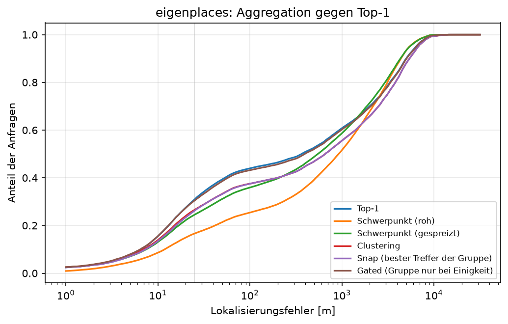
  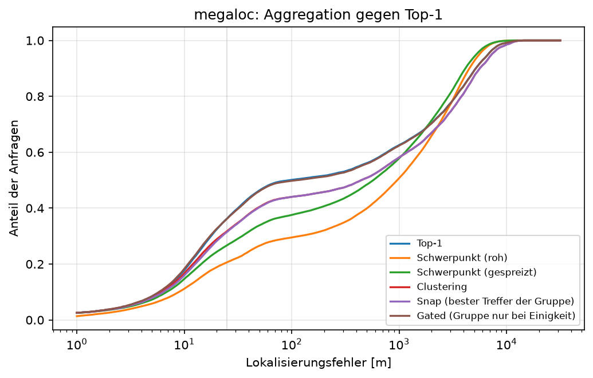
</p>
<p align="center">
  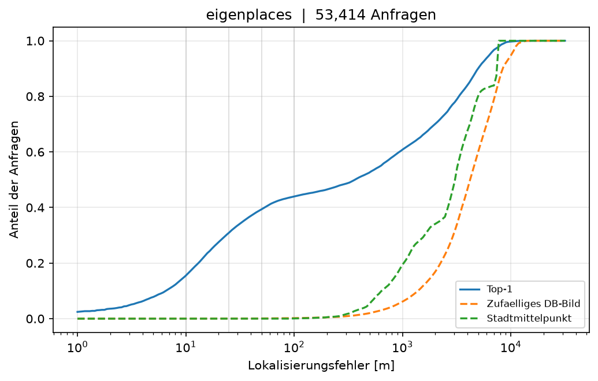
  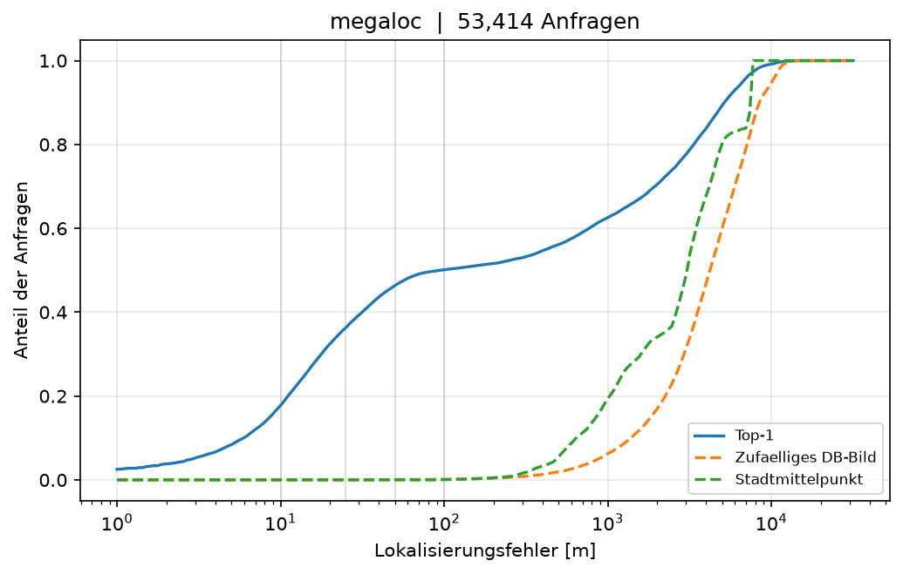
</p>

<sub>Oben fünf Aggregationsverfahren gegen Top-1, links EigenPlaces, rechts
MegaLoc. Unten die Verteilung des Fehlers derselben zwei Encoder.</sub>

```text
Lokalisierung  |  Anteil unter 25 m  |  53,414 Anfragen, Top-10 je Anfrage
Median des Fehlers in Klammern.

Encoder                         Top-1
-------------------------------------
anyloc               0.130 ( 1,420 m)
anyloc_linear        0.214 ( 1,338 m)
clip                 0.046 ( 2,365 m)
clip_linear          0.078 ( 1,853 m)
eigenplaces          0.309 (   364 m)
eigenplaces_linear   0.283 (   758 m)
megaloc              0.363 (    94 m)
megaloc_linear       0.283 ( 1,496 m)
mixvpr               0.272 (   659 m)
mixvpr_linear        0.232 ( 1,335 m)
-------------------------------------
Zufall (DB-Bild)     0.000 ( 4,223 m)

Lesart: liegt Top-1 vorn, sind die Nachbartreffer zu oft falsch, als
dass Mitteln oder Clustern helfen koennte.
```

<sub>Wörtliche Ausgabe von `python compare.py --localization`.</sub>

Bezogen auf alle 53.414 Anfragen, denn eine Koordinate wird immer
geschätzt. **MegaLoc trifft mit dem besten Treffer im Median auf 94 m.**
Fünf Aggregationsverfahren (Schwerpunkt, Clustering, Snap, Gated) sind
gemessen und unterliegen Top-1 bei jedem Encoder — MegaLoc: Clustering
0.318 bei 444 m, Schwerpunkt 0.267 bei 575 m; siehe
[`experiments/localization_aggregation.py`](experiments/localization_aggregation.py)
und [`experiments/README.md`](experiments/README.md).

### Referenzdichte

<p align="center">
  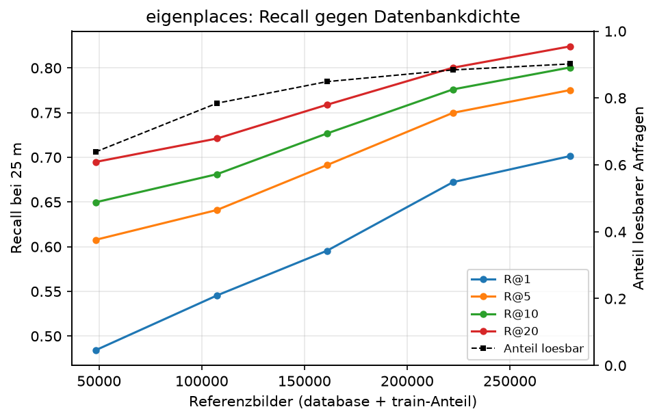
  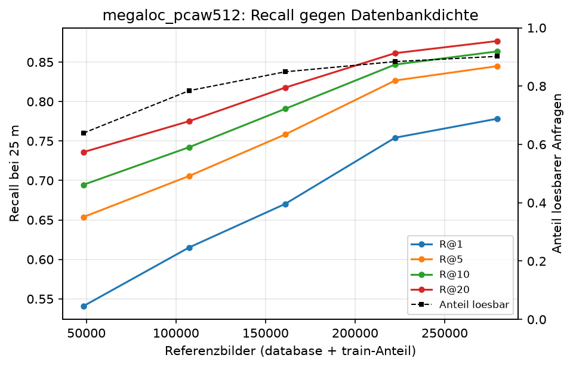
</p>

`train` stufenweise zur Datenbank dazugenommen, R@1 bei 25 m:

```text
train dazu  Referenz  lösbar  EigenPlaces  EP pcaw512  MegaLoc pcaw512
----------------------------------------------------------------------
       0%     48,321   63.9%        0.484       0.507            0.541
      25%    107,449   78.4%        0.545       0.568            0.615
      50%    160,981   84.9%        0.595       0.615            0.670
      75%    222,300   88.4%        0.672       0.688            0.754
     100%    279,453   90.2%        0.701       0.715            0.778
```

<sub>Auszug aus `experiments/results/osnabrueck/database_density_*.json`,
erzeugt von `python experiments/database_density.py` je Encoder. Bei MegaLoc
fehlen der Referenz zwei `train`-Bilder, siehe [Reproduzierbarkeit](#reproduzierbarkeit).</sub>

**Beides steigt gleichzeitig**: mehr Anfragen werden überhaupt
beantwortbar, und der Recall unter den beantwortbaren steigt trotzdem —
obwohl die dazukommenden Anfragen die schwereren sind. Nur für Baselines
sauber, weil der Adapter auf `train` trainiert wurde. Für diese Kurve gibt
es noch kein Bootstrap-Intervall; der Anstieg ist mit +0.22 aber weit
größer als jede Halbbreite unter [Unsicherheit](#unsicherheit).

### Stadtteile

<p align="center">
  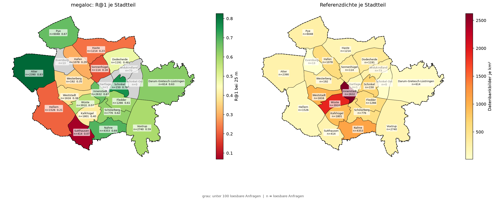
  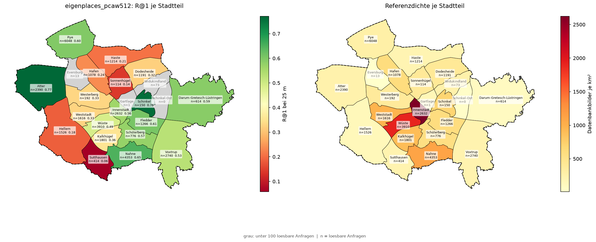
</p>

R@1 von MegaLoc je OSM-Stadtteil reicht von 0.07 (Sutthausen) bis 0.83
(Atter) — Faktor 12 beim selben Encoder, und EigenPlaces ordnet die
Stadtteile praktisch gleich (Spearman 0.96): **die Karte zeigt die Daten,
nicht den Encoder.** Mit der Referenzdichte in Bildern je km² hängt das
nicht zusammen (ρ = 0.27, p = 0.27): die Innenstadt hat die dichteste
Referenz und nur 38 % lösbare Anfragen, Atter ein Zehntel der Dichte und
den besten Recall. Was einen Stadtteil scheitern lässt, steckt in den
Aufnahmen — Blickrichtung (Haste: nur 29 % der lösbaren Anfragen haben einen
Nachbarn, der in dieselbe Richtung schaut), Jahre Abstand (Hellern), oder
eine einzelne Fahrt, die ein Wohnviertel mit einem anderen verwechselt
(Sutthausen: 208 von 414 Anfragen landen in Hellern, 4 km entfernt).
Erzeugt von `python experiments/recall_by_district.py`.

### Ablehnung

<p align="center">
  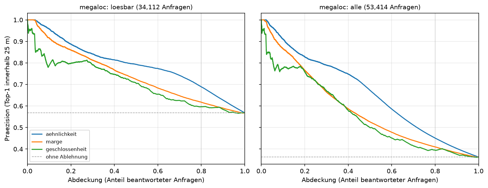
  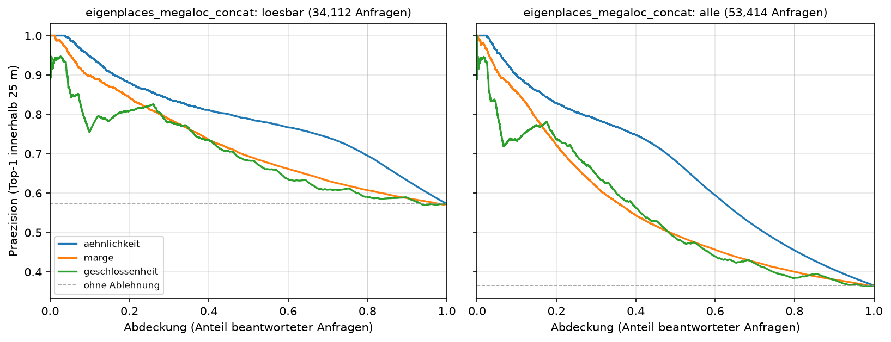
</p>

Darf das System schweigen, wenn es sich nicht sicher ist? Drei
Konfidenzmaße aus der Trefferliste, MegaLoc, Präzision = Top-1 innerhalb
25 m, bei 80, 50 und 20 % beantworteter Anfragen:

```text
Sicht    Konfidenz                     ohne   80 %   50 %   20 %    AUC
-----------------------------------------------------------------------
lösbar   Ähnlichkeit bester Treffer   0.568  0.689  0.793  0.887  0.791
lösbar   Marge zu Platz 2             0.568  0.618  0.724  0.860  0.741
lösbar   Geschlossenheit Top-10       0.568  0.597  0.706  0.798  0.706
alle     Ähnlichkeit bester Treffer   0.363  0.451  0.673  0.828  0.659
alle     Marge zu Platz 2             0.363  0.410  0.526  0.766  0.580
alle     Geschlossenheit Top-10       0.363  0.395  0.500  0.759  0.556
```

<sub>Auszug aus [`experiments/results/osnabrueck/rejection_curve_megaloc.json`](experiments/results/osnabrueck/rejection_curve_megaloc.json),
erzeugt von `python experiments/rejection_curve.py`.</sub>

**Die rohe Ähnlichkeit ist das beste Maß** — in beiden Sichten und bei
jeder Abdeckung; `locate.py` meldet sie als Konfidenz. Bei cos ≥ 0.30 sind
82 % der Antworten richtig (37 % der lösbaren Anfragen), bei cos ≥ 0.20
noch 75 % (69 %).

### Schwierigkeit je Anfrage

<p align="center">
  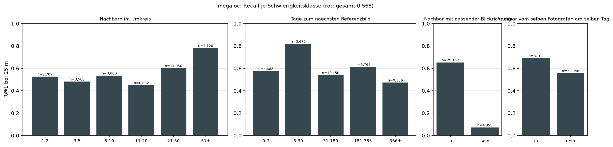
  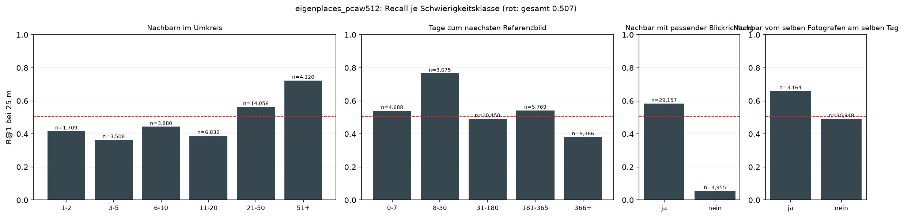
</p>

R@1 nach Eigenschaften der Anfrage, aus den Metadaten; alle Klassen, nicht
nur die auffälligen. Der Balken zeigt MegaLoc; 32 Zeichen entsprächen
R@1 = 1.0:

```text
R@1 bei 25 m je Klasse, 34,112 lösbare Anfragen      n   MegaLoc   EP pcaw512
alle                                         34,112    0.568       0.507   ██████████████████▏
Ein Nachbar schaut in dieselbe Richtung
  ja                                         29,157    0.653       0.583   ████████████████████▉
  nein                                        4,955    0.071       0.055   ██▎
Tage bis zum zeitlich nächsten Nachbarn
  0–7                                         4,688    0.575       0.540   ██████████████████▍
  8–30                                        3,675    0.819       0.766   ██████████████████████████▎
  31–180                                     10,450    0.539       0.491   █████████████████▎
  181–365                                     5,769    0.612       0.543   ███████████████████▋
  über 365                                    9,366    0.473       0.382   ███████████████▏
Nachbarn im Umkreis von 25 m
  1–2                                         1,709    0.526       0.417   ████████████████▉
  3–5                                         3,508    0.481       0.364   ███████████████▍
  6–10                                        3,880    0.535       0.444   █████████████████▏
  11–20                                       6,832    0.448       0.390   ██████████████▍
  21–50                                      14,056    0.601       0.564   ███████████████████▎
  51+                                         4,120    0.781       0.724   █████████████████████████
Nachbar vom selben Konto am selben Tag
  ja                                          3,164    0.690       0.660   ██████████████████████▏
  nein                                       30,948    0.556       0.491   █████████████████▊
```

<sub>Auszug aus `experiments/results/osnabrueck/recall_by_difficulty_*.json`,
erzeugt von `python experiments/recall_by_difficulty.py` (MegaLoc) und mit
`--method eigenplaces_pcaw512`.</sub>

**Die Blickrichtung trennt am schärfsten:** ohne einen Nachbarn, der in
dieselbe Richtung schaut, trifft MegaLoc in 7 % der Fälle, mit einem in
65 %. Zeitabstand und Nachbarzahl wirken schwächer und **nicht monoton** —
8–30 Tage sind die beste Klasse (0.819), 0–7 Tage liegen mit 0.575 nur im
Mittelfeld; bei den Nachbarn hebt sich allein 51+ ab (0.781). Die Dichte
wirkt also als „viele Nachbarn helfen", nicht als „wenige schaden". Ein
Nachbar vom selben Konto am selben Tag hilft sichtbar (0.690 gegen 0.556) —
das ist der Dubletteneffekt aus [Sechs Städte](#sechs-städte) in einer
Stadt. Beide Encoder zeigen dasselbe Muster. Für die Klassen gibt es
kein Bootstrap-Intervall, und einzelne können an wenigen Fahrten hängen;
Unterschiede unter etwa 0.1 sind deshalb nicht belastbar.

### Struktur der Fehler

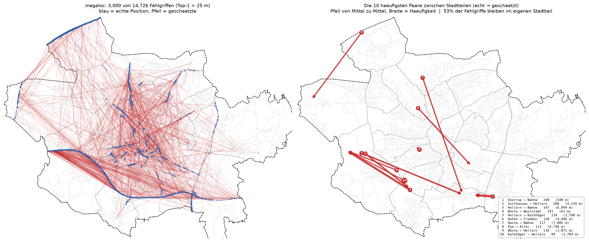

Unter den 14.726 Fehlgriffen von MegaLoc (Top-1 weiter als 25 m, nur
lösbare Anfragen) liegen 45 % unter 100 m — dieselbe Straße, knapp jenseits
der Schwelle — und 44 % über 1 km; nur 11 % dazwischen. 53 % bleiben im
eigenen Stadtteil. Kein Stadtteil-Paar trägt mehr als 1,6 % der Fehlgriffe;
es gibt keine dominante Verwechslung zweier Orte, sondern viele kleine.
Autobahn-Anfragen scheitern nicht öfter als andere (R@1 0.570 gegen 0.565),
ihre Fehlgriffe sind sogar kurz (Median 56 m); die groben Verwechslungen
sitzen in Wohnstraßen. Erzeugt von `python experiments/confusion_atlas.py`.

**Die Karte legt das Gegenteil nahe, und das ist ein Darstellungsartefakt.**
Auf ihr dominieren lange, schnurgerade rote Linien entlang der Autobahn —
ein paar hundert 6-km-Pfeile überdecken optisch zehntausend kurze. Die
Zahlen daneben sagen: die Autobahn stellt 32 % der lösbaren Anfragen, aber
nur 23 % der Fehler über 1 km. Sie ist bei den groben Verwechslungen
**unterrepräsentiert**; überrepräsentiert sind die Wohnstraßen (51 % der
Anfragen, 56 % der groben Fehler). Autobahn-Anfragen aus dem Datensatz zu
nehmen würde den Recall senken, nicht heben.

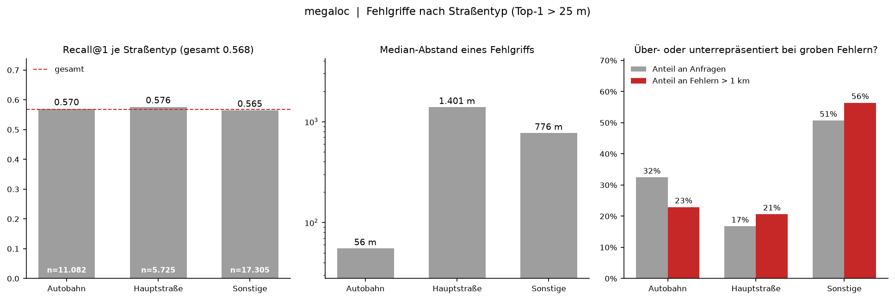

Über alle 53.414 Anfragen (08, auch die unlösbaren) liegt der Median eines
falschen Top-1 bei 1,7 km (MegaLoc) bzw. 1,5 km (EigenPlaces). Beides
zusammen erklärt, warum Aggregation scheitert: bei einer groben
Verwechslung liegen die Nachbarn geschlossen am falschen Ort, und bei einem
knappen Fehlgriff ist der beste Treffer schon die beste Antwort.

### Die Fahrt als Pfad

Der Abschnitt darüber erklärt, warum Aggregation scheitert: die Fehler
benachbarter Frames sind kohärent. Das Aufsummieren der Nachbarlisten
(`seq3`, −0.009) scheitert aber aus **zwei** Gründen, die es nicht trennt —
kohärente Fehler *und* die Forderung, dasselbe Datenbankbild in mehreren
Listen zu finden, was bei 15 % Referenz selten vorkommt.

Ein HMM braucht das zweite nicht. Zustände sind die Top-k *eines* Frames,
die Kandidaten dürfen je Frame andere sein; ein Übergang fragt nur, ob der
Abstand zweier Kandidaten zur verstrichenen Zeit passt. Ein Kandidat sechs
Kilometer abseits fällt, weil man in 0,17 s keine sechs Kilometer fährt.
Die Geschwindigkeit (12,5 m/s) kommt aus den **Datenbank**sequenzen — die
Query-Positionen sind die Ground Truth und gehen nirgends ein.

β = 30 und σ = 25 m sind die Voreinstellungen des Skripts und standen vor
dem Lauf fest (σ ist die Schwelle der Ground Truth, β eine
Ähnlichkeitsskala); berichtet wird diese eine Zeile, nicht die beste aus
einem Sweep.

```text
                          R@1     R@5    R@10    R@20   Viterbi-Pfad R@1
megaloc                 0.568   0.676   0.719   0.763
megaloc_hmm30-25        0.598   0.690   0.725   0.764   0.603
eigenplaces             0.484   0.608   0.650   0.695
eigenplaces_hmm30-25    0.501   0.603   0.633   0.675   0.511

gepaart, R@1             Diff   95-%-Intervall
megaloc → hmm          +0.030   [+0.020, +0.041]
eigenplaces → hmm      +0.017   [+0.006, +0.030]
```

<sub>Auszug aus `results/osnabrueck/evaluation/*_hmm30-25.json` und
`experiments/results/osnabrueck/bootstrap_ci.json`, erzeugt von
`python experiments/sequence_hmm.py --method megaloc` und `--method eigenplaces`.</sub>

**Das ist die einzige Nachbearbeitung im Projekt, die Top-1 schlägt** —
und die einzige, deren Gewinn das Intervall überlebt. Dass diese
Intervalle so viel enger sind als die ±0.10 der Einzelzahl, ist kein
Widerspruch: die Differenz wird **gepaart über dieselben Fahrten**
gemessen, und es ist ja dieselbe Trefferliste, nur anders sortiert — was für
beide Varianten gleich schwer ist, fällt heraus.

Und der Gewinn ist nicht umsonst. Ein Re-Ranking sortiert die Liste nur um:
was nach oben rutscht, verdrängt anderes nach unten. Bei EigenPlaces kostet
das R@5 bis R@20 (0.650 → 0.633 bei k = 10), bei MegaLoc nicht. Wer Top-1
braucht, gewinnt; wer eine Kandidatenliste braucht, verliert womöglich.

Die Erwartung war klein und ist eingetroffen: das HMM greift nur bei
*unzusammenhängenden* Ausreißern, und 88 % der Fehlgriffe sind kohärente
Verwechslungen — eine ganze Fahrt, die geschlossen auf die falsche Straße
zeigt, ist als Pfad genauso konsistent wie die richtige.

### Geometrische Verifikation

<!-- GV-PLATZHALTER. Sobald die Läufe durch sind, den Block unten durch die
     wörtliche Ausgabe von `python experiments/city_comparison.py` ersetzen
     (Abschnitt "Geometrische Verifikation"), die Notiz darunter löschen und
     den Absatz "Befund" schreiben. Danach Befund 5 unter "Ergebnisse auf
     einen Blick" nachziehen. -->

> [!NOTE]
> Die Läufe über alle Anfragen stehen noch aus. Der Block zeigt die
> Struktur, in die sie gehören; was schon feststeht, ist eingetragen,
> offene Werte stehen als „…".

Die einzige Nachbearbeitung, die die **grobe Verwechslung** direkt angreift
— global ähnliche, lokal verschiedene Orte; 44 % der Fehlgriffe von MegaLoc
liegen über einen Kilometer daneben ([Struktur der Fehler](#struktur-der-fehler)). Für jede
Anfrage werden die Top-20 von MegaLoc mit SuperPoint und LightGlue lokal
gematcht, die Matches per RANSAC gegen eine Fundamentalmatrix geprüft und
die Kandidaten nach der Zahl der Inlier neu sortiert; wer unter 15 Inliern
bleibt, behält seine alte Reihenfolge hinter den verifizierten.

**Das Protokoll stand vor dem Lauf fest**, wie beim HMM: `--top-k 20`,
`--min-inliers 15`, `--ransac-px 3.0`, `--max-keypoints 1024`,
`--max-side 640` — die Voreinstellungen des Skripts, nicht an diesen
Anfragen abgestimmt; woher sie kommen, steht in
[`experiments/README.md`](experiments/README.md#geometric_verificationpy--top-k-lokal-nachprüfen).
Berichtet wird diese eine Zeile je Stadt. Verifiziert
werden nur Anfragen, die bei 100 m überhaupt ein Datenbankbild haben; die
übrigen zählen in keinem Recall mit.

```text
Geometrische Verifikation   Top-k nach SuperPoint + LightGlue umsortiert, Differenz gepaart
Stadt               R@1    +GV    dR@1     95-%-Intervall  verif.  Anfragen     h
---------------------------------------------------------------------------------
osnabrueck        0.568      …       …                  …       …    42,010     …
fuerth            0.549      …       …                  …       …    19,957     …
karlsruhe         0.419      …       …                  …       …    71,965     …
kaiserslautern    0.651      …       …                  …       …    54,034     …
wuerzburg         0.336      …       …                  …       …    40,454     …
jena              0.417      …       …                  …       …    91,645     …
```

<sub>Struktur der Ausgabe von `python experiments/city_comparison.py`. Je
Stadt nach `python experiments/geometric_verification.py --n-queries 0` und
danach `python experiments/bootstrap_ci.py`. „Anfragen" ist die Zahl der
lösbaren Anfragen bei 100 m, also das, was verifiziert wird.</sub>

Zusammen sind das rund 320.000 Anfragen oder 6,4 Millionen Bildpaare —
bei den etwa 50 Paaren je Sekunde, die das Skript für eine GPU ansetzt,
rund 36 Stunden; die tatsächliche Rate druckt es am Ende jedes Laufs. Es
speichert die Inlier alle zwei Minuten und setzt nach einem Abbruch dort
fort; der Bootstrap rechnet die Zeile aus den gespeicherten Inliern nach,
ohne ein Bild erneut zu matchen.

Die SuperPoint-Gewichte stehen unter einer **Lizenz nur für
nichtkommerzielle Forschung**; das betrifft allein dieses Skript, siehe
[NOTICE.md](NOTICE.md).

<!-- Befund: … (nach den Läufen) -->

### Laufzeit und Speicher

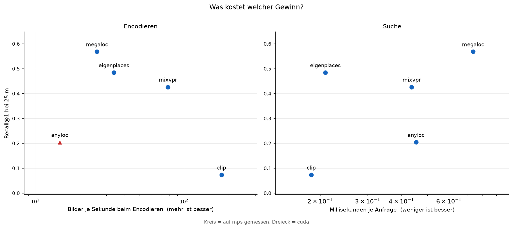

Suche im FAISS-Flat-Index über 48.321 Datenbankbilder, M1 Pro auf der CPU,
8 Threads, Anfragen in Blöcken zu 256:

```text
  Dim  Encoder                            ms je Anfrage     Index  alle Anfragen
--------------------------------------------------------------------------------
  512  alle 512er Varianten, CLIP             0.17–0.19     94 MB         9–10 s
 1024  Verkettung EigenPlaces + MegaLoc            0.11    189 MB            6 s
 2048  EigenPlaces, eigenplaces_pcaw2048           0.21    378 MB           11 s
 4096  AnyLoc, MixVPR, anyloc_pcaw4096        0.44–0.45    755 MB        23–24 s
 8448  MegaLoc                                     0.74  1,557 MB           39 s
```

Encodieren, 200 Bilder je Encoder, inklusive Laden und Dekodieren:

```text
Encoder      Gerät                px  Bilder/s   332,868 Bilder
---------------------------------------------------------------
clip         M1 Pro, MPS         224     178.6           31 min
mixvpr       M1 Pro, MPS         320      77.9           71 min
eigenplaces  M1 Pro, MPS         512      33.8            2.7 h
megaloc      M1 Pro, MPS         322      26.0            3.6 h
anyloc       RTX 3070, CUDA      322      14.6            6.3 h
```

<sub>Beide Auszüge aus [`experiments/results/osnabrueck/timing.json`](experiments/results/osnabrueck/timing.json),
erzeugt von `python experiments/timing.py`. AnyLoc mit fp16 und Batch 4 und
ohne die PCA-Projektion gemessen; auf dem Mac ist es nicht praktikabel.</sub>

**Der Speicher wächst linear mit der Breite, die Suchzeit nicht.** Von 512
auf 8448 Dimensionen wird der Index 16,5-mal größer, die Suche nur 4-mal
langsamer; unterhalb von 2048 trennt die Messung nichts mehr (1024 misst
sogar schneller als 512), dort überwiegt der feste Aufwand je Block. Bei
48.321 Referenzbildern ist das kein Argument — 10 s gegen 39 s für alle
Anfragen —, bei einer Million wäre es eines. Der Encodier-Durchsatz hängt
am Rückgrat und an der Eingabegröße, nicht an der PCA:
`eigenplaces_pcaw512` encodiert genauso schnell wie `eigenplaces`.

**Arbeitsspeicher.** Die eine Zahl, aus der alles folgt, ist die Größe eines
Encodersatzes: `Bilder × Dimension × 4 Byte`. Bei MegaLoc (8448 d) sind das in
Osnabrück 11,2 GB und in Jena — 699.120 Bilder, gut das Doppelte — 23,6 GB.
Solange ein Schritt diese Matrix am Stück im Speicher hält, skaliert er mit
der Stadt, und ein Rechner, der Osnabrück gerade noch schafft, stirbt bei
Jena. Gemessene Spitzen (RSS, MegaLoc, Einzelmessungen):

| Schritt | Osnabrück (GB) | Jena (GB) |
|---|---:|---:|
| 04, Embeddings schreiben | 22,5 → entfällt | 47,2 → entfällt |
| 05, Adapter (fit + val) | 7,8 | 16,2 |
| 06, Retrieval | 5,1 | 11,0 |
| `database_density.py`, letzte Stufe | 11,2 → 6 | 23,6 → 8,3 |
| `full_reference.py` | 6 | 8,3 |

Die Pfeile sind zwei Änderungen. **04** schrieb sein Ergebnis in ein
`np.zeros((n, dim))` und prüfte es danach mit `np.linalg.norm(x, axis=1)` —
das legt ein Temporär in Arraygröße an, also noch einmal 23,6 GB neben den
schon belegten. Genau dort starb bei Jena der Kernel, nach anderthalb Stunden
fertigem Encodieren und ohne Traceback (der OOM-Killer schickt SIGKILL,
nbclient meldet nur `Kernel died`). Jetzt liegt das Ergebnis von der ersten
Zeile an als memmap auf der Platte, ist damit zugleich der Wiedereinstieg
nach einem Absturz, und 04 prüft blockweise; der Speicherbedarf hängt nur
noch am Modell und am Batch — was davon übrig bleibt, ist nicht mehr
gemessen, aber es ist die Größe, die auch `locate.py` mit einer Handvoll
Bilder belegt, nicht die der Stadt. **`database_density.py`** und
`full_reference.py` bauten einen `faiss.IndexFlatIP` über alle
Referenzbilder — `database` plus `train`, in Jena 584.388 Bilder oder
19,8 GB. Der Index behält jeden Vektor, den er bekommt, die standen also
ein zweites Mal im Speicher, neben den Anfragen. Beide suchen jetzt über
`src.retrieval.blockwise_search`: ein Index je 65.536 Referenzbilder, die
Top-k über die Blöcke zusammengeführt. Das Ergebnis ist identisch, geprüft
gegen einen einzelnen Index.

Wer eine dritte Stadt rechnet, rechnet vorher diese eine Multiplikation. Die
Bilderzahl steht nach 01 im Audit, die Dimension in der Tabelle oben.

### Abbildungen

`results/<stadt>/figures/evaluation/` — `vergleich_r1_25m.png` (R@1 je Zeile mit
Bootstrap-Intervall, liegende Balken nach Wert sortiert, Farbe = Encoder),
`vergleich_recall_k_25m.png` und `vergleich_schwellen.png` (Kurven, Farbe =
Encoder, gestrichelt = Adapter). Mit `--derived` heißen sie `_derived` und
werden zu kleinen Vielfachen: ein Feld je Encoder, Farbe und Markerform =
Deskriptorvariante, Linienstil = Adapter bzw. Sequenz. 39 Zeilen in eine
Legende zu zwingen war vorher der Punkt, an dem die Abbildung unlesbar wurde.

<p align="center">
  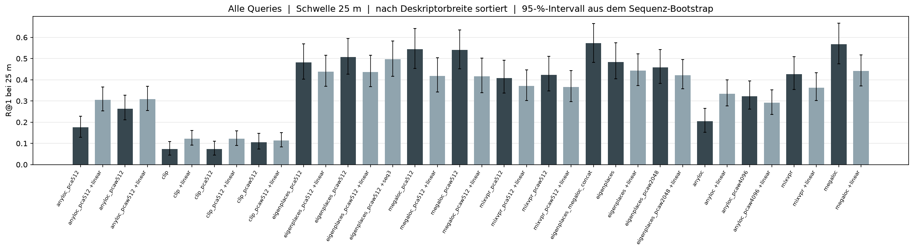
  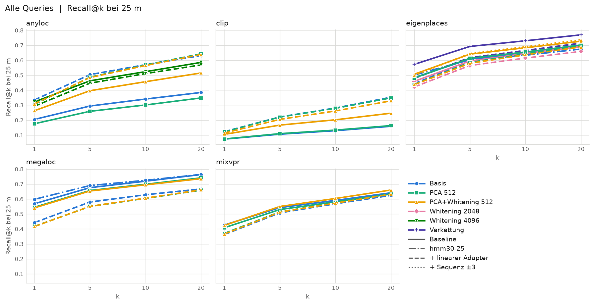
</p>

`results/<stadt>/figures/localization/` —
je Encoder die Fehlerverteilung. `results/<stadt>/figures/demo/` — Trefferreihen,
Karten auf dem Straßennetz, Encoder-Vergleich. `experiments/results/` —
Dichtekurven, Stadtteilkarten, Verwechslungsatlas.

## Mögliche Erweiterungen

**Bewusst vereinfacht.** Ein Split-Seed, eine Stadt, eine Auflösung je
Encoder. AnyLoc wurde zunächst ohne Whitening verglichen — das ist für
VLAD unüblich und kostete 0,12 R@1; die gewhitente Variante steht als
eigene Zeile in der Tabelle, in `04` eingebaut ist sie nicht. Das ist
Absicht: `anyloc` soll bleiben, was seine Autoren veröffentlicht haben,
und was Whitening bringt, sagt die abgeleitete Zeile sauberer als ein
verändertes Original.

**Weitere Städte.** Seit `src/paths.py` hat jede Stadt ihren eigenen
Zweig in `data/`, `results/` und `experiments/results/`. Gerechnet sind
Osnabrück (Standard), Jena, Fürth, Kaiserslautern, Karlsruhe und Würzburg;
die Auswertung darüber steht unter [Sechs Städte](#sechs-städte). Der ganze
Weg für eine weitere: `VPR_CITY` sticht `city`, ohne die Datei zu ändern.
Erst die Pipeline ab 01, erzwungen — Kacheln und Split, Audit, Bilder, dann
04 bis 08 mit dem Encoder aus der `config.yaml`:

```bash
VPR_CITY="Kaiserslautern, Germany" python run.py --from 01
```

danach die übrigen Encoder; was schon passt, wird übersprungen:

```bash
VPR_CITY="Kaiserslautern, Germany" python run.py --method all
```

Die Form `VAR=wert befehl` gilt in bash, zsh und fish (ab 3.1) gleich und
setzt die Variable nur für diesen einen Aufruf.

Vorher lohnt `python experiments/city_coverage.py "Stadt, Land"`: eine
Minute je Stadt, kein Bilddownload, und die Metadaten sagen schon, ob sich
der Durchgang lohnt — Panoramaanteil, Sequenzstruktur, Straßenabdeckung.
Es fragt die Mapillary-API und Overpass ab und braucht dafür den
`MAPILLARY_TOKEN` aus der `.env`.

Drei Dinge lohnen dabei den Blick:

1. **Die Stadtgrenze.** 01 druckt Fläche, `osm_type/osm_id` und die
   Kachelzahl. Passt die Fläche nicht (Stadt Osnabrück 119,7 km², der
   gleichnamige Landkreis rund 2.100), hat Nominatim den Kreis geliefert —
   dann `city` präziser angeben, etwa `"Stadt Osnabrück, Niedersachsen,
   Germany"`. Kopenhagen liefert über `"Copenhagen, Denmark"` ein
   3,1-km²-Objekt statt der Stadt; dänische Städte hängen als *Kommune* in
   OSM.
2. **Der Split entsteht neu.** `data/<stadt>/processed/*_sequences.txt`
   existiert für eine neue Stadt noch nicht, also würfelt `src/split.py`
   mit `split_seed`. Ab dem zweiten Lauf werden die Listen übernommen —
   das ist der Grund, warum eine abgebrochene Kachel in 01 hart abbricht
   statt nur zu warnen: der Split würde sonst aus unvollständigen Daten
   gezogen und eingefroren.
3. **Overpass.** Straßennetz und Stadtteile in 01 kommen von einem
   öffentlichen, geteilten Dienst, und `cache/` ist gitignored — auf einem
   frischen Rechner läuft jede Abfrage das erste Mal wirklich. Fällt sie
   aus, sagt 01 das und läuft zu Ende; der Datensatz steht da längst. Die
   Karten holt ein erneuter Lauf von 01 später nach — der Split wird dabei
   aus den `*_sequences.txt` übernommen, nicht neu gewürfelt. Dauerhaft zäh: `osm.timeout_s` hoch, oder einen Spiegel über
   `VPR_OVERPASS_URL` setzen.

Ein Encoder auf einer Stadt von Osnabrücks Größe kostet auf dem M1 Pro eine
Nacht (04) plus Minuten (06–08). Auf Mapillary dichter erschlossen als Osnabrück (2.808
Bilder/km²) sind etwa Erlangen (7.943), Mainz (6.593), Jena (6.113),
Würzburg (4.895) und Heidelberg (4.879);
Bamberg (25.248/km², 1,38 Mio. Bilder auf 55 km²) ist ein Sonderfall.

**Nächster Schritt.** Die geometrische Verifikation
([`experiments/geometric_verification.py`](experiments/geometric_verification.py))
ist gebaut, ihre Läufe über alle Anfragen der sechs Städte stehen aus; die
Zahlen gehören unter [Geometrische Verifikation](#geometrische-verifikation).
Sie ist der einzige Hebel, der die grobe Verwechslung direkt angreift:
global ähnliche, lokal verschiedene Orte. Wie groß der Gewinn ausfällt, ist
bis dahin nicht belegt.

Danach bleibt als einziger offener Punkt ein **zweiter Split-Seed**: alle
Zahlen stehen auf `split_seed: 42`, und wie viel davon am Seed hängt, ist
nicht gemessen.

**An den Fremd-Repositories.** MixVPR hat keine Lizenzdatei. AnyLocs
Download-Links für das Vokabular sind tot; `setup_external.py` holt es aus
der HuggingFace-Space, und die Datei heißt dort `c_centers.pt`, während das
README des Projekts `c_center.pt` nennt. AnyLocs `VLAD.generate()` legt
Zwischenergebnisse auf der CPU an und bricht mit CUDA-Tensoren ab.

## Befehlsreferenz

Alles, was dieses Projekt ausführt, an einer Stelle; was es bedeutet, steht
oben unter [Nutzung](#nutzung). **Ein Block, ein Befehl:** das Kopiersymbol
oben rechts in jedem Block übernimmt genau diesen Aufruf, ohne Kommentar,
lauffähig in bash, zsh und fish. Jeder Aufruf kennt `--help`. Für eine
andere Stadt `VPR_CITY="Jena, Germany"` voranstellen; ebenso stechen
`VPR_METHOD`, `VPR_ADAPTER`, `VPR_IMAGE_ROOT`, `VPR_IMAGE_PATH` und
`VPR_OVERPASS_URL` die `config.yaml`.

<details open>
<summary><b>Pipeline</b> — 01 bis 08 und was dafür nötig ist</summary>

Alles, was nötig ist; überspringt, was schon zur `config.yaml` passt:

```bash
python run.py
```

Welche Encoder auf diesem Rechner vollständig vorliegen:

```bash
python run.py --bestand
```

Ein anderer Encoder, ohne die `config.yaml` zu ändern (auch `clip,mixvpr`):

```bash
python run.py --method mixvpr
```

Alle echten Encoder, je ohne und mit Adapter:

```bash
python run.py --method all --adapter all
```

Ab einer Stufe, erzwungen:

```bash
python run.py --from 06
```

Alles neu:

```bash
python run.py --force
```

Fremd-Repos, Gewichte und Vokabular für AnyLoc und MixVPR:

```bash
python setup_external.py
```

</details>

<details>
<summary><b>Vergleichen und anwenden</b> — Tabellen, Abbildungen, eigenes Foto, Tests</summary>

Die Recall-Tabelle mit 95-%-Intervallen:

```bash
python compare.py --ci
```

Dazu alle PCA-, Whitening-, Verkettungs- und Sequenz-Zeilen:

```bash
python compare.py --derived
```

Eine andere Schwelle (5, 10, 25, 50, 100 m):

```bash
python compare.py --threshold 5
```

Die strengere Ground Truth; ebenso `"Blickrichtung: Treffer nur bei <= 90 Grad Abweichung"`:

```bash
python compare.py --split "Hard: anderer creator_id ODER > 180 Tage Abstand"
```

Das zweite Protokoll, database + train als Referenz:

```bash
python compare.py --reference full --ci
```

Lokalisierung, Anteil unter 25 m und Median je Encoder:

```bash
python compare.py --localization
```

Die Vergleichsabbildungen nach `results/<stadt>/figures/evaluation/`; mit `--derived` als kleine Vielfache:

```bash
python compare.py --plot
```

Ein eigenes Foto verorten:

```bash
python locate.py foto.jpg
```

Tests und Linter, wie im CI:

```bash
pytest tests/ -q
```

```bash
ruff check .
```

</details>

<details>
<summary><b>Abgeleitete Encoder</b> — PCA, Whitening, Verkettung</summary>

PCA- und Whitening-Varianten als eigene Encoder schreiben:

```bash
python experiments/pca_reduce.py
```

Zwei Encoder verketten:

```bash
python experiments/concat_embeddings.py
```

Danach die Pipeline über alle Varianten:

```bash
python run.py --method derived --adapter all
```

</details>

<details>
<summary><b>Unsicherheit und zweites Protokoll</b></summary>

Konfidenzintervalle für alle Zeilen, rund eine Minute:

```bash
python experiments/bootstrap_ci.py
```

database + train als Referenz, alle Baselines; danach der Bootstrap dafür mit `--reference full`:

```bash
python experiments/full_reference.py
```

</details>

<details>
<summary><b>Woran es scheitert</b> — Standard ist MegaLoc, anderer Encoder mit <code>--method</code></summary>

R@1 gegen Nachbarzahl, Zeitabstand, Blickrichtung, Konto:

```bash
python experiments/recall_by_difficulty.py
```

Recall je Stadtteil, als Karte:

```bash
python experiments/recall_by_district.py
```

Wohin die Fehlgriffe zeigen, Karte und Straßentyp:

```bash
python experiments/confusion_atlas.py
```

Präzision gegen Abdeckung — welche Konfidenz taugt:

```bash
python experiments/rejection_curve.py
```

Recall gegen Referenzdichte (Standard: EigenPlaces):

```bash
python experiments/database_density.py
```

</details>

<details>
<summary><b>Nachbearbeitung der Top-k</b></summary>

Fünf Aggregationsverfahren gegen Top-1:

```bash
python experiments/localization_aggregation.py
```

Dieselbe Fahrt als Pfad, das HMM; die Zeile im README ist MegaLoc und EigenPlaces:

```bash
python experiments/sequence_hmm.py --method megaloc
```

Trefferlisten benachbarter Frames aufsummieren (Standard: `eigenplaces_pcaw512`):

```bash
python experiments/sequence_retrieval.py
```

Geometrische Verifikation über alle Anfragen, braucht Bilder und eine GPU, setzt nach Abbruch fort:

```bash
python experiments/geometric_verification.py --n-queries 0
```

Mapillary-Detections als Re-Ranking-Signal, und ob sie überhaupt taugen:

```bash
python experiments/detection_rerank.py
```

```bash
python experiments/detection_probe.py
```

</details>

<details>
<summary><b>Städte, Laufzeit, Abbildungen fürs README</b></summary>

Straßenabdeckung einer Stadt, nur aus Metadaten, eine Minute; braucht den `MAPILLARY_TOKEN`:

```bash
python experiments/city_coverage.py "Heidelberg, Germany"
```

Dieselbe Pipeline über alle gerechneten Städte, liest nur Versioniertes:

```bash
python experiments/city_comparison.py
```

Bilder/s, ms je Anfrage, Indexgröße. Auf dem Mac in zwei Aufrufen, weil
Torch und FAISS dort im selben Prozess abstürzen können:

```bash
python experiments/timing.py --skip-search
```

```bash
python experiments/timing.py --skip-encode
```

Beispielbilder je Szenentyp als Kontaktabzug, dann die Auswahl mit `--ids`:

```bash
python experiments/beispielbilder.py --szenen
```

</details>

## Team

| GitHub | Name |
|---|---|
| [@nbomers](https://github.com/nbomers) | Noah Bomers |
| [@D4ne2kk](https://github.com/D4ne2kk) | Niels Dähne |
| [@eknight04](https://github.com/eknight04) | Erasmus Ritter | 

Entwickelt wird in Feature-Branches, `main` bleibt lauffähig; vor dem Push
`git pull --rebase origin main`, damit die Historie linear bleibt — **außer
der Commit enthält Ergebnis-JSONs**. Deren `code_version.commit` zeigt nach
einem Rebase auf einen Commit, den es nicht mehr gibt, und
`tests/test_results.py` schlägt an; dann `git pull` mit Merge.
Notebook-Ausgaben entfernt `nbstripout` beim Commit von selbst, `ruff` und
`pytest` laufen bei jedem Push.

## Credits

**Genutzte Repositories und Datensätze**

| | Lizenz | Verwendung |
|---|---|---|
| [Mapillary](https://www.mapillary.com) — Bilder und Metadaten | [CC BY-SA 4.0](https://www.mapillary.com/terms) | Datensatz: 332.868 Straßenbilder aus Osnabrück samt GPS, Kompass, Sequenz |
| [AnyLoc](https://github.com/AnyLoc/AnyLoc) | BSD-3-Clause | VLAD über DINOv2-Merkmale, Domänen-Vokabular |
| [DINOv2](https://github.com/facebookresearch/dinov2) | Apache-2.0 | ViT-G/14-Gewichte, von AnyLoc über `torch.hub` geladen |
| [EigenPlaces](https://github.com/gmberton/EigenPlaces) | MIT | vortrainierter ResNet-50-Encoder, lädt Teile von [CosPlace](https://github.com/gmberton/CosPlace) (MIT) |
| [MegaLoc](https://github.com/gmberton/MegaLoc) | MIT | vortrainierter Encoder; Code über `torch.hub`, Gewichte über [Hugging Face](https://huggingface.co/gberton/MegaLoc) |
| [MixVPR](https://github.com/amaralibey/MixVPR) | keine Lizenzdatei im Repository | vortrainierter ResNet-50-Encoder und Gewichte |
| [CLIP](https://github.com/openai/CLIP) über 🤗 Transformers | MIT | ViT-B/32 als Baseline ohne VPR-Training |
| [LightGlue](https://github.com/cvg/LightGlue) | Apache-2.0 | lokales Matching für die geometrische Verifikation |
| [SuperPoint](https://github.com/magicleap/SuperPointPretrainedNetwork) | [Magic Leap, nur nichtkommerziell](https://github.com/magicleap/SuperPointPretrainedNetwork/blob/master/LICENSE) | Merkmalsdetektor der geometrischen Verifikation, mit LightGlue installiert |
| [FAISS](https://github.com/facebookresearch/faiss) | MIT | die Suche in 06 |
| [OSMnx](https://github.com/gboeing/osmnx) / OpenStreetMap | MIT / [ODbL](https://www.openstreetmap.org/copyright) | Stadtgrenze, Straßennetz, Stadtteile |

Die Mapillary-Bilder werden von Mapillary vor der Veröffentlichung
automatisch unkenntlich gemacht — Gesichter und Kennzeichen sind verpixelt.
Der Bildbestand liegt nicht im Repository, sondern wird über
`03_image_download` mit eigenem API-Token geladen; nur die Abbildungen
unter `results/<stadt>/figures/demo/` zeigen einzelne Bilder, mit einem Link
je Bild in [`QUELLEN.md`](results/osnabrueck/figures/demo/QUELLEN.md). Die
CC-BY-SA-Lizenz verlangt Namensnennung des Urhebers und Weitergabe unter
gleichen Bedingungen; wer abgeleitete Datensätze veröffentlicht, muss das
beachten.

**Werkzeuge**

- [claude.ai](https://claude.ai) — Unterstützung bei Recherche und Entwicklung

**Literatur**

- CLIP — Radford et al., *Learning Transferable Visual Models From Natural Language Supervision*, ICML 2021
- DINOv2 (Basis von AnyLoc und MegaLoc) — Oquab et al., *DINOv2: Learning Robust Visual Features without Supervision*, TMLR 2024
- AnyLoc — Keetha et al., *AnyLoc: Towards Universal Visual Place Recognition*, IEEE RA-L 2023
- MixVPR — Ali-bey, Chaib-draa, Giguère, *MixVPR: Feature Mixing for Visual Place Recognition*, WACV 2023
- EigenPlaces — Berton, Trivigno, Caputo, Masone, *EigenPlaces: Training Viewpoint Robust Models for Visual Place Recognition*, ICCV 2023
- MegaLoc — Berton, Masone, *MegaLoc: One Retrieval to Place Them All*, CVPR Workshops 2025, S. 2886–2892 ([arXiv 2502.17237](https://arxiv.org/abs/2502.17237))
- VLAD — Jégou, Douze, Schmid, Pérez, *Aggregating local descriptors into a compact image representation*, CVPR 2010
- PCA-Whitening für VLAD — Jégou, Chum, *Negative evidences and co-occurences in image retrieval: The benefit of PCA and whitening*, ECCV 2012
- MSLS — Warburg et al., *Mapillary Street-Level Sequences: A Dataset for Lifelong Place Recognition*, CVPR 2020
- SuperPoint — DeTone, Malisiewicz, Rabinovich, *SuperPoint: Self-Supervised Interest Point Detection and Description*, CVPR Workshops 2018
- LightGlue — Lindenberger, Sarlin, Pollefeys, *LightGlue: Local Feature Matching at Light Speed*, ICCV 2023
- FAISS — Johnson, Douze, Jégou, *Billion-scale similarity search with GPUs*, IEEE Transactions on Big Data 2019

## Lizenz

Der **Code** steht unter der [MIT-Lizenz](LICENSE).

Nicht darunter fallen die Mapillary-Daten, die OSM-Geodaten, die geklonten
Fremd-Repositories unter `external/` und alle Modellgewichte. Was genau
davon im Repository liegt, unter welcher Lizenz, und welche Namensnennung
dazugehört, steht in [NOTICE.md](NOTICE.md). Zwei Einträge dort schränken
die Nutzung ein: **SuperPoint** nur für nichtkommerzielle Forschung
(betrifft allein die geometrische Verifikation), **MixVPR** ohne
Lizenzdatei.

**Kurz:** Die Bilder liegen nicht hier, die **Metadaten schon** —
`data/<stadt>/processed/metadata.parquet`, rund 66 MB über sechs Städte,
unter CC BY-SA 4.0. Wer daraus abgeleitete Datensätze veröffentlicht, muss
sie unter denselben Bedingungen weitergeben und Mapillary nennen. Die Karten
enthalten OSM-Daten (ODbL, © OpenStreetMap-Mitwirkende).

### Personenbezug

Gesichter und Kennzeichen macht Mapillary vor der Veröffentlichung
automatisch unkenntlich — das betrifft die **Bilder**. Die **Metadaten**
enthalten `creator_id`, eine pseudonyme Konto-ID, zusammen mit `lat`, `lon`
und `captured_at`: je Konto also eine Aufnahmespur durch die Stadt.

Das steht nicht zum Schmuck dort. Die „Hard"-Ground-Truth (*anderer
Fotograf oder mehr als 180 Tage Abstand*) braucht genau diesen Vergleich,
und ohne ihn ließe sich der Dubletteneffekt im Städtevergleich — der
größte einzelne Messeffekt des Projekts, bis zu 0.204 R@1 — nicht messen.
Gebraucht wird dabei nur, **ob** zwei Bilder vom selben Konto stammen, nie
wessen Konto es ist; die IDs werden nirgends aufgelöst oder verknüpft.

> [!IMPORTANT]
> Wer das Repository weiterverwendet, sollte das wissen: es ist ein
> Benchmark-Datensatz, kein anonymisierter.

[^p]: Zu den p-Werten: `scipy.stats.spearmanr` liefert bei perfekter
    Monotonie eine 0, weil seine t-Näherung dort durch eine verschwindende
    Varianz teilt. `city_comparison.py` zählt deshalb die Permutationen
    durch. Bei n = 4 ist der exakte Wert 0.083 — da ist überhaupt nichts
    signifikant zu bekommen, unabhängig von den Daten.
