# VPR Osnabrück — Visual Place Recognition auf Mapillary-Bildern

[Begriffe](#begriffe-in-einem-satz) ·
[Ergebnisse](#ergebnisse-auf-einen-blick) ·
[Schnellstart](#schnellstart) ·
[Nutzung](#nutzung) ·
[Ausführliche Ergebnisse](#ergebnisse) ·
[Befehle](#befehlsreferenz) ·
[**Nebenuntersuchungen →**](experiments/README.md)

[](https://github.com/nbomers/VisualPlaceRecognition/actions/workflows/check.yml)
[](#installation)
[](LICENSE)
[](NOTICE.md)
[](#daten)
[](#sechs-städte)

Projekt im Rahmen des Programmierpraktikums an der **Universität Osnabrück**.

**Ein Straßenfoto rein, ein Ort raus.** Das System vergleicht das Foto mit
verorteten Referenzbildern aus Osnabrück und gibt die Koordinate des
ähnlichsten zurück — dazu eine Konfidenz und die Treffer selbst:

```bash
python locate.py foto.jpg
```

Die Encoder kommen fertig trainiert. Der Eigenanteil ist der **Benchmark**
drumherum: ein Split nach Fahrten statt nach Bildern, drei Definitionen von „richtig",
Konfidenzintervalle, Fingerabdrücke gegen vertauschte Dateien — und damit
40 vergleichbare Varianten von fünf Encodern in sechs Städten.

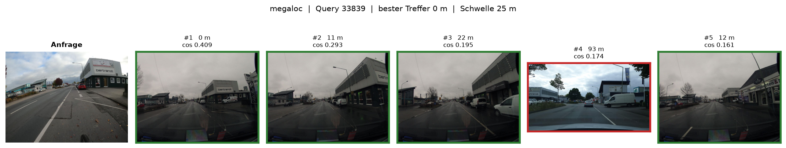

<sub>Links das Anfragebild, rechts die fünf ähnlichsten Referenzbilder von
MegaLoc; grün = höchstens 25 m vom echten Ort. Bilder von
[Mapillary](https://www.mapillary.com), CC BY-SA 4.0, Urheber je Bild in
[QUELLEN.md](results/osnabrueck/figures/demo/QUELLEN.md).</sub>

> [!TIP]
> **Dieses README fasst zusammen. Wie jede Zahl entstanden ist** — Methode,
> alle Tabellen, Abbildungen und offene Fragen zu jeder Nebenuntersuchung —
> steht in **[`experiments/README.md`](experiments/README.md)**.

---

## Inhalt

| Verstehen | Benutzen | Nachprüfen |
|---|---|---|
| [Begriffe in einem Satz](#begriffe-in-einem-satz) | [Schnellstart](#schnellstart) | [Ergebnisse im Detail](#ergebnisse) |
| [Ergebnisse auf einen Blick](#ergebnisse-auf-einen-blick) | [Installation](#installation) | [Reproduzierbarkeit](#reproduzierbarkeit) |
| [Das Projekt](#das-projekt) | [Nutzung](#nutzung) | [Grenzen](#grenzen-und-nächste-schritte) |
| [So funktioniert es](#so-funktioniert-es) | [Projektstruktur](#projektstruktur) | [Nebenuntersuchungen](experiments/README.md) |
| [Daten](#daten) | [Befehlsreferenz](#befehlsreferenz) | [Lizenz](#lizenz) · [KI-Nutzung](#ki-nutzung) |

---

## Begriffe in einem Satz

| Begriff | Bedeutung |
|---|---|
| **VPR** | *Visual Place Recognition*: den Aufnahmeort eines Fotos finden, indem man es mit Bildern bekannter Orte vergleicht. |
| **Anfrage, Referenz** | Die **Anfrage** (*query*) ist das Foto, dessen Ort gesucht wird. Die **Referenz** (*database*) sind Bilder mit bekanntem Ort. |
| **Encoder, Embedding** | Ein neuronales Netz (Encoder) macht aus jedem Bild einen Zahlenvektor (Embedding). Ähnliche Orte ergeben ähnliche Vektoren. |
| **cos** | Ähnlichkeit zweier Embeddings, von −1 bis 1. Der beste Treffer ist das Referenzbild mit dem höchsten cos. |
| **Recall@1 (R@1)** | Anteil der Anfragen, bei denen der beste Treffer höchstens 25 m vom echten Ort liegt. **0.568 heißt: 56,8 % richtig.** R@5: irgendeiner der fünf besten. |
| **lösbar** | Anfrage mit mindestens einem Referenzbild im Umkreis von 25 m. Nur diese zählen im Recall — was nicht in der Referenz liegt, findet kein Modell. |
| **Ground Truth** | Die Regel für „richtig". **Standard:** höchstens 25 m. **Hard:** zusätzlich ein anderes Konto oder mehr als 180 Tage Abstand. **Blickrichtung:** zusätzlich höchstens 90° Kompassabweichung. |
| **Fahrt, Sequenz** | Eine zusammenhängende Aufnahmeserie, alle 0,17 s ein Bild. Train, Referenz und Anfragen werden **nach Sequenzen** getrennt, nie nach Einzelbildern. |
| **Benchmark, volle Referenz** | Zwei Protokolle. Benchmark: 15 % der Sequenzen als Referenz (48.321 Bilder). Volle Referenz: alle 279.453 Bilder, die keine Anfrage sind. |
| **95-%-Intervall** | Bereich, in dem der wahre Wert mit 95 % Sicherheit liegt. Gerechnet, indem die 198 Anfrage-Fahrten 1.000-mal neu gezogen werden (*Bootstrap*). |
| **gepaarte Differenz** | Unterschied zweier Varianten auf denselben Anfragen — viel genauer als zwei Einzelzahlen. **„Belegt"** heißt: ihr Intervall schließt 0 aus. |
| **Adapter** | Eine kleine nachtrainierte Schicht über einem festen Encoder. |
| **PCA, Whitening** | Feste Rechenvorschriften ohne Training: PCA verkürzt einen Vektor, Whitening gewichtet seine Achsen gleich. |

---

## Ergebnisse auf einen Blick

Fünf Encoder, dieselben 53.414 Anfragen aus Osnabrück, R@1 bei 25 m:

| Encoder | für Orte trainiert | Dim | volle Referenz | voll, ohne Zwillinge | voll, Hard | Benchmark |
|---|:---:|---:|---:|---:|---:|---:|
| **MegaLoc** | ja | 8448 | **0.798** <sub>[0.739, 0.848]</sub> | **0.690** | **0.523** | **0.568** <sub>[0.475, 0.666]</sub> |
| **EigenPlaces** | ja | 2048 | 0.701 <sub>[0.630, 0.765]</sub> | 0.593 | 0.427 | 0.484 <sub>[0.405, 0.574]</sub> |
| MixVPR | ja | 4096 | 0.653 <sub>[0.575, 0.724]</sub> | — | 0.373 | 0.426 <sub>[0.354, 0.509]</sub> |
| AnyLoc | nein | 4096 | 0.435 <sub>[0.343, 0.533]</sub> | — | 0.148 | 0.204 <sub>[0.153, 0.265]</sub> |
| CLIP | nein | 512 | 0.232 <sub>[0.144, 0.349]</sub> | — | 0.024 | 0.073 <sub>[0.044, 0.108]</sub> |
| *Raten* | | | *0.0005* | | | *0.0006* |

<sub>Klein dahinter das 95-%-Intervall. Die drei „voll"-Spalten nutzen dieselbe Referenz und zählen
verschieden streng: alle Treffer; ohne doppelt hochgeladene Fahrten (gemessen für die zwei stärksten
Encoder); Hard = nur Treffer von einem anderen Konto oder mit mehr als 180 Tagen Abstand. Warum das
nötig ist: [Zwillingsfahrten](#zwillingsfahrten). Varianten mit
PCA, Whitening, Adapter und Nachbearbeitung: [Benchmark-Protokoll](#benchmark-protokoll).</sub>

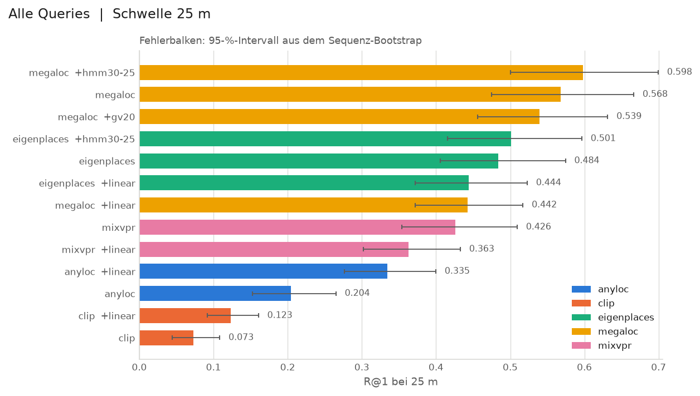

> [!NOTE]
> **So liest man das Balkendiagramm.**
> - Jeder Balken ist der R@1 einer Variante im Benchmark-Protokoll; die Farbe ist der Encoder.
> - `+linear` = mit Adapter, `+hmm30-25` = Fahrt als Pfad gelesen, `+gv20` = geometrisch nachgeprüft.
> - Der **schwarze Strich** ist das 95-%-Intervall: dort liegt der wahre Wert mit 95 % Sicherheit.
>   Er ist breit (±0.10), weil die Stichprobe aus 198 Fahrten besteht, nicht aus 53.414 unabhängigen Bildern.
> - Überlappende Striche heißen **nicht** „kein Unterschied" — das entscheidet die
>   [gepaarte Differenz](#unsicherheit).

**Acht Befunde.** Jeder ist gemessen; „belegt" heißt, das Intervall schließt 0 aus.

| | Befund | Kernzahl | Mehr |
|---|---|---|---|
| 1 | **Der Encoder ist der größte Hebel.** | CLIP → MegaLoc +0.496 [+0.405, +0.590], belegt. Die Rangfolge bleibt auch auf 512 Dimensionen. | [Recall](#wie-gut-findet-das-system-den-ort) |
| 2 | **Mehr Referenz hilft — ein Teil davon sind Zwillinge.** | Benchmark 0.568 → volle Referenz 0.798. Ohne doppelt hochgeladene Fahrten 0.550 → **0.690**: +0.14 statt +0.23. | [Zwillingsfahrten](#zwillingsfahrten) |
| 3 | **Entscheidend ist ein Vergleichsbild in derselben Blickrichtung.** | 0.653 mit, 0.071 ohne. | [Woran es scheitert](#woran-es-scheitert) |
| 4 | **Nachtrainieren schadet den guten Encodern.** | MegaLoc mit Adapter −0.126 [−0.179, −0.073]. Der Gewinn bei CLIP war Whitening. | [Adapter](experiments/README.md#adapter-diagnose--adapter_diagnosepy) |
| 5 | **Nachbearbeitung hilft kaum — nur die Fahrt als Pfad.** | HMM +0.030 [+0.020, +0.041], belegt. Geometrische Verifikation −0.029, nicht belegt. | [Nachbearbeitung](#was-nachbearbeitung-bringt) |
| 6 | **Fehler kommen geschlossen.** | 45 % der Fehlgriffe liegen unter 100 m, 44 % über 1 km. | [Struktur der Fehler](#struktur-der-fehler) |
| 7 | **cos ist eine brauchbare Konfidenz.** | Bei cos ≥ 0.30 sind 82 % der Antworten richtig. | [Ablehnung](#wie-sicher-ist-eine-antwort) |
| 8 | **Eine Stadt ist keine Aussage über ein Verfahren.** | R@1 schwankt zwischen Städten von 0.336 bis 0.651; der Abstand MegaLoc − EigenPlaces nur von +0.073 bis +0.114, in jeder Stadt belegt. | [Sechs Städte](#sechs-städte) |

---

## Schnellstart

**Nur die Ergebnisse ansehen** — kein Download, keine GPU. Die Ergebnisdateien liegen im Git:

```bash
git clone https://github.com/nbomers/VisualPlaceRecognition.git && cd VisualPlaceRecognition
```

```bash
conda env create -f environment.yml && conda activate vpr
```

```bash
python compare.py --ci
```

**Alles selbst rechnen** — braucht einen [Mapillary-Token](#installation),
rund 50 GB für Bilder und je Encoder 3 bis 25 GB:

```bash
cp .env.example .env
```

```bash
python setup_external.py
```

```bash
python run.py
```

`run.py` führt die Pipeline-Notebooks 02 bis 08 aus und überspringt jede
Stufe, deren Ergebnis schon zur `config.yaml` passt. Beim ersten Lauf dauern
der Bilddownload Stunden und das Encodieren je nach Encoder eine halbe
Stunde bis eine Nacht; alles danach Minuten.

<sub>Ein Block, ein Befehl: das Kopiersymbol übernimmt genau einen Aufruf.
Kommentare stehen bewusst nicht in den Blöcken — zsh würde ein eingefügtes
`# …` als Argument weiterreichen.</sub>

---

## Das Projekt

**Die Frage.** Wie gut finden veröffentlichte VPR-Verfahren einen Ort in
einer Stadt, die keines von ihnen je gesehen hat — mit Bildern, die niemand
für sie ausgesucht hat? Die Forschung misst auf kuratierten Datensätzen
(Pittsburgh-30k, MSLS). Hier ist es Osnabrück, mit allem, was Mapillary dort hat.

**Drei Teilfragen.**
1. Wie nah kommen Open-Source-Encoder an ihre Zahlen aus den Papern?
2. Was begrenzt ein VPR-System in der Praxis — Modell, Daten, Deskriptor oder Nachbearbeitung?
3. Wie misst man so, dass die Zahlen etwas bedeuten? *Diese wurde die wichtigste.*

**Abgrenzung.**
- Kein Encoder wird trainiert; alle fünf kommen mit den Gewichten ihrer Autoren.
- Trainiert wird nur ein linearer Adapter — als Vergleich, nicht als Beitrag.
- Osnabrück ist die Hauptstadt: alle Varianten und Nebenuntersuchungen laufen dort.
  Fünf weitere Städte prüfen mit MegaLoc und EigenPlaces, was sich überträgt.
- Ein Benchmark und eine Demo, kein Produkt.

**Was am Ende stehen sollte — und steht:**

- [x] Ein Split ohne Leakage zwischen den Sequenzen, im Git und per Test nachgerechnet
  (mit einer Lücke: [Zwillingsfahrten](#zwillingsfahrten))
- [x] Jede Zeile unter denselben Bedingungen — Fingerabdrücke prüfen jedes Zwischenergebnis
- [x] Drei Ground-Truth-Definitionen und eine Zufallsbasis
- [x] Unterschiede statistisch geprüft — 39 gepaarte Vergleiche mit Intervall
- [x] Ergebnisse erklärt, nicht nur berichtet — samt sechs Negativergebnissen
- [x] Ein System zum Vorführen: [`locate.py`](locate.py) und [`demo/demo.ipynb`](demo/demo.ipynb)

---

## So funktioniert es

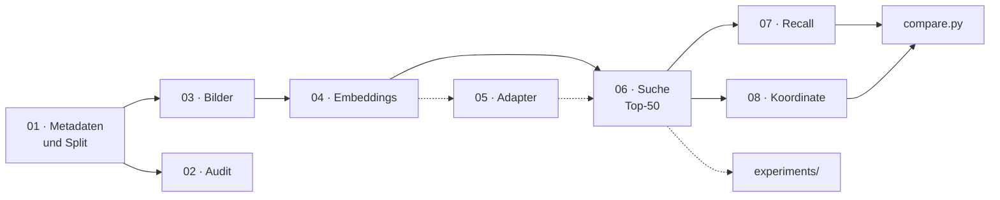

| Stufe | Notebook | Was passiert |
|---|---|---|
| 01 | [`01_mapillary_coverage`](notebooks/01_mapillary_coverage.ipynb) | Bildpunkte der Stadt holen, nach Sequenzen in train / database / query teilen (70 / 15 / 15 %) |
| 02 | [`02_dataset_audit`](notebooks/02_dataset_audit.ipynb) | Datensatz prüfen: Leakage, Jahre, Abdeckung, Fotografen |
| 03 | [`03_image_download`](notebooks/03_image_download.ipynb) | Bilder laden (1024 px) und prüfen |
| 04 | [`04_embeddings`](notebooks/04_embeddings.ipynb) | jedes Bild durch den Encoder |
| 05 | [`05_adapter`](notebooks/05_adapter.ipynb) | optional: linearen Adapter auf train trainieren |
| 06 | [`06_retrieval`](notebooks/06_retrieval.ipynb) | je Anfrage die 50 ähnlichsten Referenzbilder |
| 07 | [`07_evaluation`](notebooks/07_evaluation.ipynb) | Recall bei 5 / 10 / 25 / 50 / 100 m, drei Ground Truths |
| 08 | [`08_localization`](notebooks/08_localization.ipynb) | aus der Trefferliste eine Koordinate, Fehler in Metern |

**Warum nach Sequenzen geteilt wird.** Teilte man nach Einzelbildern, stünde
zu fast jeder Anfrage ein Trainingsbild vom selben Meter — aus derselben
Fahrt, Sekundenbruchteile später. Der Recall maße dann das Wiederfinden
desselben Fotos, nicht das Erkennen eines Ortes.

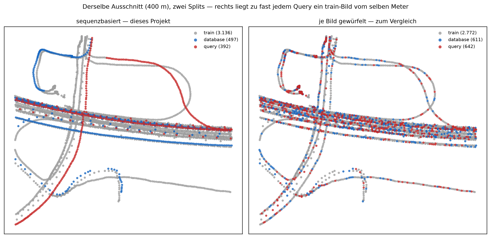

<sub>Derselbe 400-m-Ausschnitt. Links liegt jede Fahrt vollständig in einem
Topf; rechts, je Bild gewürfelt, steht zu fast jeder Anfrage ein Trainingsbild
daneben.</sub>

**Die fünf Encoder.**

| Encoder | Netz | Dim | für Orte trainiert |
|---|---|---:|:---:|
| [MegaLoc](https://github.com/gmberton/MegaLoc) | DINOv2 | 8448 | ja |
| [EigenPlaces](https://github.com/gmberton/EigenPlaces) | ResNet-50 | 2048 | ja |
| [MixVPR](https://github.com/amaralibey/MixVPR) | ResNet-50 + MLP-Mixer | 4096 | ja |
| [AnyLoc](https://github.com/AnyLoc/AnyLoc) | DINOv2 ViT-G + VLAD, per PCA auf 4096 | 4096 | nein |
| [CLIP](https://github.com/openai/CLIP) ViT-B/32 | Vision Transformer | 512 | nein |

Ob ein Encoder für Orte trainiert ist, erklärt später, wie er auf Adapter und
Whitening reagiert.

**Vier Bausteine.**
- **[`config.yaml`](config.yaml)** ist der einzige Schalter: Stadt, Split, Encoder, Radien.
  Wer einen Wert ändert, ändert den Fingerabdruck der betroffenen Dateien — und genau die werden neu gerechnet.
- **[`src/`](src/)** ist der geteilte Code. Die Recall-Auswertung steht an genau einer Stelle
  ([`src/evaluation.py`](src/evaluation.py)) und gilt für 07 wie für jedes Experiment.
- **[`notebooks/`](notebooks/)** sind die Pipeline 01–08; [`run.py`](run.py) führt sie der Reihe nach aus.
- **[`experiments/`](experiments/README.md)** stellt je Skript eine Frage und antwortet mit denselben Bausteinen.

<details>
<summary><b>Die Module in <code>src/</code></b></summary>

| Modul | Aufgabe |
|---|---|
| [`config.py`](src/config.py), [`paths.py`](src/paths.py) | config lesen, Umgebungsvariablen übernehmen, alle Ablageorte je Stadt |
| [`run_guard.py`](src/run_guard.py) | Fingerabdrücke schreiben und prüfen, config auf Widersprüche prüfen |
| [`split.py`](src/split.py), [`pairs.py`](src/pairs.py) | Sequenz-Split; Bildpaare für Audit und Adapter |
| [`evaluation.py`](src/evaluation.py) | die Recall-Auswertung, drei Ground Truths |
| [`retrieval.py`](src/retrieval.py) | Trefferlisten laden, „lösbar" und Treffer je Anfrage |
| [`sequence_hmm.py`](src/sequence_hmm.py), [`verification.py`](src/verification.py) | Nachbearbeitung: Fahrt als Pfad, geometrische Verifikation |
| [`locate.py`](src/locate.py) | Foto → Encoder → Suche → Koordinate mit Konfidenz |
| [`models/`](src/models/) | ein Modul je Encoder, Adapter, PCA-/Whitening-/Verkettungsvarianten, `factory.py` |
| [`districts.py`](src/districts.py), [`geo.py`](src/geo.py) | Stadtteile aus OSM; Distanzen und Projektionen |
| [`mapillary.py`](src/mapillary.py), [`quellen.py`](src/quellen.py) | API-Zugang; Namensnennung je Bild in jeder Abbildung |
| [`adapter_training.py`](src/adapter_training.py), [`device.py`](src/device.py) | Training des Adapters; cuda / mps / cpu |

</details>

---

## Daten

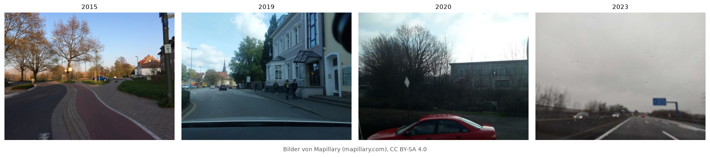

<sub>Bilder von [Mapillary](https://www.mapillary.com), CC BY-SA 4.0:
[Fußgängerzone](https://www.mapillary.com/app/?pKey=1391533835065315) ·
[Autobahn](https://www.mapillary.com/app/?pKey=1452480101753239) ·
[Park](https://www.mapillary.com/app/?pKey=3796249137169638) ·
[Am Wasser](https://www.mapillary.com/app/?pKey=1120224498685697) ·
[Wohnstraße](https://www.mapillary.com/app/?pKey=500860001925774) ·
[Hauptstraße](https://www.mapillary.com/app/?pKey=775519696297537)</sub>

| | Osnabrück |
|---|---|
| **Quelle** | [Mapillary](https://www.mapillary.com): Straßenbilder von Freiwilligen, CC BY-SA 4.0; Gesichter und Kennzeichen unkenntlich |
| **Umfang** | 332.868 Bilder auf 120 km² Stadtgebiet |
| **Aufteilung** | nach Sequenzen: train 231.133 · Referenz 48.321 · Anfragen 53.414 (70 / 15 / 15 %) |
| **Anfragen** | 198 Fahrten; Median 176 Bilder je Fahrt, die längste 3.156 |
| **Fotografen** | 57 Konten; eines stellt 47,8 % aller Bilder |
| **Jahre** | 2014 bis 2026, Schwerpunkte 2022 (29 %) und 2016 |
| **lösbar** | 63,9 % der Anfragen haben ein Referenzbild im Umkreis von 25 m |

<p align="center">
  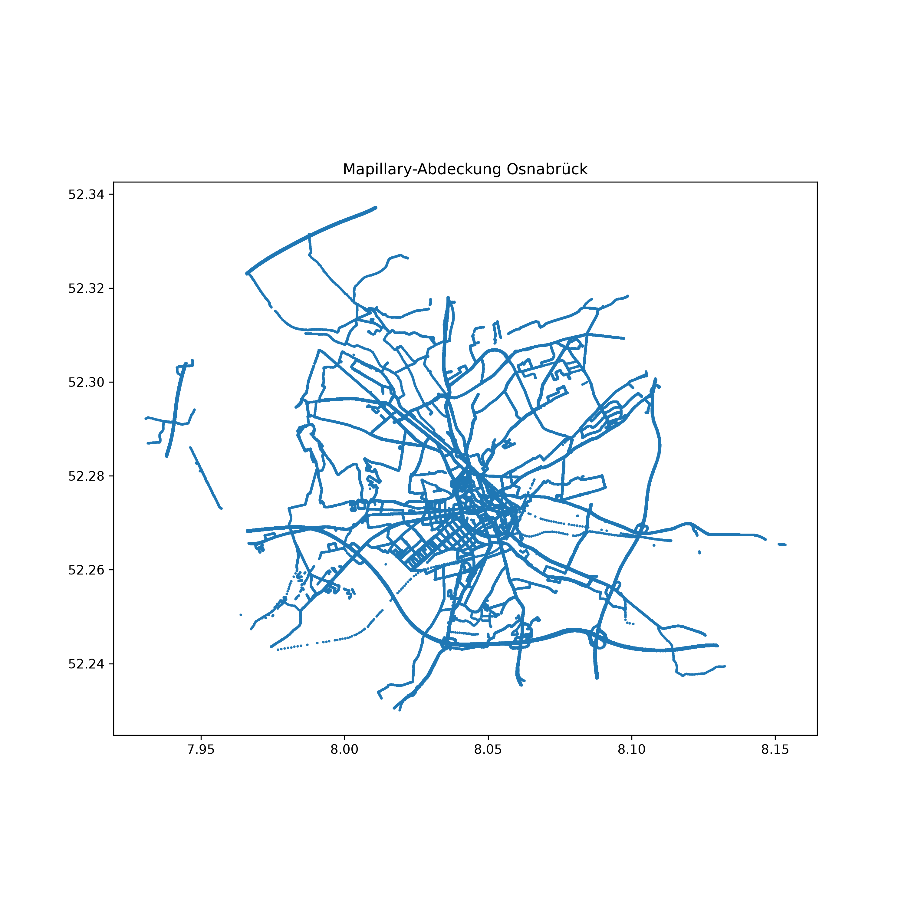
  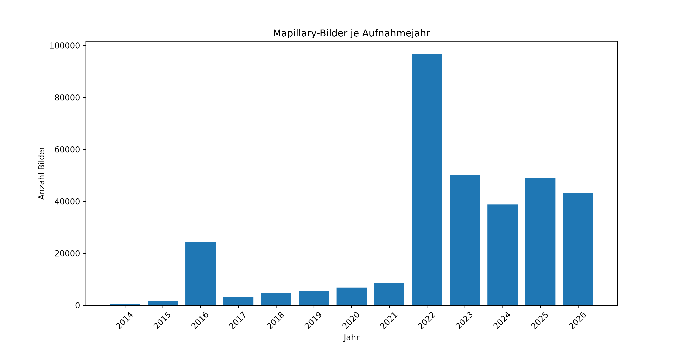
</p>

<sub>Aus `02_dataset_audit`: links die räumliche Abdeckung, rechts die
Aufnahmejahre. Weitere Kennzahlen in
[`results/osnabrueck/dataset_audit.json`](results/osnabrueck/dataset_audit.json).</sub>

**Warum 25 Meter?**
- Das GPS von Smartphones und Dashcams streut in der Stadt typisch 5 bis 15 m.
  Eine engere Schwelle mäße das Rauschen der Kamera statt den Encoder.
- 50 m fingen schon die Nachbarstraße ein.
- MSLS und Pittsburgh-30k nutzen dieselbe Größenordnung.
- Jede Zahl gibt es zusätzlich bei 5, 10, 50 und 100 m: `python compare.py --threshold 5`.

---

## Installation

| | |
|---|---|
| **Python** | ab 3.11; getestet mit 3.11 und 3.14 |
| **Umgebung** | conda (empfohlen) oder uv |
| **GPU** | nicht nötig, aber hilfreich: 04 encodiert jedes Bild der Stadt. AnyLoc und MegaLoc gehören auf eine CUDA-GPU |
| **Arbeitsspeicher** | ein Encodersatz ist `Bilder × Dimension × 4 Byte` — MegaLoc in Osnabrück 11,2 GB. 16 GB reichen für Osnabrück |
| **Platz** | 50 GB Bilder, 3 bis 25 GB je Encoder, 1 GB Ergebnisse |
| **Mapillary-Token** | kostenloser [Developer-Account](https://www.mapillary.com/developer) |

```bash
conda env create -f environment.yml
```

```bash
conda activate vpr
```

```bash
nbstripout --install --attributes .gitattributes
```

```bash
pytest tests/
```

`nbstripout` hält Zellausgaben aus dem Git; `pytest` prüft die Installation
ohne Torch und ohne Bilder. **Auf dem Mac** danach einmal die
[Fehlerbehebung](#fehlerbehebung) lesen — sonst stürzt die Demo beim ersten
eigenen Foto ohne Meldung ab.

**Token.** Der Mapillary-Token gehört in eine lokale `.env`, nie ins Repository:

```bash
cp .env.example .env
```

**Fremd-Repositories.** AnyLoc und MixVPR werden aus ihren Original-Repos
importiert; ein Skript holt sie auf festen Commits, dazu die MixVPR-Gewichte
(mit SHA-256-Prüfung) und das AnyLoc-Vokabular:

```bash
python setup_external.py
```

EigenPlaces und MegaLoc laden sich beim ersten Lauf selbst über `torch.hub`
— nicht auf einen Commit festgelegt. Welche Lizenz jede Komponente hat, steht
in [NOTICE.md](NOTICE.md).

<details>
<summary><b>Alternative mit uv</b>, und welche Versionen geprüft sind</summary>

```bash
uv venv --python 3.14 && source .venv/bin/activate && uv pip install -r requirements.txt
```

`requirements.txt` und `environment.yml` nennen untere Grenzen, keine festen
Versionen. Eine Auflösung, unter der Tests, Linter und Pipeline nachweislich
liefen, ist eingefroren:

```bash
uv pip install -r requirements.lock.txt
```

`conda install --file requirements.txt` funktioniert **nicht** — mehrere
Pakete gibt es nur über pip. Die passende PyTorch-Variante nennt der
[Konfigurator von PyTorch](https://pytorch.org/get-started/locally/).

</details>

<details>
<summary><b>Die wichtigsten Schlüssel in <code>config.yaml</code></b></summary>

`validate_config` prüft die Datei beim Laden auf Widersprüche, bevor eine
Stufe Stunden rechnet.

| Schlüssel | Bedeutung |
|---|---|
| `city` | Stadt — und der Ordnername aller Ergebnisse; per `VPR_CITY` überschreibbar |
| `vpr.method`, `vpr.adapter` | Encoder und Adapter; `run.py --method/--adapter` überschreibt beides |
| `vpr.uncertain_radius_m` | die 25 m der Ground Truth |
| `vpr.max_heading_diff_deg` | die 90° der Blickrichtungs-Auswertung |
| `retrieval.top_k`, `k_values`, `thresholds` | gespeicherte Treffer, berichtete R@k und Schwellen |
| `retrieval.min_days_apart` | die 180 Tage der Hard-Ground-Truth |
| `image_root` | wo die Bilder liegen; per `VPR_IMAGE_ROOT` überschreibbar |
| `osm.overpass_url`, `osm.timeout_s` | Endpunkt und Zeitlimit für OpenStreetMap; per `VPR_OVERPASS_URL` |

</details>

---

## Nutzung

**Die häufigsten Befehle.** Alle übrigen stehen in der [Befehlsreferenz](#befehlsreferenz).

| Aufgabe | Befehl |
|---|---|
| Pipeline rechnen, Fertiges überspringen | `python run.py` |
| Was liegt auf diesem Rechner vor? | `python run.py --bestand` |
| Anderer Encoder | `python run.py --method megaloc` |
| Vergleichstabelle mit Intervallen | `python compare.py --ci` |
| Ein Foto verorten | `python locate.py foto.jpg` |
| Tests | `pytest tests/` |

### Ein eigenes Foto verorten

Eigene Fotos gehören in den Ordner `test/` neben dem Bildordner der Stadt,
bei Standardeinstellung `~/Downloads/mapillary/test`:

<p align="center">
  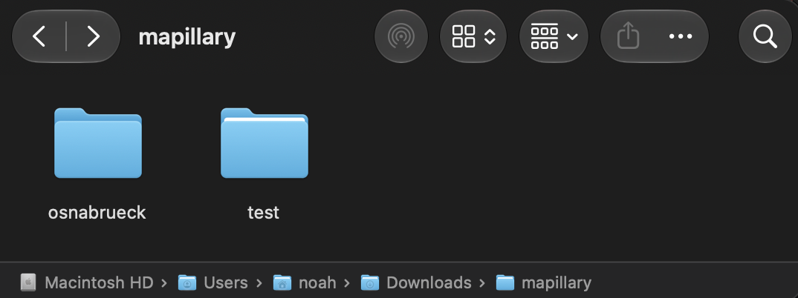
</p>

```bash
python locate.py ~/Downloads/mapillary/test
```

`--method` wählt einen anderen Encoder, `--k` die Zahl der Treffer, `--json`
gibt alles maschinenlesbar aus. Dasselbe mit Bildern und Karte:
[`demo/demo.ipynb`](demo/demo.ipynb), Abschnitt „Eigene Fotos testen".

**So liest man die Ausgabe.**
- **Koordinate** = der Ort des besten Treffers.
- **cos** = die Konfidenz. Bei MegaLoc sind ab cos 0.30 82 % der Antworten richtig; darunter warnt die Demo.
- **Abstand zu #1** = wie weit die übrigen Treffer vom besten entfernt liegen, aus den Koordinaten der
  Referenzbilder. Das eigene Foto braucht dafür kein GPS.
- **Streuung** = der größte dieser Abstände. Sie misst, ob sich die Treffer einig sind — **nicht**, ob sie
  stimmen: fünf Bilder derselben Fahrt liegen immer nah beieinander, auch am falschen Ort.

### Was die Demo zeigt

<p align="center">
  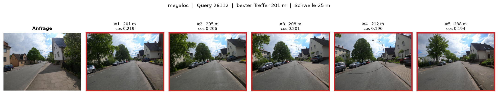
</p>
<p align="center">
  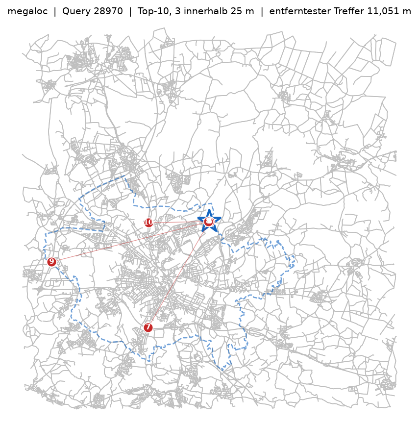
  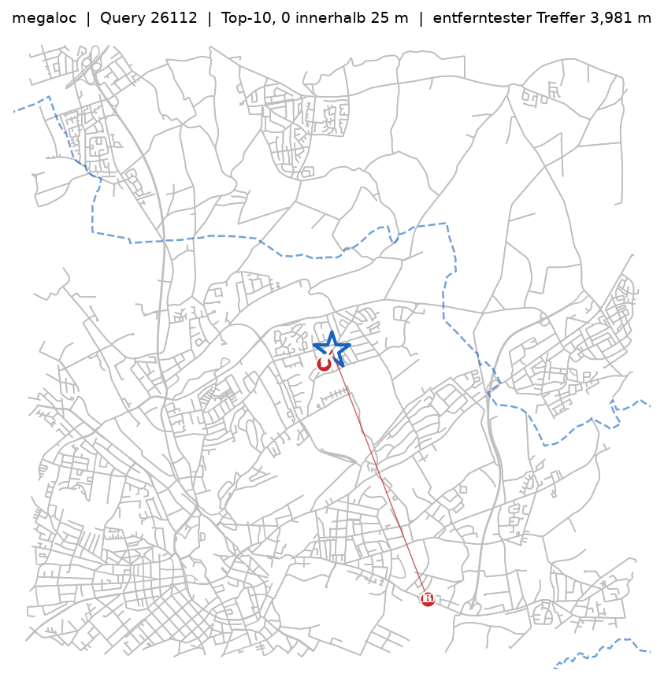
</p>

<sub>Oben eine gescheiterte Anfrage (rot = mehr als 25 m daneben), obwohl es
Referenzbilder in der Nähe gibt. Unten die Treffer auf dem Straßennetz: links
liegt der beste Treffer richtig, andere über 200 m weit weg — zwei Gruppen; rechts liegt
kein Treffer näher als 200 m. Als Beispiele gelten nur Treffer von einem anderen
Konto, und Anfragen an der Autobahn werden übersprungen.</sub>

Dasselbe Anfragebild durch alle fünf Encoder:

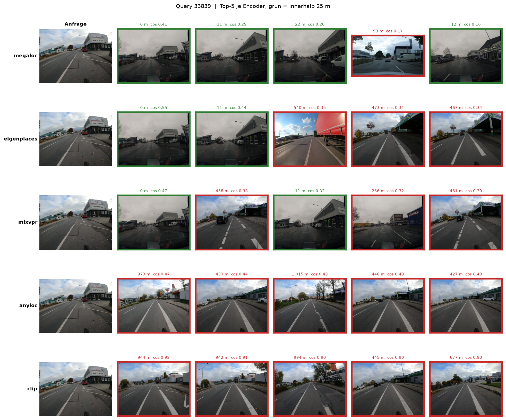

<sub>Eine Zeile je Encoder; grün = höchstens 25 m daneben. Bilder von
[Mapillary](https://www.mapillary.com), CC BY-SA 4.0, Urheber je Bild in
[QUELLEN.md](results/osnabrueck/figures/demo/QUELLEN.md).</sub>

### Eine andere Stadt

`VPR_CITY` setzt die Stadt für einen Aufruf, ohne `config.yaml` zu ändern:

```bash
VPR_CITY="Jena, Germany" python run.py --bestand
```

Der ganze Weg für eine neue Stadt: [Befehlsreferenz → Weitere Städte](#befehlsreferenz).

---

## Projektstruktur

```text
.
├── README.md             dieses Dokument
├── config.yaml           alle Parameter — der einzige Schalter
├── run.py                Pipeline 01–08, überspringt Fertiges
├── compare.py            Vergleichstabellen und -abbildungen
├── locate.py             ein Foto verorten
├── setup_external.py     Fremd-Repos und Gewichte holen
├── environment.yml       conda-Umgebung (requirements.txt für uv)
│
├── notebooks/            die Pipeline
│   ├── 01_mapillary_coverage.ipynb
│   ├── 02_dataset_audit.ipynb
│   ├── 03_image_download.ipynb
│   ├── 04_embeddings.ipynb
│   ├── 05_adapter.ipynb
│   ├── 06_retrieval.ipynb
│   ├── 07_evaluation.ipynb
│   └── 08_localization.ipynb
├── demo/demo.ipynb       Trefferreihen, Karten, eigene Fotos
│
├── experiments/          Nebenuntersuchungen — eigenes README
├── src/                  geteilter Code
├── tests/                pytest
├── data/<stadt>/         Metadaten und Split
└── results/<stadt>/      Ergebnisse und Abbildungen
```

<details>
<summary><b>Was beim Rechnen entsteht</b> (nicht im Git)</summary>

```text
data/<stadt>/embeddings/<encoder>/    Embeddings aus 04 und 05
results/<stadt>/retrieval/<encoder>/  Trefferlisten aus 06
weights/                              Adapter, MixVPR-Gewichte
external/                             AnyLoc und MixVPR
cache/                                OpenStreetMap-Antworten
~/Downloads/mapillary/<stadt>/        die Bilder (image_root)
~/Downloads/mapillary/test/           eigene Fotos
```

Alle Ablageorte kommen aus [`src/paths.py`](src/paths.py); `<stadt>` ist
der Ordnername aus `city` (`Osnabrück, Germany` → `osnabrueck`).

</details>

---

## Ergebnisse

Der rote Faden in sechs Fragen. Jede Antwort hat einen ausführlichen
Abschnitt in den [Nebenuntersuchungen](experiments/README.md).

1. [Wie gut findet das System den Ort?](#wie-gut-findet-das-system-den-ort)
2. [Gilt das auch in anderen Städten?](#sechs-städte)
3. [Woran scheitert es?](#woran-es-scheitert)
4. [Was bringt Nachbearbeitung?](#was-nachbearbeitung-bringt)
5. [Wie sicher ist eine Antwort?](#wie-sicher-ist-eine-antwort)
6. [Was kostet es?](#was-es-kostet)

<sub>Zahlenblöcke sind entweder die **wörtliche Ausgabe** eines Befehls oder
ein **Auszug** aus einer versionierten JSON; die Quelle steht jeweils
darunter. In Blöcken stehen Zahlen, wie die Programme sie drucken
(Dezimalpunkt, Tausenderkomma).</sub>

### Wie gut findet das System den Ort?

> **Kurz:** MegaLoc findet mit voller Referenz 8 von 10 lösbaren Anfragen auf
> 25 m genau. Ein Teil davon sind doppelt hochgeladene Fahrten — ohne sie
> sind es knapp 7 von 10 (0.690).

#### Volle Referenz

```text
Alle Queries  |  Schwelle 25 m  |  48,177 loesbare Queries  |  Referenz: 279,453 Bilder (database + train)

Encoder       Variante     Dim        R@1          95-%-KI     R@5    R@10    R@20
----------------------------------------------------------------------------------
anyloc        none        4096      0.435  [0.343, 0.533]   0.512   0.549   0.588
clip          none         512      0.232  [0.144, 0.349]   0.288   0.318   0.353
eigenplaces   none        2048      0.701  [0.630, 0.765]   0.775   0.801   0.824
megaloc       none        8448      0.798  [0.739, 0.848]   0.858   0.876   0.888
mixvpr        none        4096      0.653  [0.575, 0.724]   0.723   0.751   0.777
----------------------------------------------------------------------------------
Zufall        (Raten)              0.0005                   0.0022  0.0043  0.0088

Intervall: Sequenz-Bootstrap, 2,5- und 97,5-Perzentil (experiments/bootstrap_ci.py).
Fuer den Vergleich zweier Zeilen gilt die gepaarte Differenz dort, nicht die Ueberlappung.
```

<sub>Wörtliche Ausgabe von `python compare.py --reference full --ci`.</sub>

- **Dieselbe Rangfolge wie im Benchmark, jede Zahl rund 0.2 höher.**
- Ohne Adapter: der Adapter lernte auf `train`, `train` als Referenz wäre für ihn Leakage.
- Alle 18 Zeilen samt PCA und Whitening: `--derived` und
  [Volle Referenz](experiments/README.md#volle-referenz--full_referencepy).

#### Benchmark-Protokoll

Hier werden alle 40 Varianten verglichen: Adapter, PCA, Whitening, Verkettung, Nachbearbeitung.

```text
Alle Queries  |  Schwelle 25 m  |  34,112 loesbare Queries  |  Referenz: 48,321 Bilder (database)

Encoder       Variante     Dim        R@1          95-%-KI     R@5    R@10    R@20
----------------------------------------------------------------------------------
anyloc        none        4096      0.204  [0.153, 0.265]   0.294   0.340   0.384
anyloc        linear      4096      0.335  [0.277, 0.400]   0.504   0.570   0.631
clip          none         512      0.073  [0.044, 0.108]   0.106   0.129   0.158
clip          linear       512      0.123  [0.092, 0.161]   0.221   0.281   0.353
eigenplaces   none        2048      0.484  [0.405, 0.574]   0.608   0.650   0.695
eigenplaces   hmm30-25    2048      0.501  [0.415, 0.596]   0.603   0.633   0.675
eigenplaces   linear      2048      0.444  [0.372, 0.523]   0.593   0.648   0.696
megaloc       none        8448      0.568  [0.475, 0.666]   0.676   0.719   0.763
megaloc       gv20        8448      0.539  [0.456, 0.631]   0.678   0.726   0.763
megaloc       hmm30-25    8448      0.598  [0.500, 0.699]   0.690   0.725   0.764
megaloc       linear      8448      0.442  [0.372, 0.517]   0.580   0.628   0.667
mixvpr        none        4096      0.426  [0.354, 0.509]   0.543   0.590   0.642
mixvpr        linear      4096      0.363  [0.302, 0.433]   0.508   0.568   0.624
----------------------------------------------------------------------------------
Zufall        (Raten)              0.0006                   0.0028  0.0047  0.0098

Intervall: Sequenz-Bootstrap, 2,5- und 97,5-Perzentil (experiments/bootstrap_ci.py).
Fuer den Vergleich zweier Zeilen gilt die gepaarte Differenz dort, nicht die Ueberlappung.
```

<sub>Wörtliche Ausgabe von `python compare.py --ci`.</sub>

| Variante | heißt |
|---|---|
| `none` | Encoder wie veröffentlicht |
| `linear` | mit trainiertem linearem Adapter |
| `hmm30-25` | Trefferlisten einer Fahrt als Pfad umsortiert ([Fahrt als Pfad](#was-nachbearbeitung-bringt)) |
| `gv20` | Top-20 geometrisch nachgeprüft und umsortiert |
| `_pca512`, `_pcaw512`, `_concat`, `seq3` | per PCA verkürzt, zusätzlich gewhitent, zwei Encoder verkettet, Nachbarbilder summiert — mit `--derived` |

Die wichtigsten abgeleiteten Varianten:

| Variante | Dim | Benchmark | volle Referenz |
|---|---:|---:|---:|
| MegaLoc | 8448 | 0.568 | 0.798 |
| MegaLoc, PCA + Whitening | 512 | 0.541 | 0.778 |
| EigenPlaces + MegaLoc verkettet | 1024 | 0.572 | 0.778 |
| EigenPlaces, PCA + Whitening | 512 | 0.507 | 0.715 |

<sub>Die Verkettung liegt im Benchmark nicht „vor" MegaLoc: +0.004 [−0.005, +0.014]
schließt 0 ein. Mehr unter [PCA und Whitening](experiments/README.md#pca-und-whitening--pca_reducepy)
und [Verkettung](experiments/README.md#verkettung--concat_embeddingspy).</sub>

#### Zwillingsfahrten

> [!WARNING]
> **Ein Teil der „richtigen" Treffer ist dieselbe Fahrt, zweimal hochgeladen.**
> Mapillary führt manche Fahrt als zwei Sequenzen — selbes Konto, Zeitstempel
> Sekundenbruchteile auseinander, dieselben Koordinaten. Der Split trennt nach
> Sequenzen und sieht das nicht. Landet eine Kopie bei den Anfragen und die
> andere in der Referenz, findet jeder Encoder ein fast identisches Bild: 0 m
> daneben, cos um 0.99.

**Wie oft?** Zwilling heißt hier: selbes Konto, höchstens 60 s Abstand, im
Umkreis von 25 m. In Osnabrück haben ihn **3,4 %** der Anfragen im
Benchmark und **28,2 %** mit voller Referenz — dort liegen in `train` viele
Kopien.

**Was es ausmacht.** `experiments/zwillinge.py` nimmt die Kopien aus der
Trefferliste, als wären sie nie hochgeladen worden — die nächsten Kandidaten
rücken auf:

| R@1 bei 25 m | Benchmark | ohne Zwillinge | volle Referenz | ohne Zwillinge |
|---|---:|---:|---:|---:|
| MegaLoc | 0.568 | 0.550 | 0.798 | **0.690** |
| EigenPlaces | 0.484 | 0.464 | 0.701 | **0.593** |
| *Top-1 ist ein Zwilling* | | *4,1 %* | | *18,3 %* |

<sub>Aus `experiments/results/osnabrueck/zwillinge.json`. „Ohne Zwillinge" zählt
nur Anfragen, die auch ohne Kopie lösbar sind (Benchmark 33.146 statt 34.112,
voll 47.800 statt 48.177). Ohne Intervall.</sub>

- **Im Benchmark fast nichts** (−0.02): die Encoder-Vergleiche und gepaarten Differenzen halten.
- **Mit voller Referenz −0.108**, bei beiden Encodern gleich. Fast jeder fünfte erste Treffer war eine Kopie.
- **Der Abstand der Encoder bleibt:** MegaLoc − EigenPlaces +0.097 mit, +0.097 ohne Zwillinge.
- **Mehr Referenz hilft trotzdem:** 0.550 → 0.690 statt 0.568 → 0.798.

Die Hard-Ground-Truth ist noch strenger: Sie zählt Treffer vom selben Konto
innerhalb von 180 Tagen gar nicht. Damit fallen auch echte Wiederholungsfahrten
desselben Fotografen weg — sie ist die Untergrenze, und es gibt sie für alle
fünf Encoder:

| R@1 bei 25 m | Benchmark | Benchmark, Hard | volle Referenz | volle Referenz, Hard |
|---|---:|---:|---:|---:|
| MegaLoc | 0.568 | 0.543 | 0.798 | **0.523** |
| EigenPlaces | 0.484 | 0.456 | 0.701 | **0.427** |
| MixVPR | 0.426 | 0.394 | 0.653 | 0.373 |
| AnyLoc | 0.204 | 0.148 | 0.435 | 0.148 |
| CLIP | 0.073 | 0.024 | 0.232 | 0.024 |

<sub>Auszug aus `results/osnabrueck/evaluation/<encoder>{,_fullref}.json`,
Auswertungen „Alle Queries" und „Hard".</sub>

- **Die Rangfolge bleibt auch unter Hard.**
- **Schwache Encoder leben von Kopien:** CLIP fällt von 0.073 auf 0.024 — zwei Drittel seiner Treffer sind fast identische Bilder.
- **Ehrlich zu berichten ist 0.690:** 0.798 ist mit Kopien gezählt, 0.523 streicht auch echte Treffer.

Die Messung je Stadt, die Methode, was es für jedes andere Ergebnis heißt und wie man es behebt: [Zwillingsfahrten](experiments/README.md#zwillingsfahrten--zwillingepy).

#### Unsicherheit

Die 53.414 Anfragen stammen aus nur 198 Fahrten, und Bilder derselben Fahrt
scheitern gemeinsam. Deshalb zieht der Bootstrap die **Fahrten** neu, nicht die Bilder.

- **Eine einzelne Zahl** ist nur auf eine Nachkommastelle genau: ±0.03 (CLIP)
  bis ±0.10 (MegaLoc). Der übliche binomiale Fehler hätte ±0.005 behauptet.
- **Ein Unterschied zweier Varianten** ist viel genauer (±0.005 bis ±0.09),
  weil beide auf denselben schweren Fahrten scheitern.

```text
Vergleich (a → b)                             ΔR@1   95-%-Intervall     belegt
-----------------------------------------------------------------------------
eigenplaces → eigenplaces_pca512            -0.003   [-0.008, +0.002]   nein
eigenplaces → eigenplaces_pcaw512           +0.022   [+0.011, +0.039]   ja
eigenplaces → eigenplaces_pcaw2048          -0.025   [-0.042, -0.010]   ja
anyloc → anyloc_pcaw4096                    +0.117   [+0.078, +0.162]   ja
megaloc → eigenplaces_megaloc_concat        +0.004   [-0.005, +0.014]   nein
megaloc → megaloc_hmm30-25                  +0.030   [+0.020, +0.041]   ja
megaloc → megaloc_gv20                      -0.029   [-0.062, +0.000]   nein
megaloc → megaloc_linear                    -0.126   [-0.179, -0.073]   ja
clip_pcaw512 → clip_pcaw512_linear          +0.009   [-0.002, +0.021]   nein
```

<sub>Auszug aus [`experiments/results/osnabrueck/bootstrap_ci.json`](experiments/results/osnabrueck/bootstrap_ci.json);
dort alle 39 Paare, auch für R@5 bis R@20. Methode:
[Konfidenzintervalle](experiments/README.md#konfidenzintervalle--bootstrap_cipy).</sub>

### Sechs Städte

> **Kurz:** Das Niveau hängt an der Stadt, der Abstand der Modelle nicht.

Dieselbe Pipeline in fünf weiteren Städten, vorab aus 50 Kandidaten nach
Mapillary-Metadaten ausgewählt — bevor ein einziges Bild geladen war
([Stadtwahl](experiments/README.md#stadtwahl--city_coveragepy)).

| Stadt | Anfragen | Fahrten | EigenPlaces | MegaLoc | Δ [95 %] | MegaLoc voll | Δ voll [95 %] |
|---|---:|---:|---:|---:|---|---:|---|
| Osnabrück | 53.414 | 198 | 0.484 | 0.568 | +0.084 [+0.055, +0.116] | 0.798 | +0.096 [+0.070, +0.122] |
| Fürth | 24.994 | 239 | 0.473 | 0.549 | +0.076 [+0.057, +0.096] | 0.699 | +0.072 [+0.052, +0.092] |
| Karlsruhe | 87.181 | 584 | 0.306 | 0.419 | +0.114 [+0.095, +0.134] | 0.640 | +0.132 [+0.111, +0.155] |
| Kaiserslautern | 58.916 | 249 | **0.552** | **0.651** | +0.099 [+0.079, +0.122] | **0.810** | +0.077 [+0.058, +0.096] |
| Würzburg | 60.203 | 300 | 0.263 | 0.336 | +0.073 [+0.045, +0.106] | 0.476 | +0.092 [+0.057, +0.130] |
| Jena | 114.558 | 677 | 0.332 | 0.417 | +0.084 [+0.073, +0.096] | 0.622 | +0.102 [+0.091, +0.113] |

<sub>R@1 bei 25 m, Benchmark-Protokoll; „voll" mit voller Referenz.
Δ = MegaLoc − EigenPlaces, gepaart über dieselben Anfragen. Aus
`results/<stadt>/evaluation/` und `experiments/results/<stadt>/bootstrap_ci{,_fullref}.json`.</sub>

- **Das Niveau wandert:** MegaLoc von 0.336 (Würzburg) bis 0.651 (Kaiserslautern) — eine Spanne von 0.315.
- **Der Abstand bleibt:** MegaLoc vor EigenPlaces in allen sechs Städten und beiden Protokollen, alle zwölf Intervalle schließen 0 aus. Spanne nur 0.041.
- **Würzburg** hat 98 % Straßenabdeckung und trotzdem den niedrigsten Recall: nur 45,5 % der Anfragen sind lösbar, und die Bilder sind alt (Median 627 Tage zwischen Anfrage und Treffer).
- **Der Hard-Filter kostet** zwischen 0.010 (Jena) und 0.204 (Kaiserslautern) — und das lässt sich exakt erklären ([Städtevergleich](experiments/README.md#städtevergleich--city_comparisonpy)).

### Woran es scheitert

> **Kurz:** An den Daten, nicht am Modell. Entscheidend ist, ob an der Straße
> der Anfrage ein Referenzbild steht, das in dieselbe Richtung schaut.

#### Referenzdichte

<p align="center">
  
  
</p>

`train` stufenweise zur Referenz dazugenommen:

| train dazu | Referenzbilder | lösbar | MegaLoc | EigenPlaces |
|---:|---:|---:|---:|---:|
| 0 % | 48.321 | 63,9 % | 0.568 | 0.484 |
| 25 % | 107.449 | 78,4 % | 0.636 | 0.545 |
| 50 % | 160.981 | 84,9 % | 0.689 | 0.595 |
| 75 % | 222.300 | 88,4 % | 0.774 | 0.672 |
| 100 % | 279.453 | 90,2 % | 0.798 | 0.701 |

<sub>R@1 bei 25 m unter den lösbaren Anfragen. Auszug aus
`experiments/results/osnabrueck/database_density_<encoder>.json`.</sub>

- Mehr Anfragen werden lösbar, **und** der Recall unter ihnen steigt — obwohl die neu lösbaren die schwereren sind.
- Ein Teil des Anstiegs sind [Zwillinge](#zwillingsfahrten) aus `train`: ohne sie steigt MegaLoc von 0.550 auf 0.690 statt von 0.568 auf 0.798.
- Ohne Intervall. Details: [Referenzdichte](experiments/README.md#referenzdichte--database_densitypy).

#### Blickrichtung, Zeit, Nachbarn

<p align="center">
  
</p>
<p align="center">
  
</p>

```text
R@1 bei 25 m je Klasse, MegaLoc, 34,112 lösbare Anfragen       n     R@1
alle                                                      34,112   0.568   ██████████████████▏
Ein Nachbar schaut in dieselbe Richtung
  ja                                                      29,167   0.653   ████████████████████▉
  nein                                                     4,945   0.071   ██▎
Tage bis zum zeitlich nächsten Nachbarn
  0–7                                                      4,850   0.575   ██████████████████▍
  8–30                                                     3,675   0.819   ██████████████████████████▎
  31–180                                                  10,450   0.539   █████████████████▎
  181–365                                                  5,772   0.612   ███████████████████▋
  über 365                                                 9,365   0.472   ███████████████▏
Nachbarn im Umkreis von 25 m
  1–2                                                      1,705   0.523   ████████████████▊
  3–5                                                      3,496   0.483   ███████████████▌
  6–10                                                     3,883   0.534   █████████████████▏
  11–20                                                    6,808   0.448   ██████████████▍
  21–50                                                   14,076   0.600   ███████████████████▎
  51+                                                      4,144   0.780   █████████████████████████
Nachbar vom selben Konto am selben Tag
  ja                                                       3,168   0.690   ██████████████████████▏
  nein                                                    30,944   0.556   █████████████████▊
```

<sub>Auszug aus `experiments/results/osnabrueck/recall_by_difficulty_megaloc.json`.
32 Zeichen Balken entsprächen R@1 = 1.0.</sub>

- **Blickrichtung trennt am schärfsten:** ohne Nachbarn in derselben Richtung 7 %, mit einem 65 %.
- **Zeit und Nachbarzahl wirken schwächer und nicht gleichmäßig:** 8–30 Tage Abstand ist die beste Klasse,
  0–7 Tage nur Mittelfeld; bei den Nachbarn hebt sich nur 51+ ab.
- **Ein Nachbar vom selben Konto am selben Tag hilft:** R@1 0.690 gegen 0.556 ohne einen solchen — derselbe Effekt wie die Zwillinge, die in dieser Klasse stecken.
- Dieselbe Zerlegung für EigenPlaces zeigt die zweite Abbildung. Klassen ohne Intervall; Unterschiede unter etwa 0.1 nicht deuten.
  Details: [Schwierigkeit je Anfrage](experiments/README.md#schwierigkeit-je-anfrage--recall_by_difficultypy).

#### Stadtteile

<p align="center">
  
</p>
<p align="center">
  
</p>

- **Faktor 12 beim selben Encoder:** MegaLoc 0.07 in Sutthausen, 0.83 in Atter.
- **Die Karte zeigt die Daten, nicht den Encoder:** EigenPlaces (zweite Karte) ordnet die Stadtteile praktisch gleich (Spearman 0.96).
- **Bilder je km² erklären es nicht** (ρ = 0.27): die Innenstadt hat die dichteste Referenz und nur 38 % lösbare Anfragen.
- **Gründe je Stadtteil:** Haste — kaum passende Blickrichtung; Hellern — fast ein Jahr Abstand zur Referenz; Sutthausen — eine einzige
  Fahrt, die 208 von 414 Anfragen ins 4 km entfernte Hellern legt.
  Details: [Stadtteile](experiments/README.md#stadtteile--recall_by_districtpy).

#### Struktur der Fehler


Von 34.112 lösbaren Anfragen verfehlt MegaLoc 14.726. Wohin?

| Fehler | Anteil | heißt |
|---|---:|---|
| unter 100 m | 45 % | dieselbe Straße, knapp jenseits der Schwelle |
| 100 m bis 1 km | 11 % | |
| über 1 km | 44 % | ein anderes Viertel |

- **Bimodal:** fast nichts in der Mitte — ein Median beschreibt das schlecht.
- **Keine dominante Verwechslung:** das häufigste Stadtteil-Paar trägt 1,6 % der Fehler.
- **Nicht die Autobahn:** die langen roten Linien auf der Karte täuschen. Autobahn-Anfragen scheitern nicht öfter
  (R@1 0.570 gegen 0.565), die groben Fehler sitzen in Wohnstraßen.
- **Folge:** bei einer groben Verwechslung liegen auch die übrigen Treffer am falschen Ort — deshalb scheitert jede Mittelung.
  Details: [Verwechslungsatlas](experiments/README.md#verwechslungsatlas--confusion_atlaspy).

### Was Nachbearbeitung bringt

> **Kurz:** Kaum etwas. Nur die Fahrt als Pfad schlägt den besten Einzeltreffer, und auch nur knapp.

| Verfahren | Idee | Ergebnis (MegaLoc) | belegt |
|---|---|---|:---:|
| Mitteln, Clustern (5 Arten) | mehrere Treffer zu einer Koordinate | alle schlechter als Top-1 (Clustering 0.318 gegen 0.363) | — |
| Nachbarbilder summieren (`seq3`) | Trefferlisten benachbarter Fotos zusammenzählen | −0.009 [−0.017, −0.001] (EigenPlaces, 512) | ja, schlechter |
| **Fahrt als Pfad (HMM)** | ein Kandidat muss zur Fahrt passen — in 0,2 s fährt man keine 6 km | **+0.030 [+0.020, +0.041]** | **ja** |
| Geometrische Verifikation | Top-20 mit lokalen Merkmalen nachprüfen | −0.029 [−0.062, +0.000] | nein |
| Mapillary-Detections | Objekte im Bild als zweites Signal | kein Gewinn; trennt schlechter als der Deskriptor (AUC 0.56 gegen 0.73, EigenPlaces) | — |

<p align="center">
  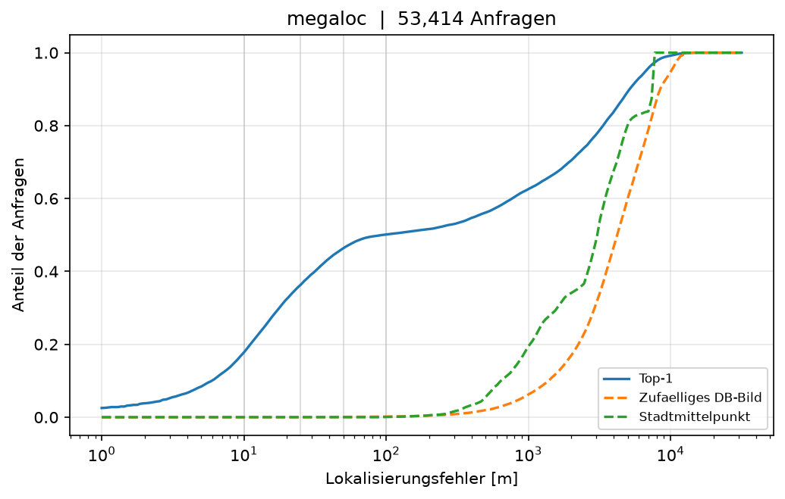
  
</p>

<sub>Links der Fehler des besten Treffers über alle 53.414 Anfragen (Median 94 m),
rechts die fünf Mittelungsverfahren gegen Top-1. Dieselben Abbildungen für
EigenPlaces: [`eigenplaces_lokalisierungsfehler.png`](results/osnabrueck/figures/localization/eigenplaces_lokalisierungsfehler.png),
[`localization_aggregation_eigenplaces.png`](experiments/results/osnabrueck/localization_aggregation_eigenplaces.png).</sub>

**Fahrt als Pfad.** Ein Hidden-Markov-Modell liest die Top-k aufeinanderfolgender
Bilder als möglichen Weg. Die Parameter (β = 30, σ = 25 m) standen vor dem Lauf fest.
- MegaLoc 0.568 → **0.598**, EigenPlaces 0.484 → 0.501 — beide belegt.
- Der Gewinn ist klein, weil die meisten Fehler kohärent sind: eine ganze Fahrt auf der falschen Straße ist auch als Pfad stimmig.
- Bei EigenPlaces kostet es R@10 (0.650 → 0.633).
  Details: [Fahrt als Pfad](experiments/README.md#fahrt-als-pfad--sequence_hmmpy).

**Geometrische Verifikation.** SuperPoint + LightGlue prüfen die Top-20 mit lokalen Merkmalen
und sortieren nach übereinstimmenden Punkten. Gerechnet für Osnabrück, 8,6 Stunden.

| R@1 | 5 m | 10 m | 25 m | 50 m | 100 m |
|---|---:|---:|---:|---:|---:|
| MegaLoc | 0.230 | 0.353 | 0.568 | 0.666 | 0.637 |
| + Verifikation | 0.242 | 0.363 | 0.539 | 0.632 | 0.599 |
| Differenz | +0.013 | +0.010 | −0.029 | −0.034 | −0.039 |

<sub>Aus `results/osnabrueck/evaluation/megaloc{,_gv20}.json`; ein Intervall gibt es nur bei 25 m.</sub>

- **Sie schärft die Position, findet aber nicht öfter den richtigen Ort.** Lesart: übereinstimmende Punkte messen,
  wie stark sich zwei Bilder überlappen — nicht, ob es derselbe Ort ist.
- 87 % aller Kandidaten kommen über die 15-Punkte-Schwelle; sie trennt kaum.
- Gemessen ist eine Einstellung in einer Stadt. Details:
  [Geometrische Verifikation](experiments/README.md#geometrische-verifikation--geometric_verificationpy).

### Wie sicher ist eine Antwort?

> **Kurz:** Der cos-Wert des besten Treffers ist eine brauchbare Konfidenz. Wer
> bei niedrigem cos schweigt, liegt deutlich öfter richtig.

<p align="center">
  
</p>
<p align="center">
  
</p>

MegaLoc, lösbare Anfragen; Präzision = Anteil richtiger Antworten:

| beantwortet | 100 % | 80 % | 50 % | 20 % |
|---|---:|---:|---:|---:|
| nach cos | 0.568 | **0.689** | 0.793 | 0.887 |
| nach Abstand zu Platz 2 | 0.568 | 0.618 | 0.724 | 0.860 |
| nach Einigkeit der Top-10 | 0.568 | 0.597 | 0.706 | 0.798 |

<sub>Auszug aus [`experiments/results/osnabrueck/rejection_curve_megaloc.json`](experiments/results/osnabrueck/rejection_curve_megaloc.json).</sub>

- **cos ≥ 0.30:** 82 % richtig, beantwortet werden 37 % der lösbaren Anfragen.
- **cos ≥ 0.20:** 75 % richtig bei 69 %.
- Der rohe cos schlägt die anderen Maße bei jeder Abdeckung; `locate.py` meldet ihn als Konfidenz.
- Die Verkettung EigenPlaces + MegaLoc liegt gleichauf (0.695 bei 80 %). Details: [Ablehnung](experiments/README.md#ablehnung--rejection_curvepy).

### Was es kostet

> **Kurz:** Am genauesten ist MegaLoc. **Den besten Kompromiss bietet MegaLoc,
> auf 512 Dimensionen gewhitent:** 0.028 weniger R@1, aber ein 16,5-mal
> kleinerer Index und eine viermal schnellere Suche.


| Encoder | R@1 | Suche je Anfrage | Index (48.321 Bilder) | Encodieren, 332.868 Bilder |
|---|---:|---:|---:|---:|
| MegaLoc | **0.568** | 0,74 ms | 1.557 MB | 3,6 h |
| **MegaLoc, 512 gewhitent** | 0.541 | **0,18 ms** | **94 MB** | 3,6 h |
| EigenPlaces | 0.484 | 0,21 ms | 378 MB | 2,7 h |
| MixVPR | 0.426 | 0,44 ms | 755 MB | 71 min |
| AnyLoc | 0.204 | 0,45 ms | 755 MB | 6,3 h (GPU) |
| CLIP | 0.073 | 0,19 ms | 94 MB | **31 min** |

<sub>Auszug aus [`experiments/results/osnabrueck/timing.json`](experiments/results/osnabrueck/timing.json).
Suche auf der CPU; Encodieren auf einem Apple-M1-Pro (MPS), AnyLoc auf einer CUDA-GPU.</sub>

- **Der Index wächst linear mit der Breite, die Suchzeit nicht:** 16,5-mal mehr Speicher, nur 4-mal langsamer.
- Bei 48.321 Referenzbildern ist das egal (10 s gegen 39 s für alle Anfragen); bei einer Million wären es 32 GB gegen 2 GB Index.
- Encodieren hängt am Netz und an der Bildgröße, nicht an der PCA: `megaloc_pcaw512` encodiert so schnell wie MegaLoc.
- **Speicher vorher ausrechnen:** `Bilder × Dimension × 4 Byte`. MegaLoc in Jena: 23,6 GB.
  Details: [Laufzeit und Speicher](experiments/README.md#laufzeit-und-speicher--timingpy).

---

## Reproduzierbarkeit

**Ein Seed für alles.**
`vpr.split_seed: 42` steuert den Split, das Adapter-Training, die PCA-Stichproben, die Zufallsbasis und den Bootstrap.

**Metadaten und Split liegen im Git.**
`data/<stadt>/processed/metadata.parquet` (5 bis 17 MB je Stadt) und die drei Split-Listen.
Ein Test rechnet den Split aus dem Seed nach. 01 läuft nur noch für eine neue Stadt — Mapillary ändert sich, ein frischer Lauf ergäbe einen anderen Datensatz.

**Fingerabdrücke statt Vertrauen.**
Neben jeder Zwischendatei liegt eine `.fingerprint.json`: Encoder, Modellkonfiguration, Split, Hash der Metadaten.
Jede Stufe prüft ihre Eingaben dagegen und bricht ab, statt mit einer Datei aus einem anderen Lauf falsche Zahlen zu rechnen.

**Jede Ergebnisdatei kennt ihren Code.**
Die JSONs aus 07 und 08 tragen den Git-Commit und einen Hash der Auswertung (`evaluation.py`, `geo.py`, `retrieval.py`).
Ein Test prüft, dass dieser Commit im Repository existiert.

**Tests rechnen die Ergebnisse nach.**
Der Bootstrap muss jede Recall-Zahl aus 07 exakt treffen; dazu die Auswertung gegen eine handgerechnete Erwartung,
der Split gegen die Listen und die config gegen Tippfehler. Dieselben Tests laufen bei jedem Push im
[CI](.github/workflows/check.yml), unter Python 3.11 und 3.14.

**Zwei Rechner.**
Die Encoder wurden auf zwei Rechnern gerechnet und die Embeddings per `rsync` zusammengeführt.
Folge: dieselben Bilder stehen je Encoder in anderer Zeilenreihenfolge, und MegaLoc fehlen zwei Trainingsbilder.
Alles, was Encoder nebeneinanderlegt, richtet deshalb über die `image_id` aus.

**Nicht bitgleich.**
Die randomisierte SVD der PCA-Varianten rundet auf anderer Hardware minimal anders, und GPU-Training ist nicht bitgenau.
Wer die exakten Zahlen will, nimmt die Embeddings, mit denen sie gerechnet wurden.

---

## Grenzen und nächste Schritte

| Grenze | Folge | Was helfen würde |
|---|---|---|
| **Zwillingsfahrten** | Teile des Recalls, vor allem mit voller Referenz, sind wiedergefundene Kopien | Split nach Konto und Zeit statt nach Sequenz; bis dahin die Zahl ohne Zwillinge mitlesen (MegaLoc voll 0.690 statt 0.798) |
| **Ein Split-Seed** | wie viel am Zufall des Splits hängt, ist nicht gemessen | zweiter Seed |
| **Fünf Städte nur mit zwei Encodern** | die volle Rangfolge ist nur in Osnabrück belegt | weitere Encoder dort rechnen |
| **Geometrische Verifikation nur in Osnabrück** | eine Einstellung, eine Stadt | eine Bewertung, die übereinstimmende Punkte mit cos verrechnet — auf einer Stadt, die nicht berichtet wird |
| **Adapter mit Lernrate 1e-3** | mit 1e-4 schadet er EigenPlaces nicht mehr ([Raster](experiments/README.md#adapter-raster--adapter_sweeppy)) | umstellen und alle Adapter-Zeilen neu rechnen |
| **AnyLoc ohne Whitening** | AnyLoc wirkt schwächer, als es ist (+0.117 mit Whitening) | Absicht: `anyloc` bleibt, was seine Autoren veröffentlicht haben; die gewhitente Zeile steht daneben |

**An den Fremd-Repositories.** MixVPR hat keine Lizenzdatei. AnyLocs Download-Links
sind tot (`setup_external.py` holt das Vokabular von Hugging Face), und AnyLocs
`VLAD.generate()` bricht mit CUDA-Tensoren ab.

---

## Befehlsreferenz

**Häufig gebraucht**

```bash
python run.py
```

```bash
python run.py --bestand
```

```bash
python compare.py --ci
```

```bash
python locate.py foto.jpg
```

```bash
pytest tests/
```

Jeder Befehl kennt `--help`. Für eine andere Stadt `VPR_CITY="Jena, Germany"`
voranstellen; ebenso überschreiben `VPR_METHOD`, `VPR_ADAPTER` und
`VPR_IMAGE_ROOT` die `config.yaml`. Was jedes Experiment misst, steht in den
[Nebenuntersuchungen](experiments/README.md).

<details>
<summary><b>Pipeline</b></summary>

Anderer Encoder, ohne `config.yaml` zu ändern (auch `clip,mixvpr`):

```bash
python run.py --method mixvpr
```

Alle Encoder, je ohne und mit Adapter:

```bash
python run.py --method all --adapter all
```

Ab einer Stufe, erzwungen:

```bash
python run.py --from 06
```

Alles neu:

```bash
python run.py --force
```

</details>

<details>
<summary><b>Vergleichen</b></summary>

Mit allen abgeleiteten Varianten:

```bash
python compare.py --derived
```

Andere Schwelle (5, 10, 25, 50, 100 m):

```bash
python compare.py --threshold 5
```

Hard-Ground-Truth; ebenso `"Blickrichtung: Treffer nur bei <= 90 Grad Abweichung"`:

```bash
python compare.py --split "Hard: anderer creator_id ODER > 180 Tage Abstand"
```

Volle Referenz:

```bash
python compare.py --reference full --ci
```

Lokalisierung in Metern:

```bash
python compare.py --localization
```

Abbildungen, mit `--derived` als kleine Vielfache:

```bash
python compare.py --plot
```

</details>

<details>
<summary><b>Experimente</b> — eine Zeile je Skript; Standard ist MegaLoc</summary>

| Frage | Befehl |
|---|---|
| PCA- und Whitening-Varianten schreiben | `python experiments/pca_reduce.py` |
| zwei Encoder verketten | `python experiments/concat_embeddings.py` |
| danach die Pipeline über alle Varianten | `python run.py --method derived --adapter all` |
| volle Referenz | `python experiments/full_reference.py` |
| Konfidenzintervalle | `python experiments/bootstrap_ci.py` |
| Zwillingsfahrten | `python experiments/zwillinge.py` |
| Adapter-Diagnose | `python experiments/adapter_diagnose.py` |
| Adapter-Raster | `python experiments/adapter_sweep.py --method eigenplaces` |
| Referenzdichte | `python experiments/database_density.py` |
| Schwierigkeit je Anfrage | `python experiments/recall_by_difficulty.py` |
| Stadtteile | `python experiments/recall_by_district.py` |
| Verwechslungsatlas | `python experiments/confusion_atlas.py` |
| Mittelungsverfahren | `python experiments/localization_aggregation.py` |
| Nachbarbilder summieren | `python experiments/sequence_retrieval.py` |
| Fahrt als Pfad | `python experiments/sequence_hmm.py --method megaloc` |
| geometrische Verifikation (GPU) | `python experiments/geometric_verification.py --n-queries 0` |
| Detections | `python experiments/detection_rerank.py` |
| Ablehnungskurve | `python experiments/rejection_curve.py` |
| Laufzeit | `python experiments/timing.py --skip-search` |
| Städte vorab bewerten | `python experiments/city_coverage.py "Heidelberg, Germany"` |
| Städte vergleichen | `python experiments/city_comparison.py` |

Mit EigenPlaces: `--method eigenplaces` anhängen.

</details>

<details>
<summary><b>Weitere Städte</b></summary>

Vorher prüfen, ob sich eine Stadt lohnt — eine Minute, ohne Bilder:

```bash
python experiments/city_coverage.py "Heidelberg, Germany"
```

Dann die Pipeline ab 01, danach die übrigen Encoder:

```bash
VPR_CITY="Heidelberg, Germany" python run.py --from 01
```

```bash
VPR_CITY="Heidelberg, Germany" python run.py --method all
```

Drei Stolpersteine:
1. **Stadtgrenze.** 01 druckt die Fläche. Liefert Nominatim den gleichnamigen Landkreis, `city` genauer angeben,
   etwa `"Stadt Osnabrück, Niedersachsen, Germany"`.
2. **Der Split entsteht beim ersten Lauf** und wird danach aus den Listen übernommen.
3. **Overpass** ist ein öffentlicher Dienst. Fällt er aus, läuft 01 trotzdem zu Ende; ein Spiegel über `VPR_OVERPASS_URL` hilft.

</details>

---

## Fehlerbehebung

### Kernel stirbt ohne Meldung (macOS)

**Symptom.** Der Prozess endet, sobald das Modell das erste Bild rechnet:
Jupyter meldet *kernel died*, das Terminal `Segmentation fault`. In der Demo
trifft es das erste eigene Foto.

**Ursache.** Zwei OpenMP-Bibliotheken im selben Prozess: conda-forge-Pakete
(scikit-learn, faiss) laden `$CONDA_PREFIX/lib/libomp.dylib`, das pip-Wheel
von torch bringt eine eigene Kopie mit. macOS lädt beide, und die erste
parallele Rechnung stürzt ab. Unter Linux passiert das nicht.

**Prüfen.** Sind beide Einträge normale Dateien, ist die Umgebung betroffen:

```bash
ls -l $CONDA_PREFIX/lib/libomp.dylib $CONDA_PREFIX/lib/python3.*/site-packages/torch/lib/libomp.dylib
```

**Beheben.** torch auf die libomp von conda umlenken:

```bash
cd $CONDA_PREFIX/lib/python3.*/site-packages/torch/lib
mv libomp.dylib libomp.dylib.orig
ln -s $CONDA_PREFIX/lib/libomp.dylib libomp.dylib
cd -
```

Rückgängig, im selben Ordner: `mv libomp.dylib.orig libomp.dylib`. Nach jeder
Neuinstallation von torch wiederholen. `KMP_DUPLICATE_LIB_OK=TRUE` ist **kein**
Ersatz — es schaltet nur die Warnung ab.

**Allgemein.** Stirbt ein Kernel ohne Meldung, denselben Code im Terminal
ausführen: `python -X faulthandler skript.py` zeigt, was Jupyter verschluckt.

---

## Team

| GitHub | Name |
|---|---|
| [@nbomers](https://github.com/nbomers) | Noah Bomers |
| [@D4ne2kk](https://github.com/D4ne2kk) | Niels Dähne |
| [@eknight04](https://github.com/eknight04) | Erasmus Ritter |

Entwickelt in Feature-Branches, `main` bleibt lauffähig. Commits mit
Ergebnis-JSONs **nicht rebasen**, sondern mergen: ihr vermerkter Commit
verschwände sonst, und `tests/test_results.py` schlägt an.

## KI-Nutzung

KI-Assistenten waren im Projekt erlaubt und wurden genutzt, vor allem
Claude (Anthropic) über [claude.ai](https://claude.ai). Wofür:

- **Code schreiben** — Entwürfe für Module, Experimente und Tests; vor der
  Übernahme gelesen, ausgeführt und mit `pytest` geprüft.
- **Code-Review und Fehlersuche** — Durchsicht von Code, Kommentaren und
  Dokumentation; Eingrenzen von Abstürzen wie dem
  [OpenMP-Konflikt auf macOS](#fehlerbehebung).
- **Dokumentation** — Formulieren und Überarbeiten der READMEs und
  Docstrings.
- **Recherche** — Einordnung von Verfahren, Literatur und Lizenzen.

Jede Zahl in diesem Repository stammt aus dem Code hier und den
versionierten Ergebnis-JSONs, nicht aus einer KI-Ausgabe; `pytest` rechnet
die Ergebnisse gegeneinander nach.

## Credits

| | Lizenz | Verwendung |
|---|---|---|
| [Mapillary](https://www.mapillary.com) — Bilder und Metadaten | [CC BY-SA 4.0](https://www.mapillary.com/terms) | der Datensatz |
| [MegaLoc](https://github.com/gmberton/MegaLoc) | MIT | Encoder; Gewichte über [Hugging Face](https://huggingface.co/gberton/MegaLoc) |
| [EigenPlaces](https://github.com/gmberton/EigenPlaces) | MIT | Encoder, nutzt Teile von [CosPlace](https://github.com/gmberton/CosPlace) (MIT) |
| [MixVPR](https://github.com/amaralibey/MixVPR) | keine Lizenzdatei | Encoder und Gewichte |
| [AnyLoc](https://github.com/AnyLoc/AnyLoc) | BSD-3-Clause | VLAD über DINOv2-Merkmale |
| [DINOv2](https://github.com/facebookresearch/dinov2) | Apache-2.0 | Grundlage von AnyLoc und MegaLoc |
| [CLIP](https://github.com/openai/CLIP) über 🤗 Transformers | MIT | Baseline ohne Ortstraining |
| [LightGlue](https://github.com/cvg/LightGlue) | Apache-2.0 | geometrische Verifikation |
| [SuperPoint](https://github.com/magicleap/SuperPointPretrainedNetwork) | [nur nichtkommerziell](https://github.com/magicleap/SuperPointPretrainedNetwork/blob/master/LICENSE) | geometrische Verifikation |
| [FAISS](https://github.com/facebookresearch/faiss) | MIT | die Suche in 06 |
| [OSMnx](https://github.com/gboeing/osmnx) / OpenStreetMap | MIT / [ODbL](https://www.openstreetmap.org/copyright) | Stadtgrenze, Straßennetz, Stadtteile |

Werkzeug: [claude.ai](https://claude.ai) — siehe [KI-Nutzung](#ki-nutzung).

<details>
<summary><b>Literatur</b></summary>

- CLIP — Radford et al., *Learning Transferable Visual Models From Natural Language Supervision*, ICML 2021
- DINOv2 — Oquab et al., *DINOv2: Learning Robust Visual Features without Supervision*, TMLR 2024
- AnyLoc — Keetha et al., *AnyLoc: Towards Universal Visual Place Recognition*, IEEE RA-L 2023
- MixVPR — Ali-bey, Chaib-draa, Giguère, *MixVPR: Feature Mixing for Visual Place Recognition*, WACV 2023
- EigenPlaces — Berton, Trivigno, Caputo, Masone, *EigenPlaces: Training Viewpoint Robust Models for Visual Place Recognition*, ICCV 2023
- MegaLoc — Berton, Masone, *MegaLoc: One Retrieval to Place Them All*, CVPR Workshops 2025, S. 2886–2892 ([arXiv 2502.17237](https://arxiv.org/abs/2502.17237))
- VLAD — Jégou, Douze, Schmid, Pérez, *Aggregating local descriptors into a compact image representation*, CVPR 2010
- PCA-Whitening für VLAD — Jégou, Chum, *Negative evidences and co-occurences in image retrieval: The benefit of PCA and whitening*, ECCV 2012
- MSLS — Warburg et al., *Mapillary Street-Level Sequences: A Dataset for Lifelong Place Recognition*, CVPR 2020
- SuperPoint — DeTone, Malisiewicz, Rabinovich, *SuperPoint: Self-Supervised Interest Point Detection and Description*, CVPR Workshops 2018
- LightGlue — Lindenberger, Sarlin, Pollefeys, *LightGlue: Local Feature Matching at Light Speed*, ICCV 2023
- FAISS — Johnson, Douze, Jégou, *Billion-scale similarity search with GPUs*, IEEE Transactions on Big Data 2019

</details>

## Lizenz

Der **Code** steht unter der [MIT-Lizenz](LICENSE).

Nicht darunter fallen die Mapillary-Daten, die OSM-Daten, die Fremd-Repositories
unter `external/` und alle Modellgewichte — Einzelheiten in [NOTICE.md](NOTICE.md).
Zwei Einschränkungen: **SuperPoint** nur für nichtkommerzielle Forschung
(betrifft allein die geometrische Verifikation), **MixVPR** ohne Lizenzdatei.

Die Bilder liegen nicht im Repository, **die Metadaten schon** (rund 66 MB über
sechs Städte, CC BY-SA 4.0). Wer daraus Datensätze ableitet, gibt sie unter
denselben Bedingungen weiter und nennt Mapillary. Karten enthalten
OSM-Daten (ODbL, © OpenStreetMap-Mitwirkende).

### Personenbezug

Mapillary macht Gesichter und Kennzeichen in den **Bildern** unkenntlich. Die
**Metadaten** enthalten aber `creator_id` (eine pseudonyme Konto-ID) mit
Koordinaten und Zeit — je Konto eine Aufnahmespur.

Gebraucht wird davon nur, **ob** zwei Bilder vom selben Konto stammen: für die
Hard-Ground-Truth, den Städtevergleich und die Zwillingsfahrten. Die IDs
werden nirgends aufgelöst oder verknüpft.

> [!IMPORTANT]
> Das Repository ist ein Benchmark-Datensatz, kein anonymisierter.
