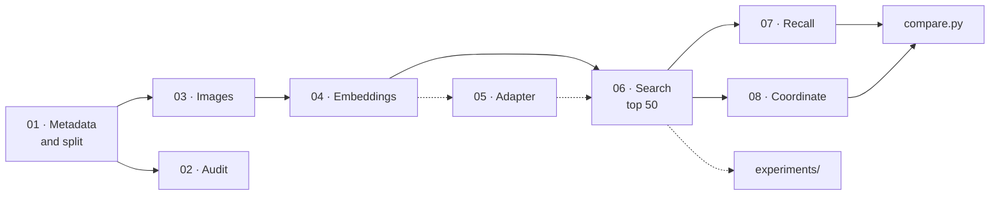

# VPR Osnabrück — Visual Place Recognition on Mapillary images

**English** · [Deutsch](README.de.md)

[Terms](#terms-in-one-sentence) ·
[Results](#results-at-a-glance) ·
[Quick start](#quick-start) ·
[Usage](#usage) ·
[Detailed results](#results) ·
[Commands](#command-reference) ·
[**Side studies →**](experiments/README.md)

[](https://github.com/nbomers/VisualPlaceRecognition/actions/workflows/check.yml)
[](#installation)
[](LICENSE)
[](NOTICE.md)
[](#data)
[](#six-cities)

A project for the programming lab (*Programmierpraktikum*) at **Osnabrück University**.

> [!NOTE]
> **Graded submission:** tag [`abgabe-2026-10-08`](https://github.com/nbomers/VisualPlaceRecognition/releases/tag/abgabe-2026-10-08)
> (commit `026deeb`). Later commits only translate the documentation; code and results are unchanged.
> Program output, plot labels and code comments are in German.

**A street photo in, a location out.** The system compares the photo with
geotagged reference images from Osnabrück and returns the coordinate of the
most similar one — together with a confidence and the matches themselves:

```bash
python locate.py foto.jpg
```

The encoders come pre-trained. Our own contribution is the **benchmark**
around them: a split by drives instead of by images, three definitions of "correct",
confidence intervals, fingerprints against mixed-up files — and with that,
40 comparable variants of five encoders in six cities.


<sub>Left the query image, right MegaLoc's five most similar reference images;
green = at most 25 m from the true location. Images from
[Mapillary](https://www.mapillary.com), CC BY-SA 4.0, author of each image in
[QUELLEN.md](results/osnabrueck/figures/demo/QUELLEN.md).</sub>

> [!TIP]
> **This README is a summary. How every number came about** — method,
> all tables, figures and open questions for every side study —
> is in **[`experiments/README.md`](experiments/README.md)**.

---

## Contents

1. [Terms in one sentence](#terms-in-one-sentence)
2. [Results at a glance](#results-at-a-glance)
3. [Quick start](#quick-start)
4. [The project](#the-project)
5. [How it works](#how-it-works)
6. [Data](#data)
7. [Installation](#installation)
8. [Usage](#usage)
9. [Project structure](#project-structure)
10. [Results in detail](#results) — including the [twin drives](#twin-drives), the problem in the dataset
11. [Reproducibility](#reproducibility)
12. [Limitations and possible extensions](#limitations-and-possible-extensions)
13. [Command reference](#command-reference)
14. [Troubleshooting](#troubleshooting)
15. [Team](#team) · [Use of AI](#use-of-ai) · [Credits](#credits) · [License](#license)

**Side studies:** all 20 experiments with method and figures in [`experiments/README.md`](experiments/README.md).

---

## Terms in one sentence

| Term | Meaning |
|---|---|
| **VPR** | *Visual Place Recognition*: finding where a photo was taken by comparing it with images of known places. |
| **Query, reference** | The **query** is the photo whose location is sought. The **reference** (*database*) are images with a known location. |
| **Encoder, embedding** | A neural network (encoder) turns every image into a vector of numbers (embedding). Similar places give similar vectors. |
| **cos** | Similarity of two embeddings, from −1 to 1. The best match is the reference image with the highest cos. |
| **Recall@1 (R@1)** | Share of queries whose best match lies at most 25 m from the true location. **0.568 means: 56.8 % correct.** R@5: any of the five best. |
| **solvable** | A query with at least one reference image within 25 m. Only these count in the recall — what is not in the reference, no model can find. |
| **Ground truth** | The rule for "correct". **Standard:** at most 25 m. **Hard:** additionally a different account or more than 180 days apart. **Viewing direction:** additionally at most 90° compass difference. |
| **Drive, sequence** | A continuous capture series, one image every 0.17 s. Train, reference and queries are split **by sequence**, never by single image. |
| **Benchmark, full reference** | Two protocols. Benchmark: 15 % of the sequences as reference (48,321 images). Full reference: all 279,453 images that are not queries. |
| **95 % interval** | The range that contains the true value with 95 % confidence. Computed by resampling the 198 query drives 1,000 times (*bootstrap*). |
| **Paired difference** | The difference between two variants on the same queries — far more precise than two separate numbers. **"Established"** means: its interval excludes 0. |
| **Adapter** | A small layer trained on top of a frozen encoder. |
| **PCA, whitening** | Fixed transformations without training: PCA shortens a vector, whitening gives all its axes equal weight. |

---

## Results at a glance

Five encoders, the same 53,414 queries from Osnabrück, R@1 at 25 m:

| Encoder | trained for places | Dim | full reference | full, without twins | full, Hard | Benchmark |
|---|:---:|---:|---:|---:|---:|---:|
| **MegaLoc** | yes | 8448 | **0.798** <sub>[0.739, 0.848]</sub> | **0.690** | **0.523** | **0.568** <sub>[0.475, 0.666]</sub> |
| **EigenPlaces** | yes | 2048 | 0.701 <sub>[0.630, 0.765]</sub> | 0.593 | 0.427 | 0.484 <sub>[0.405, 0.574]</sub> |
| MixVPR | yes | 4096 | 0.653 <sub>[0.575, 0.724]</sub> | 0.533 | 0.373 | 0.426 <sub>[0.354, 0.509]</sub> |
| AnyLoc | no | 4096 | 0.435 <sub>[0.343, 0.533]</sub> | 0.273 | 0.148 | 0.204 <sub>[0.153, 0.265]</sub> |
| CLIP | no | 512 | 0.232 <sub>[0.144, 0.349]</sub> | 0.071 | 0.024 | 0.073 <sub>[0.044, 0.108]</sub> |
| *Random guess* | | | *0.0005* | | | *0.0006* |

<sub>The small numbers are the 95 % interval. The three "full" columns use the same reference and count
with different strictness: all matches; without drives uploaded twice; Hard = only matches from a different account or more than 180 days apart. Why this
is needed: [twin drives](#twin-drives). Variants with
PCA, whitening, adapter and post-processing: [benchmark protocol](#benchmark-protocol).</sub>

> [!IMPORTANT]
> **A problem in the dataset that we found ourselves.** Mapillary lists some drives twice: as two
> sequences of the same account, fractions of a second apart. Our split separates by sequence and did not see this.
> With the full reference, 28 % of the Osnabrück queries had an almost identical copy; without them MegaLoc finds
> **0.690 instead of 0.798**. In Jena, by contrast, the "duplicates" are mostly not copies but a second camera
> looking in another direction. Measurement, explanation and consequences: [twin drives](#twin-drives).


> [!NOTE]
> **How to read the chart**
> - **One bar** is the R@1 at 25 m of one variant in the benchmark protocol, i.e. against the 48,321
>   reference images. The colour marks the encoder, the label the variant.
> - **Variants:** without suffix the encoder as published; `+linear` with a trained adapter;
>   `+hmm30-25` the match list re-ranked as a path of the drive; `+gv20` the 20 best matches checked
>   geometrically.
> - **The error bar** is the 95 % interval from the sequence bootstrap. It is about ±0.10 wide
>   because the 53,414 queries come from only 198 drives, and images of one drive succeed or fail
>   together.
> - **Comparing two bars:** overlapping error bars do *not* mean there is no difference.
>   Whether a variant is better is decided by the [paired difference](#uncertainty) on the same queries;
>   its interval is usually several times narrower.

**Eight findings.** Each one is measured; "established" means the interval excludes 0.

| | Finding | Key number | More |
|---|---|---|---|
| 1 | **The encoder is the biggest lever.** | CLIP → MegaLoc +0.496 [+0.405, +0.590], established. The ranking holds at 512 dimensions too. | [Recall](#how-well-does-the-system-find-the-location) |
| 2 | **More reference helps — part of it is twins.** | Benchmark 0.568 → full reference 0.798. Without drives uploaded twice 0.550 → **0.690**: +0.14 instead of +0.23. | [Twin drives](#twin-drives) |
| 3 | **What matters is a reference image facing the same direction.** | 0.653 with, 0.071 without. | [What it fails on](#what-it-fails-on) |
| 4 | **Fine-tuning hurts the good encoders.** | MegaLoc with adapter −0.126 [−0.179, −0.073]. The gain for CLIP came from whitening. | [Adapter](experiments/README.md#adapter-diagnosis--adapter_diagnosepy) |
| 5 | **Post-processing barely helps — only the drive as a path.** | HMM +0.030 [+0.020, +0.041], established. Geometric verification −0.029, not established. | [Post-processing](#what-post-processing-brings) |
| 6 | **Errors come in clusters.** | 45 % of the misses lie within 100 m, 44 % beyond 1 km. | [Structure of the errors](#structure-of-the-errors) |
| 7 | **cos is a usable confidence.** | At cos ≥ 0.30, 82 % of the answers are correct. | [Rejection](#how-reliable-is-an-answer) |
| 8 | **One city says nothing about a method.** | R@1 varies between cities from 0.336 to 0.651; the gap MegaLoc − EigenPlaces only from +0.073 to +0.114, established in every city. | [Six cities](#six-cities) |

---

## Quick start

**Only look at the results** — no download, no GPU. The result files are in Git:

```bash
git clone https://github.com/nbomers/VisualPlaceRecognition.git && cd VisualPlaceRecognition
```

```bash
conda env create -f environment.yml && conda activate vpr
```

```bash
python compare.py --ci
```

**Compute everything yourself** — needs a [Mapillary token](#installation),
about 50 GB for images and 3 to 25 GB per encoder:

```bash
cp .env.example .env
```

```bash
python setup_external.py
```

```bash
python run.py
```

`run.py` runs the pipeline notebooks 02 to 08 and skips every
stage whose result already matches `config.yaml`. On the first run the
image download takes hours and encoding takes between half an hour and a night,
depending on the encoder; everything after that takes minutes.

<sub>One block, one command: the copy icon takes exactly one call.
Comments are deliberately left out of the blocks — zsh would pass a pasted
`# …` on as an argument.</sub>

---

## The project

**The question.** How well do published VPR methods find a location in
a city that none of them has ever seen — with images that nobody
selected for them? Research measures on curated datasets
(Pittsburgh-30k, MSLS). Here it is Osnabrück, with everything Mapillary has there.

**Three sub-questions.**
1. How close do open-source encoders come to the numbers in their papers?
2. What limits a VPR system in practice — model, data, descriptor or post-processing?
3. How do you measure so that the numbers mean something? *This one became the most important.*

**Scope.**
- No encoder is trained; all five come with their authors' weights.
- Only a linear adapter is trained — as a comparison, not as a contribution.
- Osnabrück is the main city: all variants and side studies run there.
  Five more cities test with MegaLoc and EigenPlaces what carries over.
- A benchmark and a demo, not a product.

**What should be there at the end — and is:**

- A split without leakage between sequences, in Git and re-checked by a test —
  with a gap that we found and measured ourselves: [twin drives](#twin-drives)
- Every row under the same conditions: fingerprints check every intermediate result
- Three ground-truth definitions and a random baseline
- Differences tested statistically: 39 paired comparisons with intervals
- Results explained, not just reported, including six negative results
- A system to demonstrate: [`locate.py`](locate.py) and [`demo/demo.ipynb`](demo/demo.ipynb)

---

## How it works



| Stage | Notebook | What happens |
|---|---|---|
| 01 | [`01_mapillary_coverage`](notebooks/01_mapillary_coverage.ipynb) | fetch the city's image points, split by sequence into train / database / query (70 / 15 / 15 %) |
| 02 | [`02_dataset_audit`](notebooks/02_dataset_audit.ipynb) | check the dataset: leakage, years, coverage, photographers |
| 03 | [`03_image_download`](notebooks/03_image_download.ipynb) | download images (1024 px) and verify them |
| 04 | [`04_embeddings`](notebooks/04_embeddings.ipynb) | every image through the encoder |
| 05 | [`05_adapter`](notebooks/05_adapter.ipynb) | optional: train a linear adapter on train |
| 06 | [`06_retrieval`](notebooks/06_retrieval.ipynb) | the 50 most similar reference images per query |
| 07 | [`07_evaluation`](notebooks/07_evaluation.ipynb) | recall at 5 / 10 / 25 / 50 / 100 m, three ground truths |
| 08 | [`08_localization`](notebooks/08_localization.ipynb) | a coordinate from the match list, error in metres |

**Why the split is by sequence.** If you split by single image, almost every
query would have a training image from the same metre — from the same
drive, a fraction of a second later. Recall would then measure finding
the same photo again, not recognising a place.


<sub>The same 400 m section. On the left every drive lies entirely in one
pot; on the right, shuffled per image, almost every query has a training image
right next to it.</sub>

**The five encoders.**

| Encoder | Network | Dim | trained for places |
|---|---|---:|:---:|
| [MegaLoc](https://github.com/gmberton/MegaLoc) | DINOv2 | 8448 | yes |
| [EigenPlaces](https://github.com/gmberton/EigenPlaces) | ResNet-50 | 2048 | yes |
| [MixVPR](https://github.com/amaralibey/MixVPR) | ResNet-50 + MLP-Mixer | 4096 | yes |
| [AnyLoc](https://github.com/AnyLoc/AnyLoc) | DINOv2 ViT-G + VLAD, PCA to 4096 | 4096 | no |
| [CLIP](https://github.com/openai/CLIP) ViT-B/32 | Vision Transformer | 512 | no |

Whether an encoder is trained for places later explains how it reacts to adapter and
whitening.

**Four building blocks.**
- **[`config.yaml`](config.yaml)** is the single switch: city, split, encoder, radii.
  Changing a value changes the fingerprint of the affected files — and exactly those are recomputed.
- **[`src/`](src/)** is the shared code. The recall evaluation lives in exactly one place
  ([`src/evaluation.py`](src/evaluation.py)) and applies to 07 as well as to every experiment.
- **[`notebooks/`](notebooks/)** are the pipeline 01–08; [`run.py`](run.py) runs them in order.
- **[`experiments/`](experiments/README.md)** asks one question per script and answers with the same building blocks.

<details>
<summary><b>The modules in <code>src/</code></b></summary>

| Module | Task |
|---|---|
| [`config.py`](src/config.py), [`paths.py`](src/paths.py) | read the config, take over environment variables, all storage locations per city |
| [`run_guard.py`](src/run_guard.py) | write and check fingerprints, check the config for contradictions |
| [`split.py`](src/split.py), [`pairs.py`](src/pairs.py) | sequence split; image pairs for audit and adapter |
| [`evaluation.py`](src/evaluation.py) | the recall evaluation, three ground truths |
| [`retrieval.py`](src/retrieval.py) | load match lists, "solvable" and hits per query |
| [`sequence_hmm.py`](src/sequence_hmm.py), [`verification.py`](src/verification.py) | post-processing: drive as a path, geometric verification |
| [`locate.py`](src/locate.py) | photo → encoder → search → coordinate with confidence |
| [`models/`](src/models/) | one module per encoder, adapter, PCA / whitening / concatenation variants, `factory.py` |
| [`districts.py`](src/districts.py), [`geo.py`](src/geo.py) | districts from OSM; distances and projections |
| [`mapillary.py`](src/mapillary.py), [`quellen.py`](src/quellen.py) | API access; attribution per image in every figure |
| [`adapter_training.py`](src/adapter_training.py), [`device.py`](src/device.py) | adapter training; cuda / mps / cpu |

</details>

---

## Data


<sub>Images from [Mapillary](https://www.mapillary.com), CC BY-SA 4.0:
[pedestrian zone](https://www.mapillary.com/app/?pKey=1391533835065315) ·
[motorway](https://www.mapillary.com/app/?pKey=1452480101753239) ·
[park](https://www.mapillary.com/app/?pKey=3796249137169638) ·
[by the water](https://www.mapillary.com/app/?pKey=1120224498685697) ·
[residential street](https://www.mapillary.com/app/?pKey=500860001925774) ·
[main road](https://www.mapillary.com/app/?pKey=775519696297537)</sub>

| | Osnabrück |
|---|---|
| **Source** | [Mapillary](https://www.mapillary.com): street-level images from volunteers, CC BY-SA 4.0; faces and licence plates blurred |
| **Size** | 332,868 images over 120 km² of city area |
| **Split** | by sequence: train 231,133 · reference 48,321 · queries 53,414 (70 / 15 / 15 %) |
| **Queries** | 198 drives; median 176 images per drive, the longest 3,156 |
| **Photographers** | 57 accounts; one provides 47.8 % of all images |
| **Years** | 2014 to 2026, peaks in 2022 (29 %) and 2016 |
| **Solvable** | 63.9 % of the queries have a reference image within 25 m |

<p align="center">
  
</p>
<p align="center">
  
</p>

<sub>From `02_dataset_audit`: top the spatial coverage, bottom the
capture years. More figures in
[`results/osnabrueck/dataset_audit.json`](results/osnabrueck/dataset_audit.json).</sub>

**Why 25 metres?**
- The GPS of smartphones and dashcams typically scatters by 5 to 15 m in a city.
  A tighter threshold would measure the camera's noise rather than the encoder.
- 50 m would already catch the neighbouring street.
- MSLS and Pittsburgh-30k use the same order of magnitude.
- Every number is also available at 5, 10, 50 and 100 m: `python compare.py --threshold 5`.

---

## Installation

| | |
|---|---|
| **Python** | 3.11 or newer; tested with 3.11 and 3.14 |
| **Environment** | conda (recommended) or uv |
| **GPU** | not required but helpful: 04 encodes every image of the city. AnyLoc and MegaLoc belong on a CUDA GPU |
| **Memory** | one encoder's embeddings are `images × dimension × 4 bytes` — MegaLoc in Osnabrück 11.2 GB. 16 GB are enough for Osnabrück |
| **Disk** | 50 GB images, 3 to 25 GB per encoder, 1 GB results |
| **Mapillary token** | free [developer account](https://www.mapillary.com/developer) |

```bash
conda env create -f environment.yml
```

```bash
conda activate vpr
```

```bash
nbstripout --install --attributes .gitattributes
```

```bash
pytest tests/
```

`nbstripout` keeps cell outputs out of Git; `pytest` checks the installation
without Torch and without images. **On a Mac**, read the
[troubleshooting](#troubleshooting) section once afterwards — otherwise the demo crashes silently on the first
photo of your own.

**Token.** The Mapillary token belongs in a local `.env`, never in the repository:

```bash
cp .env.example .env
```

**Third-party repositories.** AnyLoc and MixVPR are imported from their original
repos; a script fetches them at pinned commits, together with the MixVPR weights
(with SHA-256 check) and the AnyLoc vocabulary:

```bash
python setup_external.py
```

EigenPlaces and MegaLoc download themselves on the first run via `torch.hub`
— not pinned to a commit. The license of every component is listed
in [NOTICE.md](NOTICE.md).

<details>
<summary><b>Alternative with uv</b>, and which versions are tested</summary>

```bash
uv venv --python 3.14 && source .venv/bin/activate && uv pip install -r requirements.txt
```

`requirements.txt` and `environment.yml` give lower bounds, not pinned
versions. A resolution under which tests, linter and pipeline demonstrably
ran is frozen:

```bash
uv pip install -r requirements.lock.txt
```

`conda install --file requirements.txt` does **not** work — several
packages are only available via pip. The right PyTorch build is given by the
[PyTorch configurator](https://pytorch.org/get-started/locally/).

</details>

<details>
<summary><b>The most important keys in <code>config.yaml</code></b></summary>

`validate_config` checks the file for contradictions on load, before a
stage computes for hours.

| Key | Meaning |
|---|---|
| `city` | city — and the folder name of all results; can be overridden with `VPR_CITY` |
| `vpr.method`, `vpr.adapter` | encoder and adapter; `run.py --method/--adapter` overrides both |
| `vpr.uncertain_radius_m` | the 25 m of the ground truth |
| `vpr.max_heading_diff_deg` | the 90° of the viewing-direction evaluation |
| `retrieval.top_k`, `k_values`, `thresholds` | stored matches, reported R@k and thresholds |
| `retrieval.min_days_apart` | the 180 days of the Hard ground truth |
| `image_root` | where the images are; can be overridden with `VPR_IMAGE_ROOT` |
| `osm.overpass_url`, `osm.timeout_s` | endpoint and timeout for OpenStreetMap; via `VPR_OVERPASS_URL` |

</details>

---

## Usage

**The most common commands.** All others are in the [command reference](#command-reference).

| Task | Command |
|---|---|
| Run the pipeline, skip what is done | `python run.py` |
| What is available on this machine? | `python run.py --bestand` |
| Another encoder | `python run.py --method megaloc` |
| Comparison table with intervals | `python compare.py --ci` |
| Locate a photo | `python locate.py foto.jpg` |
| Tests | `pytest tests/` |

### Locating a photo of your own

Your own photos go into the folder `test/` next to the city's image folder,
by default `~/Downloads/mapillary/test`:

<p align="center">
  
</p>

```bash
python locate.py ~/Downloads/mapillary/test
python locate.py ~/Downloads/mapillary/test --referenz alle
```

**Which images are searched.** The default is the evaluation's reference
(48,321 images, 15 % of the drives). Your own photos belong to no split, so
it may be more: `--referenz alle` searches all 332,868 images, `voll`
everything except the queries. More reference means a nearby image more often
(MegaLoc: 0.568 with the benchmark reference → 0.690 with the full reference, without copies). What does not fit into memory
is read block by block from disk. The cos threshold below was measured against
the default reference.

`--method` selects another encoder, `--k` the number of matches, `--json`
prints everything machine-readable. The same with images and a map:
[`demo/demo.ipynb`](demo/demo.ipynb), section "Eigene Fotos testen".

**How to read the output.**
- **Coordinate** = the location of the best match.
- **cos** = the confidence. With MegaLoc, 82 % of the answers at cos 0.30 or above are correct; below that the demo warns.
- **Distance to #1** = how far the other matches lie from the best one, computed from the coordinates of the
  reference images. Your own photo needs no GPS for this.
- **Spread** = the largest of these distances. It measures whether the matches agree — **not** whether they
  are right: five images of the same drive always lie close together, even at the wrong place.
- **cos above 0.95** means practically the same image. If the photo itself is in the dataset, `--referenz alle` finds it again.

### What the demo shows

<p align="center">
  
</p>
<p align="center">
  
  
</p>

<sub>Top: a failed query (red = more than 25 m off), although there are
reference images nearby. Bottom: the matches on the street network: on the left
the best match is correct, others are more than 200 m away — two groups; on the right
no match is closer than 200 m. Only matches from a different account count as examples,
and only slow drives away from the motorway.</sub>

The same query image through all five encoders:


<sub>One row per encoder; green = at most 25 m off. Note that each encoder has its own cos scale:
CLIP gives wrong matches 0.90, MegaLoc gives the right one 0.41. Images from
[Mapillary](https://www.mapillary.com), CC BY-SA 4.0, author of each image in
[QUELLEN.md](results/osnabrueck/figures/demo/QUELLEN.md).</sub>

---

## Project structure

```text
.
├── README.md             this document (English); README.de.md in German
├── config.yaml           all parameters — the single switch
├── run.py                pipeline 01–08, skips what is done
├── compare.py            comparison tables and figures
├── locate.py             locate a photo
├── setup_external.py     fetch third-party repos and weights
├── environment.yml       conda environment (requirements.txt for uv)
│
├── notebooks/            the pipeline
│   ├── 01_mapillary_coverage.ipynb
│   ├── 02_dataset_audit.ipynb
│   ├── 03_image_download.ipynb
│   ├── 04_embeddings.ipynb
│   ├── 05_adapter.ipynb
│   ├── 06_retrieval.ipynb
│   ├── 07_evaluation.ipynb
│   └── 08_localization.ipynb
├── demo/demo.ipynb       match rows, maps, your own photos
│
├── experiments/          side studies — own README
├── src/                  shared code
├── tests/                pytest
├── data/<city>/          metadata and split
└── results/<city>/       results and figures
```

<details>
<summary><b>What is created when computing</b> (not in Git)</summary>

```text
data/<city>/embeddings/<encoder>/     embeddings from 04 and 05
results/<city>/retrieval/<encoder>/   match lists from 06
weights/                              adapter, MixVPR weights
external/                             AnyLoc and MixVPR
cache/                                OpenStreetMap responses
~/Downloads/mapillary/<city>/         the images (image_root)
~/Downloads/mapillary/test/           your own photos
```

All storage locations come from [`src/paths.py`](src/paths.py); `<city>` is
the folder name derived from `city` (`Osnabrück, Germany` → `osnabrueck`).

</details>

---

## Results

The common thread in six questions. Each answer has a detailed
section in the [side studies](experiments/README.md).

1. [How well does the system find the location?](#how-well-does-the-system-find-the-location)
2. [Does this hold in other cities too?](#six-cities)
3. [What does it fail on?](#what-it-fails-on)
4. [What does post-processing bring?](#what-post-processing-brings)
5. [How reliable is an answer?](#how-reliable-is-an-answer)
6. [What does it cost?](#what-it-costs)

<sub>Number blocks are either the **verbatim output** of a command or
an **excerpt** from a versioned JSON; the source is given below each.
Blocks show numbers as the programs print them (decimal point, thousands
comma). Program output is in German: *Alle Queries* = all queries, *loesbare* = solvable,
*Schwelle* = threshold, *Zufall (Raten)* = random guess.</sub>

### How well does the system find the location?

> **In short:** with the full reference, MegaLoc locates 8 out of 10 solvable queries
> within 25 m. Part of that are drives uploaded twice — without them
> it is just under 7 out of 10 (0.690).

#### Full reference

```text
Alle Queries  |  Schwelle 25 m  |  48,177 loesbare Queries  |  Referenz: 279,453 Bilder (database + train)

Encoder       Variante     Dim        R@1          95-%-KI     R@5    R@10    R@20
----------------------------------------------------------------------------------
anyloc        none        4096      0.435  [0.343, 0.533]   0.512   0.549   0.588
clip          none         512      0.232  [0.144, 0.349]   0.288   0.318   0.353
eigenplaces   none        2048      0.701  [0.630, 0.765]   0.775   0.801   0.824
megaloc       none        8448      0.798  [0.739, 0.848]   0.858   0.876   0.888
mixvpr        none        4096      0.653  [0.575, 0.724]   0.723   0.751   0.777
----------------------------------------------------------------------------------
Zufall        (Raten)              0.0005                   0.0022  0.0043  0.0088

Intervall: Sequenz-Bootstrap, 2,5- und 97,5-Perzentil (experiments/bootstrap_ci.py).
Fuer den Vergleich zweier Zeilen gilt die gepaarte Differenz dort, nicht die Ueberlappung.
```

<sub>Verbatim output of `python compare.py --reference full --ci`.</sub>

- **The same ranking as in the benchmark, every number about 0.2 higher.**
- No adapter: the adapter learned on `train`, and `train` as reference would be leakage for it.
- All 18 rows including PCA and whitening: `--derived` and
  [full reference](experiments/README.md#full-reference--full_referencepy).

#### Benchmark protocol

Here all 40 variants are compared: adapter, PCA, whitening, concatenation, post-processing.

```text
Alle Queries  |  Schwelle 25 m  |  34,112 loesbare Queries  |  Referenz: 48,321 Bilder (database)

Encoder       Variante     Dim        R@1          95-%-KI     R@5    R@10    R@20
----------------------------------------------------------------------------------
anyloc        none        4096      0.204  [0.153, 0.265]   0.294   0.340   0.384
anyloc        linear      4096      0.335  [0.277, 0.400]   0.504   0.570   0.631
clip          none         512      0.073  [0.044, 0.108]   0.106   0.129   0.158
clip          linear       512      0.123  [0.092, 0.161]   0.221   0.281   0.353
eigenplaces   none        2048      0.484  [0.405, 0.574]   0.608   0.650   0.695
eigenplaces   hmm30-25    2048      0.501  [0.415, 0.596]   0.603   0.633   0.675
eigenplaces   linear      2048      0.444  [0.372, 0.523]   0.593   0.648   0.696
megaloc       none        8448      0.568  [0.475, 0.666]   0.676   0.719   0.763
megaloc       gv20        8448      0.539  [0.456, 0.631]   0.678   0.726   0.763
megaloc       hmm30-25    8448      0.598  [0.500, 0.699]   0.690   0.725   0.764
megaloc       linear      8448      0.442  [0.372, 0.517]   0.580   0.628   0.667
mixvpr        none        4096      0.426  [0.354, 0.509]   0.543   0.590   0.642
mixvpr        linear      4096      0.363  [0.302, 0.433]   0.508   0.568   0.624
----------------------------------------------------------------------------------
Zufall        (Raten)              0.0006                   0.0028  0.0047  0.0098

Intervall: Sequenz-Bootstrap, 2,5- und 97,5-Perzentil (experiments/bootstrap_ci.py).
Fuer den Vergleich zweier Zeilen gilt die gepaarte Differenz dort, nicht die Ueberlappung.
```

<sub>Verbatim output of `python compare.py --ci`.</sub>

| Variant | means |
|---|---|
| `none` | encoder as published |
| `linear` | with a trained linear adapter |
| `hmm30-25` | match lists of a drive re-ranked as a path ([drive as a path](#what-post-processing-brings)) |
| `gv20` | top 20 checked geometrically and re-ranked |
| `_pca512`, `_pcaw512`, `_concat`, `seq3` | shortened by PCA, additionally whitened, two encoders concatenated, neighbouring images summed — with `--derived` |

The most important derived variants:

| Variant | Dim | Benchmark | full reference |
|---|---:|---:|---:|
| MegaLoc | 8448 | 0.568 | 0.798 |
| MegaLoc, PCA + whitening | 512 | 0.541 | 0.778 |
| EigenPlaces + MegaLoc concatenated | 1024 | 0.572 | 0.778 |
| EigenPlaces, PCA + whitening | 512 | 0.507 | 0.715 |

<sub>In the benchmark the concatenation is not "ahead" of MegaLoc: +0.004 [−0.005, +0.014]
includes 0. More under [PCA and whitening](experiments/README.md#pca-and-whitening--pca_reducepy)
and [concatenation](experiments/README.md#concatenation--concat_embeddingspy).</sub>

#### Twin drives

> [!WARNING]
> **Part of the "correct" matches are the same drive, uploaded twice.**
> Mapillary lists some drives as two sequences — same account, timestamps
> fractions of a second apart, the same coordinates. The split separates by
> sequence and does not see this. If one copy ends up among the queries and the
> other in the reference, every encoder finds an almost identical image: 0 m
> away and far ahead of all other candidates (example with MegaLoc: cos 0.56, rank 2 only 0.35).

**How often?** Twin here means: same account, at most 60 s apart, within
25 m. In Osnabrück **3.4 %** of the queries have one in the
benchmark and **28.2 %** with the full reference — `train` contains many
copies. 97 % of these twins face the same direction as the query.
That is not the case everywhere: in Jena it is only 12 %; there, cameras with
several viewing directions upload simultaneous sequences ([six cities](#six-cities)).

**What it changes.** `experiments/zwillinge.py` removes the copies from the
match list as if they had never been uploaded — the next candidates
move up:

| R@1 at 25 m | Benchmark | without twins | full reference | without twins |
|---|---:|---:|---:|---:|
| MegaLoc | 0.568 | 0.550 | 0.798 | **0.690** |
| EigenPlaces | 0.484 | 0.464 | 0.701 | **0.593** |
| MixVPR | 0.426 | 0.409 | 0.653 | 0.533 |
| AnyLoc | 0.204 | 0.167 | 0.435 | 0.273 |
| CLIP | 0.073 | 0.031 | 0.232 | 0.071 |

<sub>From `experiments/results/osnabrueck/zwillinge.json`. "Without twins" counts
only queries that are solvable without a copy too (benchmark 33,146 instead of 34,112,
full 47,800 instead of 48,177). No interval.</sub>

- **Little effect in the benchmark** (MegaLoc −0.018): the encoder comparisons and paired differences hold.
- **A large effect with the full reference:** MegaLoc −0.108; for 18 % of all queries the first match was a twin.
- **The ranking holds**, and the gap MegaLoc − EigenPlaces is +0.097 with and without twins.
- **Weak encoders live off copies:** with the full reference CLIP drops from 0.232 to 0.071, AnyLoc from 0.435 to 0.273.
- **More reference still helps:** 0.550 → 0.690 instead of 0.568 → 0.798.
- **The honest number to report is 0.690.** The Hard column of the [summary table](#results-at-a-glance)
  (MegaLoc 0.523) is stricter still: it also removes genuine repeat drives by the same photographer.

The measurement per city, the method, what it means for every other result and how to fix it: [twin drives](experiments/README.md#twin-drives--zwillingepy).

#### Uncertainty

The 53,414 queries come from only 198 drives, and images of the same drive
fail together. The bootstrap therefore resamples the **drives**, not the images.

- **A single number** is only accurate to one decimal place: ±0.03 (CLIP)
  to ±0.10 (MegaLoc). The usual binomial error would have claimed ±0.005.
- **A difference between two variants** is much more precise (±0.005 to ±0.09),
  because both fail on the same hard drives.

```text
Vergleich (a → b)                             ΔR@1   95-%-Intervall     belegt
-----------------------------------------------------------------------------
eigenplaces → eigenplaces_pca512            -0.003   [-0.008, +0.002]   nein
eigenplaces → eigenplaces_pcaw512           +0.022   [+0.011, +0.039]   ja
eigenplaces → eigenplaces_pcaw2048          -0.025   [-0.042, -0.010]   ja
anyloc → anyloc_pcaw4096                    +0.117   [+0.078, +0.162]   ja
megaloc → eigenplaces_megaloc_concat        +0.004   [-0.005, +0.014]   nein
megaloc → megaloc_hmm30-25                  +0.030   [+0.020, +0.041]   ja
megaloc → megaloc_gv20                      -0.029   [-0.062, +0.000]   nein
megaloc → megaloc_linear                    -0.126   [-0.179, -0.073]   ja
clip_pcaw512 → clip_pcaw512_linear          +0.009   [-0.002, +0.021]   nein
```

<sub>Excerpt from [`experiments/results/osnabrueck/bootstrap_ci.json`](experiments/results/osnabrueck/bootstrap_ci.json);
it contains all 39 pairs, also for R@5 to R@20 (*belegt* = established, *ja/nein* = yes/no). Method:
[confidence intervals](experiments/README.md#confidence-intervals--bootstrap_cipy).
The upper bound for `megaloc_gv20` is +0.0003, so that result is a borderline case.</sub>

### Six cities

> **In short:** the level depends on the city, the gap between the models does not.

The same pipeline in five more cities, selected in advance from 50 candidates by
Mapillary metadata — before a single image was downloaded
([city selection](experiments/README.md#city-selection--city_coveragepy)).

```text
Was sich uebertraegt   R@1 bei 25 m (MegaLoc voll = volle Referenz)
Delta = MegaLoc - EigenPlaces, gepaart ueber dieselben Anfragen, 95-%-Intervall aus dem Bootstrap

Stadt            Anfragen Fahrten  EigenPl  MegaLoc   Delta [95 %]              voll   Delta voll [95 %]
--------------------------------------------------------------------------------------------------------
osnabrueck         53,414     198    0.484    0.568   +0.084 [+0.055, +0.116]  0.798   +0.096 [+0.070, +0.122]
fuerth             24,994     239    0.473    0.549   +0.076 [+0.057, +0.096]  0.699   +0.072 [+0.052, +0.092]
karlsruhe          87,181     584    0.306    0.419   +0.114 [+0.095, +0.134]  0.640   +0.132 [+0.111, +0.155]
kaiserslautern     58,916     249    0.552    0.651   +0.099 [+0.079, +0.122]  0.810   +0.077 [+0.058, +0.096]
wuerzburg          60,203     300    0.263    0.336   +0.073 [+0.045, +0.106]  0.476   +0.092 [+0.057, +0.130]
jena              114,558     677    0.332    0.417   +0.084 [+0.073, +0.096]  0.622   +0.102 [+0.091, +0.113]
  Niveau MegaLoc: 0.336 bis 0.651 (Spanne 0.315); Abstand: +0.073 bis +0.114 (Spanne 0.041)
  MegaLoc vorn mit Intervall ueber 0: 12 von 12 (Staedte x Protokolle)
```

<sub>Verbatim output of `python experiments/city_comparison.py`, first part
(*Anfragen* = queries, *Fahrten* = drives, *voll* = full reference, *Niveau* = level, *Abstand* = gap).</sub>

- **The level moves:** MegaLoc from 0.336 (Würzburg) to 0.651 (Kaiserslautern) — a range of 0.315.
- **The gap stays:** MegaLoc ahead of EigenPlaces in all six cities and both protocols, all twelve intervals exclude 0. Range only 0.041.
- **Würzburg** has 98 % street coverage and still the lowest recall: only 45.5 % of the queries are solvable, and the images are old (median 627 days between query and match).
- **The Hard filter costs** between 0.010 (Jena) and 0.204 (Kaiserslautern) — and this can be explained exactly ([city comparison](experiments/README.md#city-comparison--city_comparisonpy)).

**Twins per city.** The "full" column is not inflated equally everywhere:

```text
Zwillingsfahrten (selbes Konto, <= 60 s): R@1 mit und ohne
Stadt                Zw   Alle   ohne  Zw voll  Kopie   voll   ohne  Sprung   ohne
----------------------------------------------------------------------------------
osnabrueck         3.4%  0.568  0.550    28.2%  27.4%  0.798  0.690  +0.229 +0.139
fuerth             0.9%  0.549  0.548     6.0%   5.0%  0.699  0.692  +0.149 +0.144
karlsruhe          4.7%  0.419  0.394    18.4%  17.9%  0.640  0.577  +0.220 +0.183
kaiserslautern     2.6%  0.651  0.647     7.4%   4.7%  0.810  0.807  +0.159 +0.159
wuerzburg          1.4%  0.336  0.323     7.0%   6.6%  0.476  0.426  +0.141 +0.103
jena               6.4%  0.417  0.425    35.8%   4.3%  0.622  0.638  +0.206 +0.212
  Zw = Anteil der Anfragen mit einem Zwilling im Umkreis; Kopie = davon mit derselben
  Blickrichtung (<= 30 Grad), als Anteil aller Anfragen; Sprung = voll - Alle.
```

<sub>Output of `python experiments/city_comparison.py`, section on twin drives (MegaLoc). *Zw* = share of queries
with a twin nearby; *Kopie* = of those, with the same viewing direction (≤ 30°), as a share of all queries;
*Alle* = all matches, *ohne* = without twins, *Sprung* = jump from benchmark to full reference.
The shares come from `zwillinge.py`.</sub>

- **Copies raise the recall, second cameras do not.** The more genuine copies, the larger the loss without them:
  Osnabrück −0.108, Karlsruhe −0.063, Würzburg −0.050, the others barely. In Osnabrück 97 % of the twins are copies.
- **Jena** has the most twins (35.8 %), but only 12 % of them are copies; the rest are simultaneous cameras looking elsewhere — on a
  visually checked example, the front and rear camera of the same bicycle. They make a query "solvable" by the ground truth
  without any encoder being able to find it — without them R@1 even rises.
- **Without twins Osnabrück is mid-table:** Kaiserslautern 0.807, Fürth 0.692, Osnabrück 0.690, Jena 0.638,
  Karlsruhe 0.577, Würzburg 0.426.
- **The gap between the models stays:** MegaLoc − EigenPlaces without twins +0.076 to +0.116 in the benchmark.

### What it fails on

> **In short:** on the data, not on the model. What matters is whether the query's street
> has a reference image facing the same direction.

#### Reference density

<p align="center">
  
  
</p>

`train` added to the reference step by step:

| train added | reference images | solvable | MegaLoc | EigenPlaces |
|---:|---:|---:|---:|---:|
| 0 % | 48,321 | 63.9 % | 0.568 | 0.484 |
| 25 % | 107,449 | 78.4 % | 0.636 | 0.545 |
| 50 % | 160,981 | 84.9 % | 0.689 | 0.595 |
| 75 % | 222,300 | 88.4 % | 0.774 | 0.672 |
| 100 % | 279,453 | 90.2 % | 0.798 | 0.701 |

<sub>R@1 at 25 m among the solvable queries. Excerpt from
`experiments/results/osnabrueck/database_density_<encoder>.json`.</sub>

- More queries become solvable, **and** the recall among them rises — although the newly solvable ones are the harder ones.
- Part of the rise are [twins](#twin-drives) from `train`: without them MegaLoc rises from 0.550 to 0.690 instead of from 0.568 to 0.798.
- No interval. Details: [reference density](experiments/README.md#reference-density--database_densitypy).

#### Viewing direction, time, neighbours

<p align="center">
  
</p>
<p align="center">
  
</p>

```text
R@1 bei 25 m je Klasse, MegaLoc, 34,112 lösbare Anfragen       n     R@1
alle                                                      34,112   0.568   ██████████████████▏
Ein Nachbar schaut in dieselbe Richtung
  ja                                                      29,167   0.653   ████████████████████▉
  nein                                                     4,945   0.071   ██▎
Tage bis zum zeitlich nächsten Nachbarn
  0–7                                                      4,850   0.575   ██████████████████▍
  8–30                                                     3,675   0.819   ██████████████████████████▎
  31–180                                                  10,450   0.539   █████████████████▎
  181–365                                                  5,772   0.612   ███████████████████▋
  über 365                                                 9,365   0.472   ███████████████▏
Nachbarn im Umkreis von 25 m
  1–2                                                      1,705   0.523   ████████████████▊
  3–5                                                      3,496   0.483   ███████████████▌
  6–10                                                     3,883   0.534   █████████████████▏
  11–20                                                    6,808   0.448   ██████████████▍
  21–50                                                   14,076   0.600   ███████████████████▎
  51+                                                      4,144   0.780   █████████████████████████
Nachbar vom selben Konto am selben Tag
  ja                                                       3,168   0.690   ██████████████████████▏
  nein                                                    30,944   0.556   █████████████████▊
```

<sub>Excerpt from `experiments/results/osnabrueck/recall_by_difficulty_megaloc.json`.
A bar of 32 characters would be R@1 = 1.0. Classes, top to bottom: a neighbour faces the same direction (yes/no);
days to the temporally nearest neighbour; neighbours within 25 m; a neighbour from the same account on the same day.</sub>

- **Viewing direction separates most sharply:** without a neighbour facing the same direction 7 %, with one 65 %.
- **Time and number of neighbours act more weakly and not evenly:** 8–30 days apart is the best class,
  0–7 days only mid-table; among the neighbour counts only 51+ stands out.
- **A neighbour from the same account on the same day helps:** R@1 0.690 versus 0.556 without one — the same effect as the twins contained in this class.
- The second figure shows the same breakdown for EigenPlaces. Classes without interval; do not interpret differences below about 0.1.
  Details: [difficulty per query](experiments/README.md#difficulty-per-query--recall_by_difficultypy).

#### Districts

<p align="center">
  
</p>
<p align="center">
  
</p>

- **A factor of 12 with the same encoder:** MegaLoc 0.07 in Sutthausen, 0.83 in Atter.
- **The map shows the data, not the encoder:** EigenPlaces (second map) ranks the districts practically the same (Spearman 0.96).
- **Images per km² do not explain it** (ρ = 0.27): the city centre has the densest reference and only 38 % solvable queries.
- **Reasons per district:** Haste — hardly any matching viewing direction; Hellern — almost a year between query and reference; Sutthausen — a single
  drive that places 208 of its 414 queries in Hellern, 4 km away. The extremes rest on few drives.
  Details: [districts](experiments/README.md#districts--recall_by_districtpy).

#### Structure of the errors


Of 34,112 solvable queries, MegaLoc misses 14,726. Where do they land?

| Error | Share | means |
|---|---:|---|
| under 100 m | 45 % | the same street, just beyond the threshold |
| 100 m to 1 km | 11 % | |
| over 1 km | 44 % | another neighbourhood |

- **Bimodal:** almost nothing in between — a median describes this badly.
- **No dominant confusion:** the most frequent pair of districts accounts for 1.6 % of the errors.
- **Not the motorway:** the long red lines on the map are misleading. Motorway queries do not fail more often
  (R@1 0.570 versus 0.565); the large errors sit in residential streets.
- **Consequence:** in a gross confusion the other matches are at the wrong place too — which is why every averaging fails.
  Details: [confusion atlas](experiments/README.md#confusion-atlas--confusion_atlaspy).

### What post-processing brings

> **In short:** hardly anything. Only the drive as a path beats the best single match, and only narrowly.

| Method | Idea | Result (MegaLoc) | established |
|---|---|---|:---:|
| Averaging, clustering (5 kinds) | several matches into one coordinate | all worse than top 1 (clustering 0.318 versus 0.363, share of all queries) | — |
| Summing neighbouring images (`seq3`) | add up the match lists of neighbouring photos | −0.009 [−0.017, −0.001] (EigenPlaces, 512) | yes, worse |
| **Drive as a path (HMM)** | a candidate must fit the drive — nobody drives 6 km in 0.2 s | **+0.030 [+0.020, +0.041]** | **yes** |
| Geometric verification | re-check the top 20 with local features | −0.029 [−0.062, +0.000] | no (borderline) |
| Mapillary detections | objects in the image as a second signal | no gain; separates worse than the descriptor (AUC 0.56 versus 0.73, EigenPlaces) | — |

<p align="center">
  
  
</p>

<sub>Left the error of the best match over all 53,414 queries (median 94 m),
right the five averaging methods versus top 1. The same figures for
EigenPlaces: [`eigenplaces_lokalisierungsfehler.png`](results/osnabrueck/figures/localization/eigenplaces_lokalisierungsfehler.png),
[`localization_aggregation_eigenplaces.png`](experiments/results/osnabrueck/localization_aggregation_eigenplaces.png).</sub>

**Drive as a path.** A hidden Markov model reads the top k of consecutive
images as a possible route. The parameters (β = 30, σ = 25 m) were fixed before the run.
- MegaLoc 0.568 → **0.598**, EigenPlaces 0.484 → 0.501 — both established.
- The gain is small because most errors are coherent: a whole drive on the wrong street is consistent as a path too.
- For EigenPlaces it costs R@10 (0.650 → 0.633).
  Details: [drive as a path](experiments/README.md#drive-as-a-path--sequence_hmmpy).

**Geometric verification.** SuperPoint + LightGlue re-check the top 20 with local features
and re-rank by matching points. Computed for Osnabrück, 8.6 hours.

| R@1 | 5 m | 10 m | 25 m | 50 m | 100 m |
|---|---:|---:|---:|---:|---:|
| MegaLoc | 0.230 | 0.353 | 0.568 | 0.666 | 0.637 |
| + verification | 0.242 | 0.363 | 0.539 | 0.632 | 0.599 |
| Difference | +0.013 | +0.010 | −0.029 | −0.034 | −0.039 |

<sub>From `results/osnabrueck/evaluation/megaloc{,_gv20}.json`; an interval exists only at 25 m.</sub>

- **It sharpens the position but does not find the right place more often.** Reading: matching points measure
  how much two images overlap — not whether they show the same place.
- 87 % of all candidates pass the 15-point threshold; it barely separates.
- One setting in one city was measured. Details:
  [geometric verification](experiments/README.md#geometric-verification--geometric_verificationpy).

### How reliable is an answer?

> **In short:** the cos value of the best match is a usable confidence. If you
> stay silent at low cos, you are right considerably more often.

<p align="center">
  
</p>
<p align="center">
  
</p>

MegaLoc, solvable queries; precision = share of correct answers:

| answered | 100 % | 80 % | 50 % | 20 % |
|---|---:|---:|---:|---:|
| by cos | 0.568 | **0.689** | 0.793 | 0.887 |
| by gap to rank 2 | 0.568 | 0.618 | 0.724 | 0.860 |
| by agreement of the top 10 | 0.568 | 0.597 | 0.706 | 0.798 |

<sub>Excerpt from [`experiments/results/osnabrueck/rejection_curve_megaloc.json`](experiments/results/osnabrueck/rejection_curve_megaloc.json).</sub>

- **cos ≥ 0.30:** 82 % correct, 37 % of the solvable queries are answered.
- **cos ≥ 0.20:** 75 % correct at 69 %.
- The raw cos beats the other measures at every coverage; `locate.py` reports it as the confidence.
- cos is only comparable within one encoder: CLIP gives even wrong matches about 0.90.
- The concatenation EigenPlaces + MegaLoc is on par (0.695 at 80 %). Details: [rejection](experiments/README.md#rejection--rejection_curvepy).

### What it costs

> **In short:** MegaLoc is the most accurate. **The best trade-off is MegaLoc
> whitened to 512 dimensions:** 0.028 less R@1, but a 16.5 times
> smaller index and four times faster search.


```text
Encoder                        Dim     R@1  ms/Anfrage  Index MB  Bilder/s  alle Bilder
---------------------------------------------------------------------------------------
eigenplaces_megaloc_concat    1024   0.572        0.11       189         -            -
megaloc                       8448   0.568        0.74      1557      26.0        3.6 h
megaloc_pca512                 512   0.545        0.18        94         -            -
megaloc_pcaw512                512   0.541        0.18        94         -            -
eigenplaces_pcaw512            512   0.507        0.18        94         -            -
eigenplaces                   2048   0.484        0.21       378      33.8        2.7 h
eigenplaces_pca512             512   0.481        0.19        94         -            -
eigenplaces_pcaw2048          2048   0.459        0.21       378         -            -
mixvpr                        4096   0.426        0.44       755      77.9        1.2 h
mixvpr_pcaw512                 512   0.424        0.18        94         -            -
mixvpr_pca512                  512   0.408        0.17        94         -            -
anyloc_pcaw4096               4096   0.321        0.44       755         -            -
anyloc_pcaw512                 512   0.263        0.18        94         -            -
anyloc                        4096   0.204        0.45       755      14.6        6.3 h
anyloc_pca512                  512   0.175        0.18        94         -            -
clip_pcaw512                   512   0.105        0.18        94         -            -
clip_pca512                    512   0.074        0.18        94         -            -
clip                           512   0.073        0.19        94     178.6        31 min

  R@1 bei 25 m (Benchmark, 07). Suche: FAISS flach auf der CPU, Index ueber die Referenz.
  'alle Bilder' = 332,868 Bilder encodieren. Abgeleitete Varianten (PCA, Verkettung)
  encodieren mit dem Netz ihres Basis-Encoders.
  anyloc: ohne PCA-Projektion gemessen
```

<sub>Output of `python experiments/timing.py --skip-encode --skip-search` (prints the stored
measurements from [`timing.json`](experiments/results/osnabrueck/timing.json) without measuring again;
*ms/Anfrage* = ms per query, *Bilder/s* = images per second, *alle Bilder* = all 332,868 images). Encoded on
an Apple M1 Pro, AnyLoc on a CUDA GPU (RTX 3070, batch 4) — so its 6.3 h are not comparable with the others.</sub>

- **Winner: `megaloc_pcaw512`.** 0.028 less R@1 than MegaLoc, but a 94 instead of 1,557 MB index and 0.18 instead of 0.74 ms per query.
- **Why not the concatenation at the top of the list?** It needs two networks for encoding (EigenPlaces and MegaLoc),
  is not established ahead of MegaLoc in the benchmark (+0.004 [−0.005, +0.014]) and clearly behind it with the full reference (−0.019).
- **The index grows linearly with the width, the search time does not:** 16.5 times more memory, only 4 times slower.
- With 48,321 reference images this does not matter (10 s versus 39 s for all queries); with a million it would be a 32 GB versus 2 GB index.
- Encoding depends on the network and the image size, not on the PCA: `megaloc_pcaw512` encodes as fast as MegaLoc.
- **Compute the memory beforehand:** `images × dimension × 4 bytes`. MegaLoc in Jena: 23.6 GB.
  Details: [runtime and memory](experiments/README.md#runtime-and-memory--timingpy).

---

## Reproducibility

**One seed for everything.**
`vpr.split_seed: 42` controls the split, the adapter training, the PCA samples, the random baseline and the bootstrap.

**Metadata and split are in Git.**
`data/<city>/processed/metadata.parquet` (5 to 17 MB per city) and the three split lists.
A test recomputes the split from the seed. 01 now only runs for a new city — Mapillary changes, and a fresh run would produce a different dataset.

**Fingerprints instead of trust.**
Next to every intermediate file lies a `.fingerprint.json`: encoder, model configuration, split, hash of the metadata.
Every stage checks its inputs against it and aborts rather than compute wrong numbers with a file from a different run.

**Every result file knows its code.**
The JSONs from 07 and 08 carry the Git commit and a hash of the evaluation (`evaluation.py`, `geo.py`, `retrieval.py`).
A test checks that this commit exists in the repository.

**Tests recompute the results.**
The bootstrap must hit every recall number from 07 exactly; in addition, the evaluation is checked against a hand-computed expectation,
the split against the lists and the config against typos. The same tests run on every push in
[CI](.github/workflows/check.yml), under Python 3.11 and 3.14.

**Two machines.**
The encoders were computed on two machines and the embeddings merged with `rsync`.
Consequence: the same images are in a different row order per encoder, and MegaLoc lacks two training images.
Everything that puts encoders side by side therefore aligns via the `image_id`.

**Not bit-identical.**
The randomised SVD of the PCA variants rounds minimally differently on other hardware, and GPU training is not bit-exact.
If you want the exact numbers, use the embeddings they were computed with.

---

## Limitations and possible extensions

| Limitation | Consequence | Possible extension |
|---|---|---|
| **Twin drives** | parts of the recall, especially with the full reference, are re-found copies; in Jena most twins are second cameras, not copies | split by account and time instead of by sequence; until then read the number without twins as well (MegaLoc full 0.690 instead of 0.798) |
| **One split seed** | how much depends on the randomness of the split is not measured | a second seed |
| **Five cities with only two encoders** | the full ranking is only established in Osnabrück | compute more encoders there |
| **Geometric verification only in Osnabrück** | one setting, one city | a score that combines matching points with cos — tuned on a city that is not reported |
| **Adapter with learning rate 1e-3** | with 1e-4 it no longer hurts EigenPlaces ([grid](experiments/README.md#adapter-grid--adapter_sweeppy)) | switch and recompute all adapter rows |
| **AnyLoc without whitening** | AnyLoc appears weaker than it is (+0.117 with whitening) | deliberate: `anyloc` stays what its authors published; the whitened row is listed next to it |

**About the third-party repositories.** MixVPR has no license file. AnyLoc's download links
are dead (`setup_external.py` fetches the vocabulary from Hugging Face), and AnyLoc's
`VLAD.generate()` fails with CUDA tensors.

---

## Command reference

**Frequently used**

```bash
python run.py
```

```bash
python run.py --bestand
```

```bash
python compare.py --ci
```

```bash
python locate.py foto.jpg
```

```bash
pytest tests/
```

Every command knows `--help`. For another city, prefix `VPR_CITY="Jena, Germany"`;
likewise `VPR_METHOD`, `VPR_ADAPTER` and
`VPR_IMAGE_ROOT` override `config.yaml`. What each experiment measures is described in the
[side studies](experiments/README.md).

<details>
<summary><b>Pipeline</b></summary>

Another encoder, without changing `config.yaml` (also `clip,mixvpr`):

```bash
python run.py --method mixvpr
```

All encoders, each without and with adapter:

```bash
python run.py --method all --adapter all
```

From a given stage, forced:

```bash
python run.py --from 06
```

Everything from scratch:

```bash
python run.py --force
```

</details>

<details>
<summary><b>Comparing</b></summary>

With all derived variants:

```bash
python compare.py --derived
```

Another threshold (5, 10, 25, 50, 100 m):

```bash
python compare.py --threshold 5
```

Hard ground truth; likewise `"Blickrichtung: Treffer nur bei <= 90 Grad Abweichung"` (viewing direction):

```bash
python compare.py --split "Hard: anderer creator_id ODER > 180 Tage Abstand"
```

Full reference:

```bash
python compare.py --reference full --ci
```

Localisation in metres:

```bash
python compare.py --localization
```

Figures, with `--derived` as small multiples:

```bash
python compare.py --plot
```

</details>

<details>
<summary><b>Experiments</b> — one line per script; MegaLoc is the default</summary>

| Question | Command |
|---|---|
| write the PCA and whitening variants | `python experiments/pca_reduce.py` |
| concatenate two encoders | `python experiments/concat_embeddings.py` |
| then the pipeline over all variants | `python run.py --method derived --adapter all` |
| full reference | `python experiments/full_reference.py` |
| confidence intervals | `python experiments/bootstrap_ci.py` |
| twin drives | `python experiments/zwillinge.py` |
| adapter diagnosis | `python experiments/adapter_diagnose.py` |
| adapter grid | `python experiments/adapter_sweep.py --method eigenplaces` |
| reference density | `python experiments/database_density.py` |
| difficulty per query | `python experiments/recall_by_difficulty.py` |
| districts | `python experiments/recall_by_district.py` |
| confusion atlas | `python experiments/confusion_atlas.py` |
| averaging methods | `python experiments/localization_aggregation.py` |
| summing neighbouring images | `python experiments/sequence_retrieval.py` |
| drive as a path | `python experiments/sequence_hmm.py --method megaloc` |
| geometric verification (GPU) | `python experiments/geometric_verification.py --n-queries 0` |
| detections | `python experiments/detection_rerank.py` |
| rejection curve | `python experiments/rejection_curve.py` |
| runtime | `python experiments/timing.py --skip-search` |
| assess cities in advance | `python experiments/city_coverage.py "Heidelberg, Germany"` |
| compare cities | `python experiments/city_comparison.py` |

With EigenPlaces: append `--method eigenplaces`.

</details>

<details>
<summary><b>More cities</b></summary>

First check whether a city is worth it — one minute, without images:

```bash
python experiments/city_coverage.py "Heidelberg, Germany"
```

Then the pipeline from 01, afterwards the remaining encoders:

```bash
VPR_CITY="Heidelberg, Germany" python run.py --from 01
```

```bash
VPR_CITY="Heidelberg, Germany" python run.py --method all
```

Three pitfalls:
1. **City boundary.** 01 prints the area. If Nominatim returns the district of the same name, give `city` more precisely,
   for example `"Stadt Osnabrück, Niedersachsen, Germany"`.
2. **The split is created on the first run** and taken over from the lists afterwards.
3. **Overpass** is a public service. If it is down, 01 still runs to completion; a mirror via `VPR_OVERPASS_URL` helps.

</details>

---

## Troubleshooting

<details>
<summary><b>Kernel dies without a message (macOS)</b></summary>

Two OpenMP libraries in the same process: conda-forge (scikit-learn, faiss) and torch's pip wheel.
Redirect torch to the conda version, again after every reinstallation of torch:

```bash
cd $CONDA_PREFIX/lib/python3.*/site-packages/torch/lib
mv libomp.dylib libomp.dylib.orig && ln -s $CONDA_PREFIX/lib/libomp.dylib libomp.dylib
cd -
```

`KMP_DUPLICATE_LIB_OK=TRUE` is not a substitute. In general, `python -X faulthandler script.py` shows what Jupyter swallows.

</details>

---

## Team

| GitHub | Name |
|---|---|
| [@nbomers](https://github.com/nbomers) | Noah Bomers |
| [@D4ne2kk](https://github.com/D4ne2kk) | Niels Dähne |
| [@eknight04](https://github.com/eknight04) | Erasmus Ritter |

Developed in feature branches, `main` stays runnable. **Do not rebase** commits with
result JSONs, merge them instead: otherwise the commit they record would
disappear, and `tests/test_results.py` fails.

## Use of AI

AI assistants were allowed in the project and were used, mainly
Claude (Anthropic) via [claude.ai](https://claude.ai). What for:

- **Writing code** — drafts for modules, experiments and tests; read,
  run and checked with `pytest` before being adopted.
- **Code review and debugging** — review of code, comments and
  documentation; narrowing down crashes such as the
  [OpenMP conflict on macOS](#troubleshooting).
- **Documentation** — wording and revising the READMEs and
  docstrings, including this English translation.
- **Research** — placing methods, literature and licenses in context.

Every number in this repository comes from the code here and the
versioned result JSONs, not from an AI output; `pytest` cross-checks
the results.

## Credits

| | License | Use |
|---|---|---|
| [Mapillary](https://www.mapillary.com) — images and metadata | [CC BY-SA 4.0](https://www.mapillary.com/terms) | the dataset |
| [MegaLoc](https://github.com/gmberton/MegaLoc) | MIT | encoder; weights via [Hugging Face](https://huggingface.co/gberton/MegaLoc) |
| [EigenPlaces](https://github.com/gmberton/EigenPlaces) | MIT | encoder, uses parts of [CosPlace](https://github.com/gmberton/CosPlace) (MIT) |
| [MixVPR](https://github.com/amaralibey/MixVPR) | no license file | encoder and weights |
| [AnyLoc](https://github.com/AnyLoc/AnyLoc) | BSD-3-Clause | VLAD over DINOv2 features |
| [DINOv2](https://github.com/facebookresearch/dinov2) | Apache-2.0 | basis of AnyLoc and MegaLoc |
| [CLIP](https://github.com/openai/CLIP) via 🤗 Transformers | MIT | baseline without place training |
| [LightGlue](https://github.com/cvg/LightGlue) | Apache-2.0 | geometric verification |
| [SuperPoint](https://github.com/magicleap/SuperPointPretrainedNetwork) | [non-commercial only](https://github.com/magicleap/SuperPointPretrainedNetwork/blob/master/LICENSE) | geometric verification |
| [FAISS](https://github.com/facebookresearch/faiss) | MIT | the search in 06 |
| [OSMnx](https://github.com/gboeing/osmnx) / OpenStreetMap | MIT / [ODbL](https://www.openstreetmap.org/copyright) | city boundary, street network, districts |

Tool: [claude.ai](https://claude.ai) — see [use of AI](#use-of-ai).

<details>
<summary><b>Literature</b></summary>

- CLIP — Radford et al., *Learning Transferable Visual Models From Natural Language Supervision*, ICML 2021
- DINOv2 — Oquab et al., *DINOv2: Learning Robust Visual Features without Supervision*, TMLR 2024
- AnyLoc — Keetha et al., *AnyLoc: Towards Universal Visual Place Recognition*, IEEE RA-L 2023
- MixVPR — Ali-bey, Chaib-draa, Giguère, *MixVPR: Feature Mixing for Visual Place Recognition*, WACV 2023
- EigenPlaces — Berton, Trivigno, Caputo, Masone, *EigenPlaces: Training Viewpoint Robust Models for Visual Place Recognition*, ICCV 2023
- MegaLoc — Berton, Masone, *MegaLoc: One Retrieval to Place Them All*, CVPR Workshops 2025, pp. 2886–2892 ([arXiv 2502.17237](https://arxiv.org/abs/2502.17237))
- VLAD — Jégou, Douze, Schmid, Pérez, *Aggregating local descriptors into a compact image representation*, CVPR 2010
- PCA whitening for VLAD — Jégou, Chum, *Negative evidences and co-occurences in image retrieval: The benefit of PCA and whitening*, ECCV 2012
- MSLS — Warburg et al., *Mapillary Street-Level Sequences: A Dataset for Lifelong Place Recognition*, CVPR 2020
- SuperPoint — DeTone, Malisiewicz, Rabinovich, *SuperPoint: Self-Supervised Interest Point Detection and Description*, CVPR Workshops 2018
- LightGlue — Lindenberger, Sarlin, Pollefeys, *LightGlue: Local Feature Matching at Light Speed*, ICCV 2023
- FAISS — Johnson, Douze, Jégou, *Billion-scale similarity search with GPUs*, IEEE Transactions on Big Data 2019

</details>

## License

The **code** is under the [MIT license](LICENSE).

Not covered are the Mapillary data, the OSM data, the third-party repositories
under `external/` and all model weights — details in [NOTICE.md](NOTICE.md).
Two restrictions: **SuperPoint** only for non-commercial research
(affects only the geometric verification), **MixVPR** without a license file.

The images are not in the repository, **the metadata are** (about 66 MB across
six cities, CC BY-SA 4.0). Anyone deriving datasets from them passes them on under
the same terms and credits Mapillary. Maps contain
OSM data (ODbL, © OpenStreetMap contributors).

### Personal data

Mapillary blurs faces and licence plates in the **images**. The
**metadata**, however, contain `creator_id` (a pseudonymous account ID) together with
coordinates and time — one capture trail per account.

Only **whether** two images come from the same account is used: for the
Hard ground truth, the city comparison and the twin drives. The IDs
are never resolved or linked.

> [!IMPORTANT]
> The repository is a benchmark dataset, not an anonymised one.
