# Nebenuntersuchungen

[← zurück zum README](../README.md) ·
[Übersicht](#übersicht) ·
[Messen](#messen) ·
[Encoder](#encoder-und-deskriptoren) ·
[Woran es scheitert](#woran-es-scheitert) ·
[Nachbearbeitung](#nachbearbeitung-der-top-k) ·
[Konfidenz](#konfidenz) ·
[Sechs Städte](#sechs-städte) ·
[Kosten](#kosten)

Jedes Skript hier stellt **eine Frage** und beantwortet sie auf vorhandenen
Ergebnissen. Keines gehört zur Pipeline 01–08, und keines verändert sie.
Das [README](../README.md) fasst die Antworten zusammen; hier steht, **wie**
jede Zahl entstanden ist, was sie bedeutet und was sie nicht zeigt.

Jeder Abschnitt hat denselben Aufbau:

| | |
|---|---|
| **Frage** | was das Skript klären soll |
| **Kurz** | die Antwort in einem Satz |
| **Methode** | was gerechnet wird, und der Befehl |
| **Ergebnis** | Abbildung und Zahlen, mit Quelle |
| **Grenzen** | was die Zahl nicht zeigt |

Begriffe wie R@1, lösbar oder Hard erklärt das README unter
[Begriffe in einem Satz](../README.md#begriffe-in-einem-satz).

---

## Übersicht

| Frage | Skript | Antwort |
|---|---|---|
| Was leistet das System mit aller Referenz? | [`full_reference.py`](#volle-referenz--full_referencepy) | MegaLoc 0.798 statt 0.568; die Rangfolge bleibt |
| Welche Unterschiede sind belegt? | [`bootstrap_ci.py`](#konfidenzintervalle--bootstrap_cipy) | Einzelzahlen ±0.10, Differenzen viel enger |
| Wie viele Treffer sind doppelt hochgeladene Fahrten? | [`zwillinge.py`](#zwillingsfahrten--zwillingepy) | 3,4 % der Anfragen im Benchmark, 28,2 % mit voller Referenz; ohne sie MegaLoc voll 0.690 statt 0.798 |
| Ist MegaLocs Vorsprung nur Breite? | [`pca_reduce.py`](#pca-und-whitening--pca_reducepy) | Nein: auf 512 Dimensionen bleibt die Rangfolge |
| Helfen zwei Encoder zusammen? | [`concat_embeddings.py`](#verkettung--concat_embeddingspy) | Gleichauf mit MegaLoc, nicht besser |
| Warum schadet der Adapter? | [`adapter_diagnose.py`](#adapter-diagnose--adapter_diagnosepy) | Die Auswahl konnte „nicht trainieren" nie wählen |
| Liegt es an Marge oder Lernrate? | [`adapter_sweep.py`](#adapter-raster--adapter_sweeppy) | An der Lernrate |
| Hilft mehr Referenz? | [`database_density.py`](#referenzdichte--database_densitypy) | Ja, stetig |
| Was macht eine Anfrage schwer? | [`recall_by_difficulty.py`](#schwierigkeit-je-anfrage--recall_by_difficultypy) | Vor allem die Blickrichtung |
| Wo in der Stadt scheitert es? | [`recall_by_district.py`](#stadtteile--recall_by_districtpy) | Stadtteile von 0.07 bis 0.83 |
| Wohin zeigen die Fehler? | [`confusion_atlas.py`](#verwechslungsatlas--confusion_atlaspy) | Knapp daneben oder weit weg, kaum dazwischen |
| Hilft Mitteln der Treffer? | [`localization_aggregation.py`](#aggregation--localization_aggregationpy) | Nein |
| Helfen Nachbarbilder? | [`sequence_retrieval.py`](#nachbarframes--sequence_retrievalpy) | Nein |
| Hilft die Fahrt als Pfad? | [`sequence_hmm.py`](#fahrt-als-pfad--sequence_hmmpy) | Ja, +0.030 |
| Hilft geometrisches Nachprüfen? | [`geometric_verification.py`](#geometrische-verifikation--geometric_verificationpy) | Nicht bei 25 m |
| Helfen erkannte Objekte? | [`detection_rerank.py`](#detections--detection_rerankpy) | Nein |
| Taugt cos als Konfidenz? | [`rejection_curve.py`](#ablehnung--rejection_curvepy) | Ja, besser als jedes andere Maß |
| Welche Stadt eignet sich? | [`city_coverage.py`](#stadtwahl--city_coveragepy) | Abdeckung zählt, nicht Dichte |
| Was überträgt sich auf andere Städte? | [`city_comparison.py`](#städtevergleich--city_comparisonpy) | Der Abstand der Encoder, nicht ihr Niveau |
| Was kostet welcher Encoder? | [`timing.py`](#laufzeit-und-speicher--timingpy) | Bester Kompromiss: MegaLoc auf 512 gewhitent |

**Gemeinsame Regeln.**
- Jedes Skript holt Konfiguration und Pfade aus [`_common.py`](_common.py) und bewertet mit
  [`src/evaluation.py`](../src/evaluation.py) — exakt wie 07.
- Ergebnisse landen unter `experiments/results/<stadt>/`; neue Zeilen für
  `compare.py` unter `results/<stadt>/evaluation/`. Unten kurz `results/…`.
- **Standard ist MegaLoc**; die zweite Abbildung zeigt EigenPlaces. Anderer
  Encoder: `--method`.
- Die meisten Skripte brauchen nur die Trefferlisten aus 06 (ein paar zehn MB).
  `full_reference.py`, `database_density.py` und `geometric_verification.py`
  brauchen die Embeddings bzw. die Bilder und laufen dort, wo diese liegen.
  Was wo vorliegt: `python run.py --bestand`.

---

## Messen

### Volle Referenz — `full_reference.py`

**Frage.** Was leistet das System, wenn es alles Referenzmaterial bekommt —
`train` und `database` zusammen, 279.453 statt 48.321 Bilder?

**Kurz.** Jeder Encoder gewinnt rund 0.2; die Rangfolge bleibt exakt.

**Methode.** Sucht blockweise über alle Referenzbilder (65.536 je Index,
Top-k zusammengeführt) und bewertet wie 07. Nur Encoder ohne Adapter — `train`
war das Trainingsmaterial des Adapters.

```bash
python experiments/full_reference.py
```

```bash
python experiments/bootstrap_ci.py --reference full
```

**Ergebnis.** R@1 bei 25 m, 48.177 lösbare von 53.414 Anfragen (90,2 %):

| Encoder | Dim | volle Referenz | 95 % | Benchmark | Zuwachs |
|---|---:|---:|---|---:|---:|
| megaloc | 8448 | **0.798** | [0.739, 0.848] | 0.568 | +0.230 |
| megaloc_pcaw512 | 512 | 0.778 | [0.716, 0.831] | 0.541 | +0.237 |
| eigenplaces_megaloc_concat | 1024 | 0.778 | [0.714, 0.832] | 0.572 | +0.206 |
| eigenplaces_pcaw512 | 512 | 0.715 | [0.646, 0.777] | 0.507 | +0.208 |
| eigenplaces | 2048 | 0.701 | [0.630, 0.765] | 0.484 | +0.217 |
| mixvpr | 4096 | 0.653 | [0.575, 0.724] | 0.426 | +0.227 |
| anyloc_pcaw4096 | 4096 | 0.540 | [0.456, 0.624] | 0.321 | +0.219 |
| anyloc | 4096 | 0.435 | [0.343, 0.533] | 0.204 | +0.231 |
| clip_pcaw512 | 512 | 0.290 | [0.202, 0.402] | 0.105 | +0.185 |
| clip | 512 | 0.232 | [0.144, 0.349] | 0.073 | +0.159 |

<sub>Aus `results/osnabrueck/evaluation/*_fullref.json` und `results/bootstrap_ci_fullref.json`.
Alle 18 Zeilen: `python compare.py --reference full --derived`.</sub>

- **Gleicher Zuwachs für alle** (+0.16 bis +0.24): mehr Referenz hebt jeden Encoder, ändert aber nicht, wer besser ist.
- **Rangfolge belegt:** jedes Nachbarpaar schließt 0 aus, etwa EigenPlaces → MegaLoc +0.096 [+0.070, +0.122].
- **Verkleinern kostet hier messbar:** MegaLoc 8448 → 512 gewhitent −0.019 [−0.024, −0.015];
  die Verkettung liegt sicher *unter* MegaLoc (−0.019 [−0.027, −0.011]).

**Grenzen.** Ein Teil des Zuwachses sind [Zwillingsfahrten](#zwillingsfahrten--zwillingepy):
ohne sie liegt MegaLoc bei 0.690, EigenPlaces bei 0.593.

---

### Konfidenzintervalle — `bootstrap_ci.py`

**Frage.** Welche Unterschiede zwischen zwei Zeilen sind echt, welche Rauschen?

**Kurz.** Einzelzahlen sind nur auf ±0.03 bis ±0.10 genau, gepaarte Differenzen viel genauer.

**Methode.** Die 53.414 Anfragen stammen aus 198 Fahrten, und Bilder einer
Fahrt scheitern gemeinsam. Deshalb wird 1.000-mal die Menge der **Fahrten**
mit Zurücklegen neu gezogen — für alle 40 Zeilen dieselben Ziehungen, damit
Differenzen gepaart sind. Jede Zeile wird gegen ihre 07-JSON geprüft.

```bash
python experiments/bootstrap_ci.py
```

**Ergebnis.** Seed 42, R@1 bei 25 m.

- **Einzelzahlen:** ±0.03 (CLIP) bis ±0.10 (MegaLoc) statt binomial ±0.005 —
  ein Faktor 100 bis 330 in der Varianz. Grund: die Fahrten sind extrem ungleich lang
  (Median 176 Bilder, die längste 3.156; sieben Fahrten stellen 19 % der Anfragen).
- **Differenzen:** ±0.005 bis ±0.09, weil schwere Fahrten für alle Encoder schwer sind.

| Vergleich | Diff | 95 % | belegt |
|---|---:|---|:---:|
| clip → clip_linear | +0.050 | [+0.038, +0.064] | ja |
| clip_pcaw512 → clip_pcaw512_linear | +0.009 | [−0.002, +0.021] | nein |
| anyloc → anyloc_linear | +0.130 | [+0.081, +0.187] | ja |
| anyloc → anyloc_pcaw4096 | +0.117 | [+0.078, +0.162] | ja |
| anyloc_pcaw4096 → anyloc_pcaw4096_linear | −0.029 | [−0.074, +0.012] | nein |
| anyloc_pcaw512 → anyloc_pcaw512_linear | +0.045 | [+0.009, +0.088] | ja |
| mixvpr → mixvpr_linear | −0.063 | [−0.096, −0.032] | ja |
| eigenplaces → eigenplaces_pca512 | −0.003 | [−0.008, +0.002] | nein |
| eigenplaces → eigenplaces_pcaw512 | +0.022 | [+0.011, +0.039] | ja |
| eigenplaces → eigenplaces_pcaw2048 | −0.025 | [−0.042, −0.010] | ja |
| eigenplaces → eigenplaces_linear | −0.040 | [−0.064, −0.017] | ja |
| eigenplaces_pcaw512 → seq3 | −0.009 | [−0.017, −0.001] | ja |
| megaloc → megaloc_pca512 | −0.023 | [−0.031, −0.017] | ja |
| megaloc → eigenplaces_megaloc_concat | +0.004 | [−0.005, +0.014] | nein |
| megaloc → megaloc_hmm30-25 | +0.030 | [+0.020, +0.041] | ja |
| megaloc → megaloc_gv20 | −0.029 | [−0.062, +0.000] | nein |
| megaloc → megaloc_linear | −0.126 | [−0.179, −0.073] | ja |
| megaloc_pca512 → megaloc_pca512_linear | −0.127 | [−0.160, −0.099] | ja |

<sub>Auszug aus [`results/osnabrueck/bootstrap_ci.json`](results/osnabrueck/bootstrap_ci.json);
dort alle 39 Paare, auch für R@5 bis R@20. `seq3` = `eigenplaces_pcaw512_seq3`.</sub>

**Grenzen.**
- Gezählt werden 39 Vergleiche bei 95 %. Ein bis zwei davon dürften allein durch Zufall „belegt" sein;
  eine Korrektur für Mehrfachvergleiche ist nicht gerechnet. Knappe Fälle (etwa `seq3`) entsprechend lesen.
- Referenzdichte, Schwierigkeitsklassen und Stadtteile haben keinen eigenen Bootstrap.

---

### Zwillingsfahrten — `zwillinge.py`

**Frage.** Der Split trennt nach Sequenzen. Wie oft steht trotzdem dieselbe
Fahrt auf beiden Seiten?

**Kurz.** Mapillary führt manche Fahrt als zwei Sequenzen. Im Benchmark
betrifft das wenige Anfragen (−0.02 R@1), mit voller Referenz mehr als ein
Viertel (−0.108). Ehrlich gezählt findet MegaLoc mit voller Referenz 0.690.

**Wie es aussieht.** Anfrage `117568923689680` und Referenzbild
`489059405624874` stammen aus zwei Sequenzen, aber vom selben Konto,
0,2 Sekunden auseinander, mit identischen Koordinaten und Kompassrichtung.
Jeder Encoder findet das Referenzbild als ersten Treffer: 0 m daneben,
cos um 0.99. Der Split sieht das nicht, weil er nur die Sequenz-ID kennt.

**Methode.** Zwilling heißt: selbes Konto (`creator_id`) und höchstens 60 s
Abstand. Ein Konto fotografiert nicht an zwei Orten zugleich — was zeitlich so
nah liegt, ist dieselbe Fahrt. Das Skript zählt, wie viele Anfragen einen
Zwilling im Umkreis von 25 m haben, und rechnet R@1 neu, **als wäre die
Kopie nie hochgeladen worden**: Zwillinge fallen aus der Trefferliste, die
nächsten Kandidaten rücken auf, und ein Zwilling macht keine Anfrage
lösbar. Die Standardzeile muss die Zahl aus 07 treffen, sonst bricht es ab.

```bash
python experiments/zwillinge.py
```

**Ergebnis.** Anteil der Anfragen mit Zwilling im Umkreis von 25 m, aus den Metadaten:

| Stadt | Benchmark | volle Referenz |
|---|---:|---:|
| Osnabrück | 3,4 % | **28,2 %** |
| Fürth | 0,9 % | 6,0 % |
| Karlsruhe | 4,7 % | 18,4 % |
| Kaiserslautern | 2,6 % | 7,4 % |
| Würzburg | 1,4 % | 7,0 % |
| Jena | 6,4 % | **35,8 %** |

Was das für R@1 heißt, Osnabrück, 25 m:

```text
Encoder      Protokoll   Zwilling 25 m  Top-1 Zwilling     R@1    ohne    Diff   loesbar     ohne
-------------------------------------------------------------------------------------------------
megaloc      benchmark            3.4%            4.1%   0.568   0.550  -0.018    34,112   33,146
megaloc      voll                28.2%           18.3%   0.798   0.690  -0.108    48,177   47,800
eigenplaces  benchmark            3.4%            4.9%   0.484   0.464  -0.020    34,112   33,146
eigenplaces  voll                28.2%           19.4%   0.701   0.593  -0.108    48,177   47,800
```

<sub>Wörtliche Ausgabe; gespeichert in `results/osnabrueck/zwillinge.json`. „Top-1 Zwilling" =
Anteil der lösbaren Anfragen, deren erster Treffer eine Kopie ist. „loesbar ohne" = lösbar auch
ohne Kopie. Die Standardspalte trifft die Zahlen aus 07. Ohne Intervall.</sub>

- **Benchmark:** −0.02 bei beiden Encodern. Die Vergleiche dort halten.
- **Volle Referenz:** −0.108 bei beiden. Fast jeder fünfte erste Treffer war eine Kopie.
- **Der Abstand bleibt:** MegaLoc − EigenPlaces voll +0.097, ohne Zwillinge +0.097.
- **Mehr Referenz hilft weiter:** 0.550 → 0.690 statt 0.568 → 0.798.
- Gerechnet für Osnabrück; für eine andere Stadt: `VPR_CITY="Jena, Germany" python experiments/zwillinge.py`.

Zum Vergleich die Hard-Ground-Truth, die Treffer vom selben Konto innerhalb
von 180 Tagen nicht zählt — sie entfernt die Zwillinge sicher, aber auch
echte Wiederholungsfahrten:

| R@1 | Benchmark | Benchmark, Hard | volle Referenz | volle Referenz, Hard |
|---|---:|---:|---:|---:|
| MegaLoc | 0.568 | 0.543 | 0.798 | 0.523 |
| EigenPlaces | 0.484 | 0.456 | 0.701 | 0.427 |

**Was es für die übrigen Ergebnisse heißt.**

| Ergebnis | betroffen | warum |
|---|---|---|
| Encoder-Vergleich im Benchmark | kaum | −0.02 für MegaLoc und EigenPlaces; unter Hard bleibt die Rangfolge MegaLoc > EigenPlaces > MixVPR > AnyLoc > CLIP |
| Volle Referenz, Schlagzeile 0.798 | **stark** | ohne Zwillinge 0.690 (−0.108); unter Hard 0.523 |
| Encoder-Vergleich mit voller Referenz | kaum | MegaLoc und EigenPlaces verlieren beide 0.108, der Abstand bleibt +0.097 |
| Referenzdichte | ja | mit jedem Stück `train` kommen auch Kopien dazu; der Anstieg 0 % → 100 % schrumpft von +0.23 auf +0.14 |
| Städtevergleich, Spalte „voll" | ja | wie oben, je Stadt 6,0 % bis 35,8 % |
| Hard-Abschlag je Stadt | erklärt mit | Zwillinge sind ein Teil von d und von 1 − r |
| Adapter-Auswahl auf val | ja, anders herum | val hat praktisch keine Zwillinge (0,2 % der lösbaren val-Anfragen, test 5,3 %) — ein Grund, warum val so viel schwerer ist als test |
| Konfidenz (cos) | vermutlich | Zwillinge haben cos um 0.99 und heben die Präzision bei hohem cos; wie stark, ist nicht gemessen |
| Geometrische Verifikation | vermutlich | Zwillinge haben die größte Bildüberlappung und rücken nach vorn; der Gewinn bei 5 und 10 m kann teils daher kommen |
| Fahrt als Pfad | kaum | sortiert nur um, Zwillinge bleiben, wo sie sind |
| „Selbes Konto, selber Tag" in der Schwierigkeit | ja | die Klasse enthält die Zwillinge |
| Beispiele in der Demo | behoben | gezeigt werden nur Treffer von einem anderen Konto |

**Wie man es behebt.** Drei Stufen, nach Aufwand:

| Stufe | Was | Folge | Stand |
|---|---|---|---|
| 1 | Offenlegen: die Zahl ohne Zwillinge neben jede Zahl mit voller Referenz | keine Neuberechnung | **umgesetzt** (dieses Skript) |
| 2 | Eine vierte Ground Truth „ohne Zwillinge" in `src/evaluation.py`, neben Standard, Hard und Sequenz | Code-Kennung ändert sich → Auswertung (07) und Bootstrap für alle Encoder und Städte neu | offen |
| 3 | Split nach Fahrten (Konto + Zeitfenster) statt nach Sequenzen | der Fingerabdruck der Embeddings hasht `image_id` + `split` → alles neu encodieren | offen; die saubere Lösung |

<sub>Abkürzung für Stufe 3: Die Embeddings hängen inhaltlich nicht vom Split ab. Nimmt man den Split aus dem
Fingerabdruck (`metadata_digest` in `src/run_guard.py`), müssen nur Adapter, Suche und Auswertung neu laufen.</sub>

**Grenzen.**
- Der Split ist dadurch nicht „falsch", aber undicht: dicht nach Sequenzen, nicht nach Fahrten.
- 60 s ist eine Setzung. Wer sie ändert: `--fenster-s`.
- Die Zahl ohne Zwillinge gibt es nur für MegaLoc und EigenPlaces und ohne Intervall; Hard für alle fünf Encoder steht in der [Haupt-README](../README.md#zwillingsfahrten).

---

## Encoder und Deskriptoren

### PCA und Whitening — `pca_reduce.py`

**Frage.** Wie viel von MegaLocs Vorsprung ist Können, wie viel nur Breite (8448 Dimensionen)?

**Kurz.** Können: auf 512 Dimensionen bleibt die Rangfolge, und MegaLoc verliert nur 0.023.

**Methode.** Schreibt `<encoder>_pca512` (PCA auf 512) und `<encoder>_pcaw512`
(zusätzlich Whitening) als eigene Encoder, genau so, wie 04 es täte. PCA nur
auf `train` angepasst, 50.000 Zeilen.

```bash
python experiments/pca_reduce.py
```

```bash
python run.py --method derived --adapter all
```

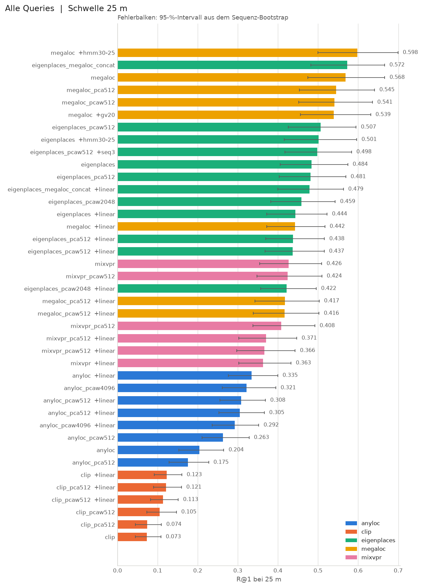

<sub>Alle 40 Benchmark-Zeilen, ein Feld je Encoder; Farbe und Form = Variante.
Erzeugt von `python compare.py --plot --derived`.</sub>

**Ergebnis.** R@1 bei 25 m, Benchmark:

| Encoder | voll | pca512 | pcaw512 | gewhitent auf voller Breite |
|---|---:|---:|---:|---:|
| megaloc (8448) | **0.568** | 0.545 | 0.541 | — |
| eigenplaces (2048) | 0.484 | 0.481 | **0.507** | 0.459 |
| mixvpr (4096) | 0.426 | 0.408 | 0.424 | — |
| anyloc (4096) | 0.204 | 0.175 | 0.263 | **0.321** |
| clip (512) | 0.073 | 0.074 | **0.105** | — |

- **Die Rangfolge hängt nicht an der Breite:** auf 512 gewhitent MegaLoc 0.541 > EigenPlaces 0.507 > MixVPR 0.424 > AnyLoc 0.263 > CLIP 0.105.
- **Whitening rettet AnyLoc** (+0.117 belegt): VLAD-Vektoren sind stark ungleich gewichtet, und das war hier nicht ausgeglichen.
- **Bei den Ortsencodern** hilft Whitening auf 512 leicht (EigenPlaces +0.022) und schadet auf voller Breite (−0.025).

**Grenzen.** Warum Whitening auf voller Breite schadet, ist nicht gemessen. Naheliegend: es teilt durch die kleinsten
Eigenwerte, und die sind bei 50.000 Stichproben Rauschen. Der Test wäre Shrinkage (`√(λ + ε·λ_max)` statt `√λ`).

---

### Verkettung — `concat_embeddings.py`

**Frage.** Sehen zwei gute Encoder Verschiedenes, sodass beide zusammen besser sind?

**Kurz.** Nein: EigenPlaces + MegaLoc liegen gleichauf mit MegaLoc allein — bei einem Achtel der Breite.

**Methode.** Beide auf 512 gewhitent, aneinandergehängt, neu normiert, als eigener Encoder geschrieben.
Ausgerichtet über die `image_id`, nicht über die Zeilennummer.

```bash
python experiments/concat_embeddings.py
```

| | Dim | R@1 | R@5 |
|---|---:|---:|---:|
| megaloc | 8448 | 0.568 | 0.676 |
| megaloc_pcaw512 | 512 | 0.541 | 0.654 |
| eigenplaces_pcaw512 | 512 | 0.507 | 0.641 |
| **eigenplaces_megaloc_concat** | **1024** | **0.572** | **0.692** |

- R@1: +0.004 [−0.005, +0.014] gegen MegaLoc — **nicht belegt**.
- R@5: +0.016 [+0.005, +0.028] — knapp belegt. Der richtige Ort rutscht öfter in die Top-5, aber nicht auf Platz 1.

**Grenzen.** Warum R@1 nicht steigt, ist nicht erklärt. Vermutung: beide scheitern an denselben schweren Fahrten.

---

### Adapter-Diagnose — `adapter_diagnose.py`

**Frage.** Der Adapter schadet allen Ortsencodern. Ist das schon beim Training zu sehen?

**Kurz.** Bei 7 von 12 schädlichen Adaptern ja — aber die Auswahl in 05 konnte „nicht trainieren" nie wählen.

**Methode.** 05 wählt die beste Epoche nach val-R@1, aber nur unter **trainierten** Epochen: der untrainierte Adapter
(die Identität, also exakt der Encoder) wird nie gemessen. Das Skript misst ihn auf demselben val-Split nach und
stellt ihn neben die beste Epoche und die Test-Zahl aus 07.

```bash
python experiments/adapter_diagnose.py
```

**Ergebnis.** Osnabrück, alle 18 Adapter, R@1:

| Encoder | val ohne | val mit | test ohne | test mit | Lesart |
|---|---:|---:|---:|---:|---|
| megaloc | 0.198 | 0.132 | 0.568 | 0.442 | schon auf val schlechter |
| megaloc_pca512 | 0.167 | 0.133 | 0.545 | 0.417 | schon auf val schlechter |
| megaloc_pcaw512 | 0.155 | 0.127 | 0.541 | 0.416 | schon auf val schlechter |
| eigenplaces_megaloc_concat | 0.220 | 0.165 | 0.572 | 0.479 | schon auf val schlechter |
| eigenplaces | 0.118 | 0.142 | 0.484 | 0.444 | val steigt, test fällt |
| eigenplaces_pca512 | 0.127 | 0.129 | 0.481 | 0.438 | val steigt, test fällt |
| eigenplaces_pcaw512 | 0.164 | 0.128 | 0.507 | 0.437 | schon auf val schlechter |
| eigenplaces_pcaw2048 | 0.097 | 0.129 | 0.459 | 0.422 | val steigt, test fällt |
| mixvpr | 0.120 | 0.112 | 0.426 | 0.363 | schon auf val schlechter |
| mixvpr_pca512 | 0.103 | 0.112 | 0.408 | 0.371 | val steigt, test fällt |
| mixvpr_pcaw512 | 0.119 | 0.110 | 0.424 | 0.366 | schon auf val schlechter |
| anyloc | 0.050 | 0.194 | 0.204 | 0.335 | hilft |
| anyloc_pca512 | 0.048 | 0.184 | 0.175 | 0.305 | hilft |
| anyloc_pcaw512 | 0.129 | 0.180 | 0.263 | 0.308 | hilft |
| anyloc_pcaw4096 | 0.136 | 0.151 | 0.321 | 0.292 | val steigt, test fällt |
| clip | 0.015 | 0.033 | 0.073 | 0.123 | hilft |
| clip_pca512 | 0.015 | 0.034 | 0.074 | 0.121 | hilft |
| clip_pcaw512 | 0.026 | 0.027 | 0.105 | 0.113 | hilft |

<sub>Aus `results/osnabrueck/adapter_diagnose_<encoder>.json`.</sub>

| Gruppe | Anzahl | welche |
|---|---:|---|
| hilft im test | 6 | CLIP und AnyLoc, außer `anyloc_pcaw4096` |
| schon auf val schlechter | 7 | alle MegaLoc-Varianten, die Verkettung, MixVPR, die gewhitenten 512er von MixVPR und EigenPlaces |
| val steigt, test fällt | 5 | die übrigen EigenPlaces- und MixVPR-Varianten, `anyloc_pcaw4096` |

- **Je besser ein Encoder schon für Orte trainiert ist, desto früher schadet der Adapter.**
- Mit der Identität als Kandidat bliebe MegaLoc bei 0.568 statt 0.442.
- Bei den fünf „val steigt, test fällt" hätte auch die korrigierte Auswahl den Adapter genommen.

**Grenzen.** val misst eine schwerere Aufgabe (MegaLoc 0.198 gegen 0.568) und ist klein: 3.210 lösbare Anfragen aus
nur 46 Fahrten. Nur die Richtung zählt; Differenzen wie bei MixVPR (0.120 gegen 0.112) sind Rauschen.
Die Auswahlregel ist in 05 nicht korrigiert, weil das jede Adapter-Zeile ändern würde.

---

### Adapter-Raster — `adapter_sweep.py`

**Frage.** Schadet der Adapter, weil die Trainingswerte zu grob sind? Die Marge 0.2 auf dem Cosinus-Abstand entspricht
0.4 auf dem quadrierten Abstand (‖a−b‖² = 2(1−cos)); NetVLAD nimmt dort 0.1.

**Kurz.** Die Marge ist es nicht, die Lernrate schon. Mit 1e-4 schadet der Adapter EigenPlaces nicht mehr — er hilft aber auch nicht.

**Methode.** Raster über Marge 0.2 / 0.1 / 0.05 und Lernrate 1e-3 / 1e-4, sonst wie 05. Anders als 05 steht die
Identität als Epoche 0 zur Wahl. Gewählt wird nur nach val; test wird nur berichtet. Schreibt nichts nach `results/`.

```bash
python experiments/adapter_sweep.py --method eigenplaces
```

**Ergebnis.** Osnabrück, R@1 bei 25 m; fett die Wahl nach val:

| Encoder | Marge | Lernrate | Epoche | val | test R@1 | test R@5 | test R@20 |
|---|---:|---:|---:|---:|---:|---:|---:|
| eigenplaces | Identität | — | 0 | 0.118 | 0.484 | 0.608 | 0.695 |
| | 0.2 | 1e-3 | 2 | 0.137 | 0.446 | 0.592 | 0.695 |
| | 0.2 | 1e-4 | 3 | 0.150 | 0.468 | 0.613 | 0.715 |
| | 0.1 | 1e-3 | 3 | 0.146 | 0.458 | 0.610 | 0.712 |
| | 0.1 | 1e-4 | 3 | **0.153** | 0.483 | 0.630 | 0.728 |
| | 0.05 | 1e-3 | 2 | 0.142 | 0.452 | 0.609 | 0.711 |
| | 0.05 | 1e-4 | 3 | 0.149 | 0.483 | 0.636 | 0.733 |
| clip | Identität | — | 0 | 0.015 | 0.073 | 0.106 | 0.158 |
| | 0.2 | 1e-3 | 1 | 0.033 | 0.115 | 0.207 | 0.332 |
| | 0.2 | 1e-4 | 1 | 0.038 | 0.133 | 0.232 | 0.357 |
| | 0.1 | 1e-3 | 1 | 0.031 | 0.115 | 0.208 | 0.334 |
| | 0.1 | 1e-4 | 1 | **0.039** | 0.137 | 0.235 | 0.364 |
| | 0.05 | 1e-3 | 1 | 0.032 | 0.115 | 0.208 | 0.337 |
| | 0.05 | 1e-4 | 1 | 0.034 | 0.136 | 0.234 | 0.365 |

<sub>Aus [`results/osnabrueck/adapter_sweep_eigenplaces.json`](results/osnabrueck/adapter_sweep_eigenplaces.json)
und [`adapter_sweep_clip.json`](results/osnabrueck/adapter_sweep_clip.json).</sub>

- **Marge:** bei gleicher Lernrate höchstens 0.015 Unterschied — die Vermutung trägt nicht.
- **Lernrate:** in allen sechs Paaren ist 1e-4 besser, auf val wie auf test. EigenPlaces: Verlust −0.027…−0.038 → −0.001…−0.016. CLIP: +0.042 → bis +0.064.
- **Auch die beste Einstellung schlägt bei EigenPlaces die Identität nicht** (0.483 gegen 0.484); nur R@5 und R@20 steigen leicht, ohne Intervall.
- **val sortiert richtig, steht aber falsch zur Identität:** die Reihenfolge der Kombinationen stimmt mit test überein (ρ = 0.94),
  doch jede liegt auf val über der Identität und auf test darunter.

**Grenzen.** Die Zeile 0.2 / 1e-3 trifft 05 nicht bitgleich (0.446 gegen 0.444, CLIP 0.115 gegen 0.123):
Unterschiede unter 0.01 nicht deuten. MegaLoc ist nicht gerechnet. Die Pipeline bleibt bei 1e-3.

---

## Woran es scheitert

### Referenzdichte — `database_density.py`

**Frage.** Scheitert das System an Osnabrück oder an zu wenig Referenz? Im Benchmark haben 36 % der Anfragen kein
Referenzbild im Umkreis von 25 m.

**Kurz.** Mehr Referenz hilft stetig: mehr Anfragen werden lösbar, und unter ihnen steigt der Recall.

**Methode.** Nimmt `train` stufenweise zur Referenz (0 / 25 / 50 / 75 / 100 % der train-Sequenzen). Nur Encoder ohne Adapter.

```bash
python experiments/database_density.py
```

<p align="center">
  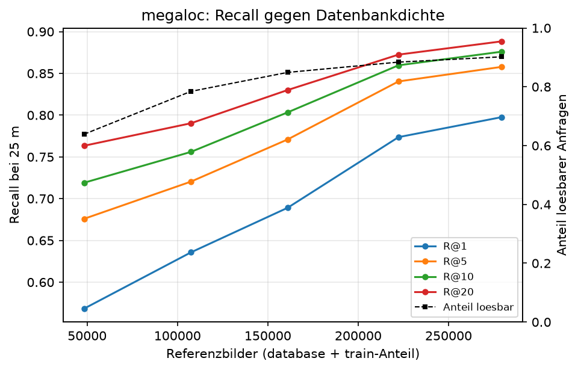
  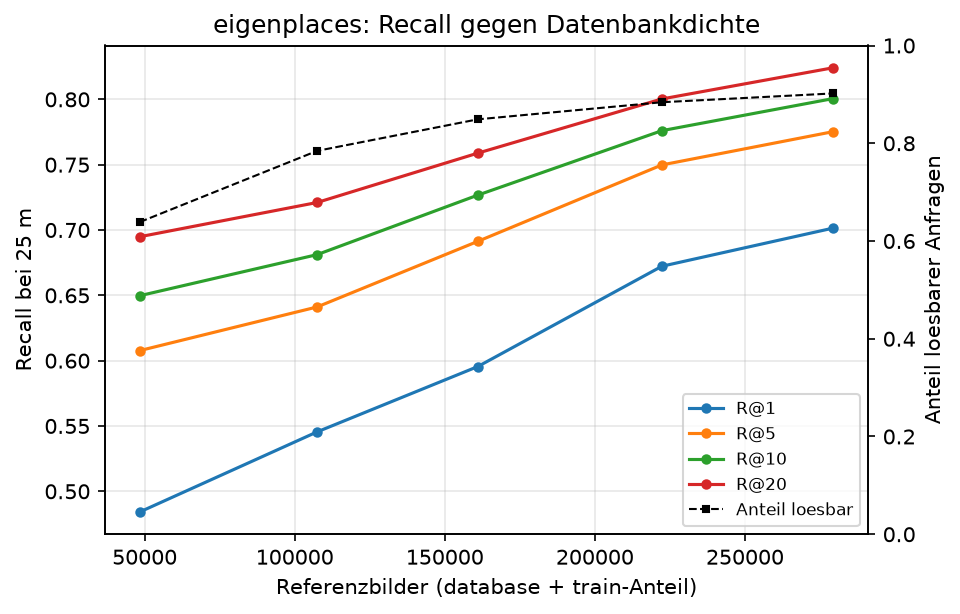
</p>

| train dazu | Referenzbilder | lösbar | MegaLoc, 512 gewhitent | EigenPlaces | EigenPlaces, 512 gewhitent |
|---:|---:|---:|---:|---:|---:|
| 0 % | 48.321 | 63,9 % | 0.541 | 0.484 | 0.507 |
| 25 % | 107.449 | 78,4 % | 0.615 | 0.545 | 0.568 |
| 50 % | 160.981 | 84,9 % | 0.670 | 0.595 | 0.615 |
| 75 % | 222.300 | 88,4 % | 0.754 | 0.672 | 0.688 |
| 100 % | 279.453 | 90,2 % | 0.778 | 0.701 | 0.715 |

<sub>Aus `results/osnabrueck/database_density_<encoder>.json`. Die letzte Stufe ist die volle Referenz.
MegaLoc auf voller Breite steigt von 0.568 auf 0.798; die Zwischenstufen zeigt die linke Abbildung.</sub>

- Die neu lösbaren Anfragen sind die schwereren — und der Recall steigt trotzdem.
- Gewonnen werden nicht nur Nachbarn, sondern auch passende Blickrichtungen und Zeitpunkte.

**Grenzen.** Kein Bootstrap. Ein Teil des Anstiegs sind [Zwillinge](#zwillingsfahrten--zwillingepy) aus `train`.
Speicher: die letzte Stufe sucht blockweise und braucht so rund 6 GB (Osnabrück) statt 11,2 GB.

---

### Schwierigkeit je Anfrage — `recall_by_difficulty.py`

**Frage.** Was macht eine einzelne Anfrage schwer?

**Kurz.** Vor allem, ob ein Referenzbild in dieselbe Richtung schaut. Zeit und Nachbarzahl wirken schwächer.

**Methode.** Je Anfrage vier Eigenschaften aus den Metadaten, R@1 je Klasse über die lösbaren Anfragen. Jede Anfrage
liegt in genau einer Klasse je Merkmal.

```bash
python experiments/recall_by_difficulty.py
```

<p align="center">
  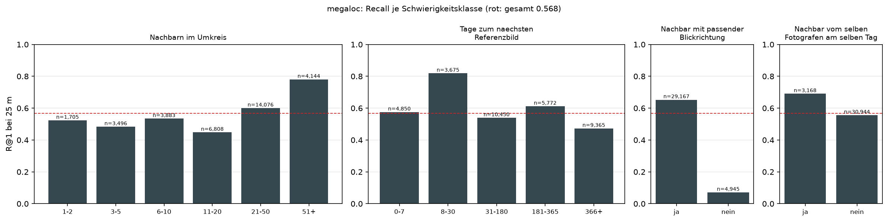
</p>
<p align="center">
  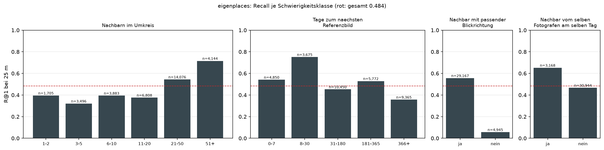
</p>

| Merkmal | Klasse | n | R@1 MegaLoc |
|---|---|---:|---:|
| Nachbar schaut in dieselbe Richtung | ja | 29.167 | 0.653 |
| | nein | 4.945 | **0.071** |
| Tage zum nächsten Nachbarn | 0–7 | 4.850 | 0.575 |
| | 8–30 | 3.675 | **0.819** |
| | 31–180 | 10.450 | 0.539 |
| | 181–365 | 5.772 | 0.612 |
| | über 365 | 9.365 | 0.472 |
| Nachbarn im Umkreis von 25 m | 1–2 | 1.705 | 0.523 |
| | 3–5 | 3.496 | 0.483 |
| | 6–10 | 3.883 | 0.534 |
| | 11–20 | 6.808 | 0.448 |
| | 21–50 | 14.076 | 0.600 |
| | 51+ | 4.144 | **0.780** |
| Nachbar vom selben Konto, selber Tag | ja | 3.168 | 0.690 |
| | nein | 30.944 | 0.556 |

<sub>Aus `results/osnabrueck/recall_by_difficulty_megaloc.json`; EigenPlaces in der zweiten Abbildung und
`recall_by_difficulty_eigenplaces.json`.</sub>

1. **Blickrichtung.** 14,5 % der lösbaren Anfragen haben keinen Nachbarn, der in dieselbe Richtung schaut: R@1 0.071.
   Ohne sie läge MegaLoc bei 0.653.
2. **Zeit, nicht gleichmäßig.** 8–30 Tage ist die beste Klasse, über ein Jahr die schlechteste — aber 0–7 Tage liegen nur im Mittelfeld.
3. **Dichte.** Erst ab 51 Nachbarn klar besser. Viele Nachbarn helfen; wenige schaden nicht messbar.

**Herkunft des Top-1-Treffers.** Die JSON zählt auch, woher die gelungenen Treffer kommen (`herkunft_top1`):
Anteil vom selben Konto, davon innerhalb von 180 Tagen (`anteil_dublette`), Zeitabstand, Blickwinkel.
`anteil_dublette` ist genau die Menge, die der Hard-Filter verwirft — der [Städtevergleich](#städtevergleich--city_comparisonpy)
rechnet damit den Hard-Recall exakt nach.

**Grenzen.** Kein Bootstrap; einzelne Klassen können an wenigen Fahrten hängen. Unterschiede unter etwa 0.1 nicht deuten.
„Selbes Konto" heißt hochladendes Konto (`creator_id`) — eine Agentur sind viele Kameras unter einem Konto.

---

### Stadtteile — `recall_by_district.py`

**Frage.** Wo in der Stadt scheitert das System — und liegt es an der Referenzdichte?

**Kurz.** Stadtteile reichen von 0.07 bis 0.83. Bilder je km² erklären das nicht; die Gründe stecken in den Aufnahmen.

**Methode.** Jede Anfrage per Punkt-in-Polygon einem OSM-Stadtteil zugeordnet; je Stadtteil R@1 und Referenzbilder je km².
Stadtteile mit weniger als 100 lösbaren Anfragen grau.

```bash
python experiments/recall_by_district.py
```

<p align="center">
  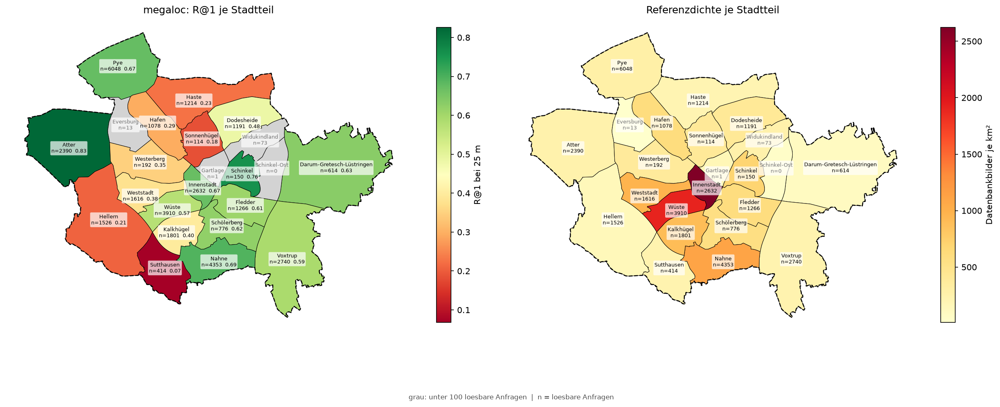
</p>
<p align="center">
  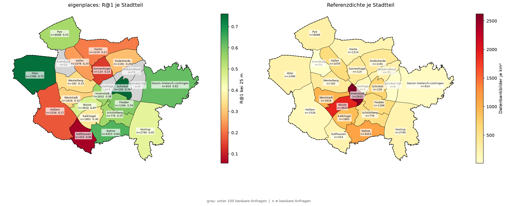
</p>

| Stadtteil | Anfragen | Fahrten | lösbar | R@1 MegaLoc | Referenz/km² |
|---|---:|---:|---:|---:|---:|
| Atter | 2.630 | 14 | 91 % | **0.83** | 244 |
| Schinkel | 311 | 4 | 48 % | 0.76 | 700 |
| Nahne | 4.956 | 16 | 88 % | 0.69 | 1.116 |
| Pye | 6.160 | 24 | 98 % | 0.67 | 287 |
| Innenstadt | 7.001 | 39 | 38 % | 0.67 | 2.623 |
| Darum-Gretesch-Lüstringen | 744 | 3 | 83 % | 0.63 | 95 |
| Schölerberg | 829 | 16 | 94 % | 0.62 | 565 |
| Fledder | 1.852 | 13 | 68 % | 0.61 | 599 |
| Voxtrup | 2.967 | 18 | 92 % | 0.59 | 228 |
| Wüste | 6.094 | 36 | 64 % | 0.57 | 1.915 |
| Dodesheide | 2.307 | 14 | 52 % | 0.48 | 412 |
| Kalkhügel | 2.853 | 14 | 63 % | 0.40 | 905 |
| Weststadt | 2.961 | 18 | 55 % | 0.38 | 970 |
| Westerberg | 744 | 14 | 26 % | 0.35 | 381 |
| Hafen | 2.014 | 20 | 54 % | 0.29 | 609 |
| Haste | 2.404 | 15 | 50 % | 0.23 | 206 |
| Hellern | 2.184 | 13 | 70 % | 0.21 | 147 |
| Sonnenhügel | 1.634 | 12 | 7 % | 0.18 | 403 |
| Sutthausen | 414 | 3 | 100 % | **0.07** | 230 |

<sub>Aus `results/osnabrueck/recall_by_district_megaloc.json`; 23 Stadtteile, vier davon unter 100 lösbaren Anfragen.</sub>

- **Faktor 12 beim selben Encoder.** Der Stadtwert 0.568 ist ein Mittel über sehr verschiedene Viertel.
- **Dichte erklärt es nicht:** ρ = 0.27 (p = 0.27). Die Innenstadt hat die dichteste Referenz und nur 38 % lösbare Anfragen.
- **Die Karte zeigt die Daten, nicht den Encoder:** EigenPlaces (512 gewhitent) ordnet die Stadtteile praktisch gleich (Spearman 0.96).
- **Gründe in den Aufnahmen:**
  - *Haste* (0.23): nur 29 % der lösbaren Anfragen haben einen Nachbarn in derselben Blickrichtung; Median drei Jahre Abstand.
  - *Hellern* (0.21): Median 338 Tage Abstand — eine andere Jahreszeit.
  - *Sutthausen* (0.07): 35 Nachbarn, sechs Tage Abstand, passende Blickrichtung — und trotzdem landen 208 von 414
    Anfragen im 4 km entfernten Hellern. Eine einzige Fahrt verwechselt ein Wohnviertel mit einem anderen.

**Grenzen.** Stadtteile mit drei Fahrten zeigen das Schicksal einer Fahrt, nicht eines Ortes.

---

### Verwechslungsatlas — `confusion_atlas.py`

**Frage.** Wohin schätzt das System, wenn es falsch liegt?

**Kurz.** Entweder knapp daneben oder in ein anderes Viertel, kaum dazwischen — und meist in Wohnstraßen.

**Methode.** Für jede lösbare Anfrage mit Top-1 jenseits von 25 m ein Pfeil von der echten zur geschätzten Position,
dazu Stadtteil-Paare und der Straßentyp aus OSM.

```bash
python experiments/confusion_atlas.py
```

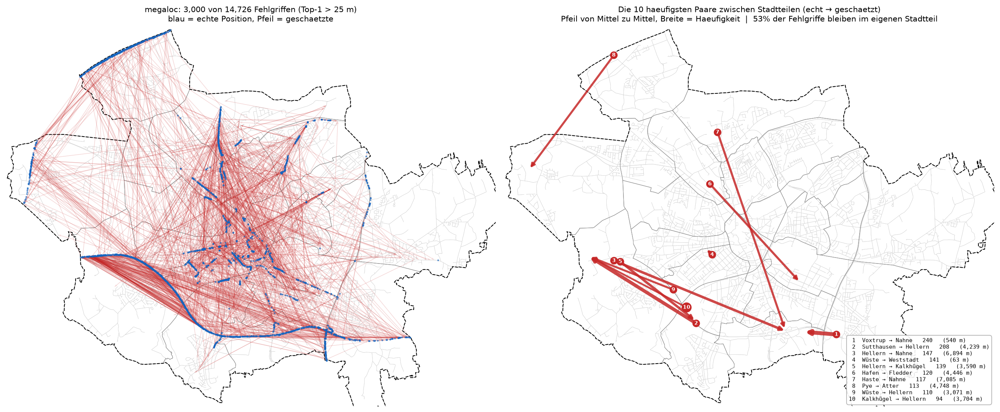

**Ergebnis.** MegaLoc, 14.726 Fehlgriffe unter 34.112 lösbaren Anfragen:

| Fehler | Anteil |
|---|---:|
| unter 100 m — dieselbe Straße | 45 % |
| 100 m bis 1 km | 11 % |
| über 1 km — ein anderes Viertel | 44 % |

Die häufigsten Stadtteil-Paare (echt → geschätzt):

| Paar | n | Median |
|---|---:|---:|
| Voxtrup → Nahne | 240 | 540 m |
| Sutthausen → Hellern | 208 | 4.239 m |
| Hellern → Nahne | 147 | 6.894 m |
| Wüste → Weststadt | 141 | 63 m |
| Hellern → Kalkhügel | 139 | 3.590 m |

- **Keine dominante Verwechslung:** kein Paar trägt mehr als 1,6 % der Fehler.
- **Ziele am Stadtrand:** Nahne und Hellern — Wohn- und Gewerbegebiete, die einander ähneln.

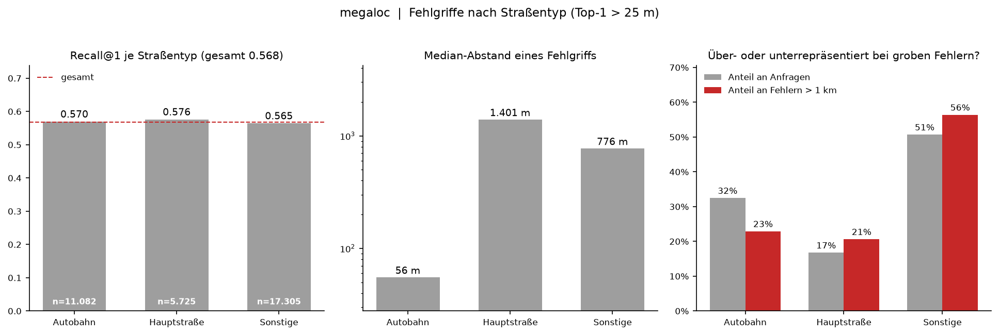

**Die Autobahn ist nicht das Problem — auch wenn die Karte das nahelegt.** Ein paar hundert lange Pfeile entlang
der A30 überdecken optisch zehntausend kurze.

| Straßentyp | R@1 | Anteil an lösbaren Anfragen | Anteil an Fehlern über 1 km |
|---|---:|---:|---:|
| Autobahn | 0.570 | 32 % | 23 % |
| Hauptstraße | 0.576 | — | — |
| Wohnstraße und übrige | 0.565 | 51 % | 56 % |

<sub>Aus `results/osnabrueck/confusion_atlas_megaloc.json`.</sub>

**Grenzen.** Nur lösbare Anfragen. Über alle Anfragen (08) liegt der Median eines falschen Top-1 bei 1,7 km.

---

## Nachbearbeitung der Top-k

Alle Verfahren hier bekommen dieselbe Trefferliste und sortieren sie um oder
fassen sie zusammen. Gemeinsame Nachanalyse: **die Fehler sind kohärent** —
bei einer groben Verwechslung liegen auch die übrigen Treffer am falschen
Ort ([Verwechslungsatlas](#verwechslungsatlas--confusion_atlaspy)).

### Aggregation — `localization_aggregation.py`

**Frage.** Wird die Koordinate besser, wenn man die Top-10 mittelt oder clustert, statt nur den besten Treffer zu nehmen?

**Kurz.** Nein — fünf Verfahren, alle schlechter als Top-1.

**Methode.** Schwerpunkt (roh und gespreizt), Clustering, Snap (bester Treffer der stärksten Gruppe), Gated (Gruppe nur
bei 70 % Einigkeit). Gemessen über alle 53.414 Anfragen: Anteil unter 25 m und Median des Fehlers.

```bash
python experiments/localization_aggregation.py
```

<p align="center">
  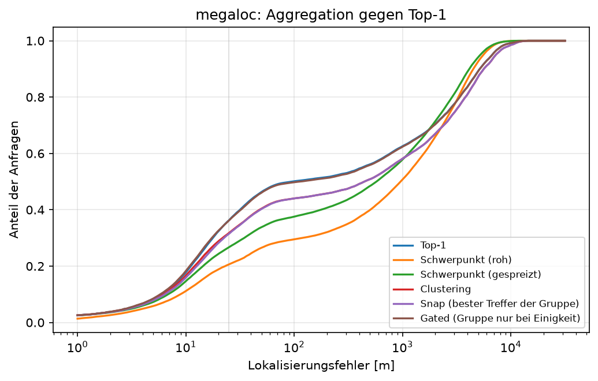
  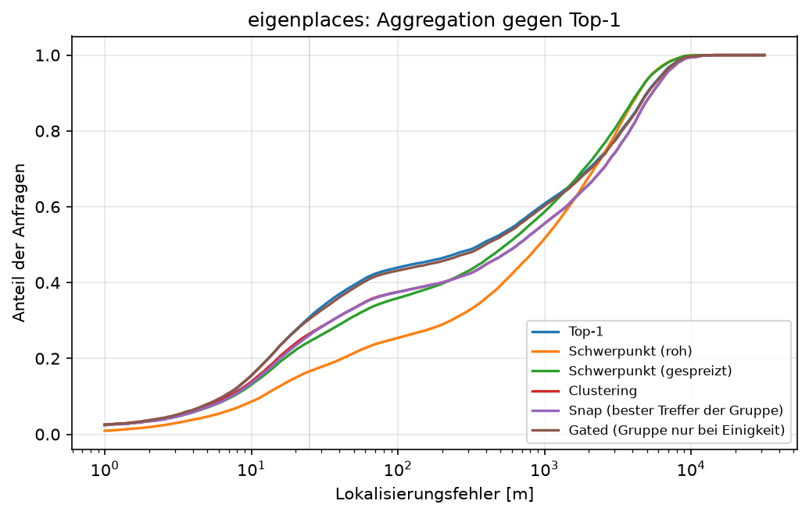
</p>

| Verfahren | MegaLoc | EigenPlaces |
|---|---|---|
| **Top-1** | **0.363 / 94 m** | **0.309 / 364 m** |
| Clustering | 0.318 / 444 m | 0.265 / 656 m |
| Snap | 0.314 / 445 m | |
| Gated | 0.362 | |
| Schwerpunkt, gespreizt | 0.267 / 575 m | |
| Schwerpunkt, roh | 0.206 / 961 m | |

- Selbst Gated, das nur bei großer Einigkeit von Top-1 abweicht, kommt nur von unten an Top-1 heran.
- Grund: bei groben Verwechslungen liegt die stärkste Gruppe geschlossen am falschen Ort — Konsens bestätigt den Fehler.

---

### Nachbarframes — `sequence_retrieval.py`

**Frage.** Einzelbilder sind mehrdeutig, Fahrten nicht. Hilft es, die Trefferlisten benachbarter Bilder zu summieren?

**Kurz.** Nein, es schadet leicht.

**Methode.** Trefferlisten der ±W Nachbarn einer Fahrt mit Dreiecksgewicht summiert. Standard ist
`eigenplaces_pcaw512`; das ist die Zeile `seq3` im Benchmark.

```bash
python experiments/sequence_retrieval.py
```

| Fenster | R@1 | R@5 | R@20 |
|---|---:|---:|---:|
| einzeln | 0.507 | 0.641 | 0.727 |
| ±1 | 0.507 | 0.644 | 0.731 |
| ±3 | 0.498 | 0.645 | 0.736 |
| ±5 | 0.488 | 0.641 | 0.739 |

- ±3 gegen einzeln: −0.009 [−0.017, −0.001], belegt.
- Zwei Gründe, die das Verfahren nicht trennt: benachbarte Bilder machen denselben Fehler, **und** es braucht dasselbe
  Referenzbild in mehreren Listen — bei 15 % Referenz selten.

---

### Fahrt als Pfad — `sequence_hmm.py`

**Frage.** Hilft die Fahrt, wenn man sie als Weg liest statt als Summe?

**Kurz.** Ja — die einzige Nachbearbeitung, die Top-1 belegt schlägt.

**Methode.** Ein Hidden-Markov-Modell. Die Kandidaten dürfen je Bild andere sein; sie müssen nur geometrisch zusammenpassen.

| | |
|---|---|
| Zustände | die Top-k eines Bildes |
| Emission | `β ×` cos aus der Suche |
| Übergang | passt der Abstand zweier Kandidaten zur verstrichenen Zeit? `−|d − v·Δt| / σ` |
| Ergebnis | Wahrscheinlichkeit je Kandidat (Forward-Backward) und bester Pfad (Viterbi) |

Ein Kandidat 6 km abseits fällt, weil man in 0,17 s keine 6 km fährt. Die Geschwindigkeit (12,5 m/s) kommt aus den
**Referenz**fahrten; die Positionen der Anfragen gehen nirgends ein. β = 30 und σ = 25 m standen vor dem Lauf fest —
berichtet wird diese eine Einstellung, nicht die beste aus einem Raster.

```bash
python experiments/sequence_hmm.py --method megaloc
```

| | R@1 | R@5 | R@10 | R@20 | Pfad R@1 |
|---|---:|---:|---:|---:|---:|
| MegaLoc | 0.568 | 0.676 | 0.719 | 0.763 | |
| MegaLoc, HMM | **0.598** | **0.690** | **0.725** | **0.764** | 0.603 |
| EigenPlaces | 0.484 | **0.608** | **0.650** | **0.695** | |
| EigenPlaces, HMM | **0.501** | 0.603 | 0.633 | 0.675 | 0.511 |

- **Belegt:** MegaLoc +0.030 [+0.020, +0.041], EigenPlaces +0.017 [+0.006, +0.030].
- **Nicht umsonst:** bei EigenPlaces kostet das Umsortieren R@5 bis R@20.
- **Klein, wie erwartet:** das HMM fängt nur einzelne Ausreißer. Eine ganze Fahrt auf der falschen Straße ist als Pfad genauso stimmig.

**Grenzen.** Forward-Backward und Viterbi sind in [`tests/test_sequence_hmm.py`](../tests/test_sequence_hmm.py) gegen eine
vollständige Aufzählung geprüft.

---

### Geometrische Verifikation — `geometric_verification.py`

**Frage.** Global ähnliche, lokal verschiedene Orte sind der typische grobe Fehler. Hilft es, die Top-20 mit lokalen
Merkmalen nachzuprüfen?

**Kurz.** Nicht bei 25 m. Sie schärft die Position auf wenige Meter, findet aber nicht öfter den richtigen Ort.

**Methode.** SuperPoint findet Merkmalspunkte, LightGlue ordnet sie zu, RANSAC prüft sie gegen die Geometrie zweier
Kameras. Die Kandidaten werden nach der Zahl übereinstimmender Punkte (Inlier) umsortiert; unter 15 bleibt die alte
Reihenfolge. Alle fünf Parameter standen vor dem Lauf fest:

| Parameter | Wert | Herkunft |
|---|---|---|
| `--top-k` | 20 | Setzung des Projekts |
| `--min-inliers` | 15 | Setzung des Projekts |
| `--ransac-px` | 3,0 | Voreinstellung von OpenCV |
| `--max-keypoints` | 1.024 | Empfehlung von LightGlue für Tempo |
| `--max-side` | 640 | Setzung des Projekts |

```bash
python experiments/geometric_verification.py --n-queries 0
```

Braucht die Bilder und eine GPU; speichert die Inlier alle zwei Minuten und setzt nach einem Abbruch fort.
`bootstrap_ci.py` rechnet die Zeile aus den gespeicherten Inliern nach, ohne neu zu matchen.

**Ergebnis.** Osnabrück, MegaLoc, gepaart:

| | MegaLoc | + Verifikation | Diff | 95 % |
|---|---:|---:|---:|---|
| R@1 | 0.568 | 0.539 | −0.029 | [−0.062, +0.000] |
| R@5 | 0.676 | 0.678 | +0.002 | [−0.018, +0.024] |
| R@10 | 0.719 | 0.726 | +0.007 | [−0.005, +0.019] |
| R@20 | 0.763 | 0.763 | 0 | — |

| R@1 je Schwelle | 5 m | 10 m | 25 m | 50 m | 100 m |
|---|---:|---:|---:|---:|---:|
| Differenz | +0.013 | +0.010 | −0.029 | −0.034 | −0.039 |

<sub>Aus [`results/osnabrueck/bootstrap_ci.json`](results/osnabrueck/bootstrap_ci.json) und
`results/osnabrueck/evaluation/megaloc{,_gv20}.json`.</sub>

- R@20 bleibt zwingend gleich: umsortiert wird nur innerhalb der Top-20.
- **Lesart, nicht einzeln geprüft:** Inlier messen Bildüberlappung, nicht Ortsgleichheit. Der Kandidat mit dem größten
  gemeinsamen Ausschnitt rückt vor — oft sehr nah, manchmal aber ein falscher Ort mit wiederkehrender Geometrie.
- **Die Schwelle trennt kaum:** 87 % aller Kandidatenpaare haben 15 Inlier oder mehr (Median 40).
- **Laufzeit:** 840.200 Bildpaare in 8,6 Stunden, rund 27 je Sekunde. Die übrigen fünf Städte hätten rund 57 Stunden gekostet.

**Grenzen.** Eine Einstellung, eine Stadt, reines Umsortieren nach Inliern. Eine höhere Schwelle ließe sich aus den
gespeicherten Inliern nachrechnen — auf Osnabrück wäre das aber Abstimmen an der berichteten Stichprobe.
SuperPoint ist nur für nichtkommerzielle Forschung lizenziert ([NOTICE.md](../NOTICE.md)).

---

### Detections — `detection_rerank.py`

**Frage.** Mapillary erkennt Objekte in jedem Bild (Schilder, Laternen, Autos). Trägt das Information bei, die im
Deskriptor fehlt?

**Kurz.** Nein. Das Signal existiert, ist aber schwächer als der Deskriptor und darin schon enthalten.

**Methode.** 2.000 Anfragen, bei denen in den Top-10 richtige **und** falsche Kandidaten stehen; je Bild ein
gewichtetes Histogramm der erkannten Klassen. Gemessen: wie gut es richtig von falsch trennt (AUC), und R@1 nach dem
Umsortieren. EigenPlaces.

```bash
python experiments/detection_rerank.py
```

| | alle Klassen | ohne Autos und Personen |
|---|---:|---:|
| AUC Detections | 0.562 | 0.559 |
| AUC Deskriptor | 0.735 | 0.735 |

| Gewicht der Detections | 0 | 0.05 | 0.5 | 1.0 |
|---|---:|---:|---:|---:|
| R@1 (1.286 Anfragen) | 0.7551 | 0.7558 | 0.7496 | 0.6998 |

- Der beste Wert liegt eine einzige Anfrage über dem Ausgangswert.
- Fehlende Detections werden neutral gewertet, nicht als Ähnlichkeit 0 — sonst bestrafte die Messung fehlende Daten.

**Grenzen.** Eigene Stichprobe, nicht mit der Haupttabelle vergleichbar. Die Detections sind versioniert
(`cache/detections.jsonl`). Die Vorstudie zur Abdeckung (`detection_probe.py`): 85 bis 94 % der Bilder haben Detections.

---

## Konfidenz

### Ablehnung — `rejection_curve.py`

**Frage.** Wie viel besser wird die Antwort, wenn das System bei niedriger Konfidenz schweigen darf — und welches Maß taugt?

**Kurz.** Der rohe cos des besten Treffers ist das beste Maß.

**Methode.** Drei Maße: cos des besten Treffers, Abstand zu Platz 2 (Marge), Einigkeit der Top-10 (Anteil innerhalb
25 m um Platz 1). Die Schwelle wird abgesenkt und die Präzision gegen den Anteil beantworteter Anfragen aufgetragen.

```bash
python experiments/rejection_curve.py
```

<p align="center">
  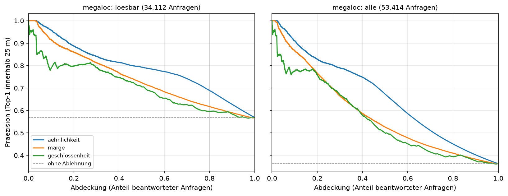
</p>
<p align="center">
  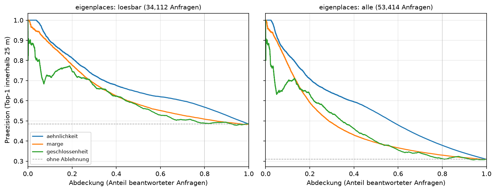
</p>

**Ergebnis.** MegaLoc, Präzision bei 100 / 80 / 50 / 20 % beantworteter Anfragen:

| Sicht | Maß | 100 % | 80 % | 50 % | 20 % | Fläche |
|---|---|---:|---:|---:|---:|---:|
| lösbare Anfragen | cos | 0.568 | **0.689** | 0.793 | 0.887 | 0.791 |
| | Marge | 0.568 | 0.618 | 0.724 | 0.860 | 0.741 |
| | Einigkeit | 0.568 | 0.597 | 0.706 | 0.798 | 0.706 |
| alle Anfragen | cos | 0.363 | **0.451** | 0.673 | 0.828 | 0.659 |
| | Marge | 0.363 | 0.410 | 0.526 | 0.766 | 0.580 |

<sub>Aus [`results/osnabrueck/rejection_curve_megaloc.json`](results/osnabrueck/rejection_curve_megaloc.json).
Die Verkettung EigenPlaces + MegaLoc liegt gleichauf (0.695 bei 80 %, Fläche 0.790).</sub>

- **Faustregel MegaLoc:** cos ≥ 0.30 → 82 % richtig (37 % der lösbaren Anfragen beantwortet); cos ≥ 0.20 → 75 % (69 %).
- Die Marge ist das schlechteste Maß — anders als bei Klassifikatoren üblich.
- `locate.py` und die Demo melden deshalb cos als Konfidenz.

**Grenzen.** Im Betrieb kennt das System die Referenz nicht. Unlösbare Anfragen erkennt cos nur zum Teil
(alle Anfragen, 80 %: 0.451 statt 0.363). Die Schwellen gelten nur für MegaLoc.

---

## Sechs Städte

### Stadtwahl — `city_coverage.py`

**Frage.** Welche Stadt eignet sich als zweite — bevor man Tage in Bilder und Embeddings steckt?

**Kurz.** Entscheidend ist, ob **jede** Straße ein Bild hat, nicht wie viele Bilder es gibt — und dass nicht ein einzelnes Konto alles aufgenommen hat.

**Methode.** Nur aus Metadaten, eine Minute je Stadt: Bildpunkte über dieselben Kacheln wie 01, Straßennetz aus OSM.
**Straßenabdeckung** = Anteil der Straßenlänge mit einem Bild im Umkreis von 25 m, getrennt nach großen Straßen und
Wohnstraßen. Dazu Fahrten, Konten, Bildalter, Panoramaanteil.

```bash
python experiments/city_coverage.py "Heidelberg, Germany"
```

**Ergebnis.** 50 Städte gemessen, 45 mit Straßenabdeckung. Die Kandidaten:

| Stadt | Bilder/km² | Abdeckung | Wohnstraßen | größtes Konto | seit 2022 | gerechnet |
|---|---:|---:|---:|---:|---:|:---:|
| Jena | 6.115 | **99 %** | 99 % | 51 % | 45 % | ✓ |
| Gütersloh | 5.363 | **99 %** | 99 % | **80 %** | 75 % | ✗ ein Konto |
| Würzburg | 4.895 | **98 %** | 98 % | 51 % | 28 % | ✓ |
| Mainz | 6.596 | 95 % | 94 % | **74 %** | 44 % | ✗ ein Konto |
| Halle (Saale) | 6.787 | 92 % | 91 % | 30 % | 87 % | offen |
| Heidelberg | 4.879 | 87 % | 83 % | 33 % | 36 % | |
| Erlangen | **7.943** | 70 % | **63 %** | 36 % | 49 % | |
| Kaiserslautern | 2.792 | 80 % | 76 % | 46 % | | ✓ |
| Karlsruhe | 3.504 | 75 % | 68 % | 7 % | | ✓ |
| Fürth | 3.030 | 72 % | 66 % | 30 % | | ✓ |
| Osnabrück | 2.808 | 44 % | **38 %** | 47 % | 84 % | ✓ |

<sub>Aus [`results/city_coverage.json`](results/city_coverage.json).</sub>

- **Dichte ist nicht Abdeckung:** Erlangen hat die meisten Bilder je km² und deckt nur 63 % der Wohnstraßen.
- **Osnabrück erklärt sich selbst:** 38 % der Wohnstraßen abgedeckt → 36 % der Anfragen ohne Referenz.
- **Gütersloh fällt heraus,** obwohl es perfekt aussieht: ein Konto stellt 80 % der Bilder und 94 % der Fahrten.
  Anfrage und Referenz wären fast immer dieselbe Kamera — ein gutes Ergebnis wäre nicht von der Kamera zu trennen.
  Wie viel das ausmacht, zeigt Osnabrück: Nachbar vom selben Konto am selben Tag 0.690 statt 0.556.

**Grenzen.** Keine Zahl aus dieser Tabelle sagt den Recall vorher: Würzburg hat die zweithöchste Abdeckung und den
niedrigsten Recall. Auch die gerechneten Städte sind nicht frei von großen Konten (Jena, Würzburg: 51 %).

---

### Städtevergleich — `city_comparison.py`

**Frage.** Ist ein Ergebnis aus Osnabrück eines über das Verfahren — oder eines über Osnabrück?

**Kurz.** Das Niveau hängt an der Stadt, der Abstand der Encoder kaum.

**Methode.** Liest nur Versioniertes (Auswertungen, Intervalle, Schwierigkeitsprofil, Stadtabdeckung) und läuft deshalb in
jedem frischen Klon. Städte lassen sich **nicht gepaart** vergleichen — ihre Anfragen sind verschieden; es bleibt der
Vergleich unabhängiger Schätzer mit breiten Intervallen.

```bash
python experiments/city_comparison.py
```

#### Was sich überträgt

| Stadt | Anfragen | Fahrten | EigenPlaces | MegaLoc | Δ [95 %] | MegaLoc voll | Δ voll [95 %] |
|---|---:|---:|---:|---:|---|---:|---|
| Osnabrück | 53.414 | 198 | 0.484 | 0.568 | +0.084 [+0.055, +0.116] | 0.798 | +0.096 [+0.070, +0.122] |
| Fürth | 24.994 | 239 | 0.473 | 0.549 | +0.076 [+0.057, +0.096] | 0.699 | +0.072 [+0.052, +0.092] |
| Karlsruhe | 87.181 | 584 | 0.306 | 0.419 | +0.114 [+0.095, +0.134] | 0.640 | +0.132 [+0.111, +0.155] |
| Kaiserslautern | 58.916 | 249 | **0.552** | **0.651** | +0.099 [+0.079, +0.122] | **0.810** | +0.077 [+0.058, +0.096] |
| Würzburg | 60.203 | 300 | 0.263 | 0.336 | +0.073 [+0.045, +0.106] | 0.476 | +0.092 [+0.057, +0.130] |
| Jena | 114.558 | 677 | 0.332 | 0.417 | +0.084 [+0.073, +0.096] | 0.622 | +0.102 [+0.091, +0.113] |

<sub>R@1 bei 25 m, Benchmark; „voll" mit voller Referenz. Δ = MegaLoc − EigenPlaces, gepaart je Stadt.
Aus `results/<stadt>/evaluation/` und `results/<stadt>/bootstrap_ci{,_fullref}.json`.</sub>

- **Niveau:** MegaLoc 0.336 bis 0.651 — Spanne 0.315.
- **Abstand:** +0.073 bis +0.114 — Spanne 0.041, rund achtmal enger. Mit voller Referenz 0.061.
- **MegaLoc vorn in allen sechs Städten und beiden Protokollen;** alle zwölf Intervalle schließen 0 aus.
- **Gleiche Reihenfolge der Städte** für beide Encoder, bis auf Karlsruhe und Jena (MegaLoc 0.419 gegen 0.417).
- **Nicht konstant:** Fürth und Karlsruhe überlappen mit voller Referenz nicht.

#### Was die Städte unterscheidet

```text
Encoder megaloc  |  R@1 bei 25 m  |  6 Staedte

Stadt              Abd  loesbar   Pano   Dubl   Tage   Alle    Hard   voll   ±boot
----------------------------------------------------------------------------------
osnabrueck        0.44    63.9%   0.0%  11.8%    317  0.568  -0.025  0.798   0.096
fuerth            0.72    62.0%   3.0%  39.6%    291  0.549  -0.141  0.699   0.059
karlsruhe         0.75    70.8%  17.9%  15.4%    408  0.419  -0.057  0.640   0.058
kaiserslautern    0.80    85.6%   0.3%  35.8%    279  0.651  -0.204  0.810   0.045
wuerzburg         0.98    45.5%   8.7%  17.9%    627  0.336  -0.034  0.476   0.059
jena              0.99    52.9%   0.3%  24.1%   2188  0.417  -0.010  0.622   0.033
```

<sub>Wörtliche Ausgabe von `python experiments/city_comparison.py`, erster Teil.
Abd = Straßenabdeckung, Pano = Panoramaanteil, Dubl = Anteil der richtigen Top-1-Treffer vom selben Konto innerhalb
180 Tagen, Tage = Median zwischen Anfrage und richtigem Treffer, Hard = Abschlag durch die Hard-Ground-Truth,
voll = volle Referenz, ±boot = halbe Breite des 95-%-Intervalls.</sub>

**Würzburg:** 98 % Abdeckung, aber nur 45,5 % lösbar und der niedrigste Recall. Die Abdeckung zählt den Gesamtbestand;
die Referenz sind 15 % der Fahrten. Eine Straße mit einer einzigen Befahrung liegt meist in `train` — und zählt trotzdem
als abgedeckt. Dazu sind die Bilder alt (Median 627 Tage zwischen Anfrage und Treffer).

#### Der Hard-Abschlag, exakt zerlegt

Die Hard-Ground-Truth kostet zwischen 0.010 (Jena) und 0.204 (Kaiserslautern). Der Anteil der Treffer vom selben Konto
allein sagt das nicht vorher (ρ = −0.54). Der Grund: zwei verschiedene Größen heißen beide „Dublette".

| | zählt | Quelle |
|---|---|---|
| **d** | Anteil der richtigen **Treffer**, die vom selben Konto innerhalb 180 Tagen stammen | `recall_by_difficulty.py` |
| **1 − r** | Anteil der lösbaren **Anfragen**, die **nur** durch solche Bilder lösbar waren | die beiden „lösbar"-Zahlen aus 07 |

Der Filter streicht beides zugleich — Zähler und Nenner. Daraus folgt eine Identität:

```math
\frac{\text{Abschlag}}{\mathrm{R@1}} = -\,\frac{d-(1-r)}{r}
```

| Stadt | d | 1 − r | d − (1−r) | rel. Abschlag | Rest |
|---|---:|---:|---:|---:|---:|
| Kaiserslautern | 35,8 % | 6,6 % | +0.292 | −0.313 | 0.000 |
| Fürth | 39,6 % | 18,7 % | +0.209 | −0.257 | 0.000 |
| Karlsruhe | 15,4 % | 2,0 % | +0.134 | −0.137 | 0.000 |
| Würzburg | 17,9 % | 8,6 % | +0.093 | −0.102 | 0.000 |
| Osnabrück | 11,8 % | 7,7 % | +0.041 | −0.044 | 0.000 |
| Jena | 24,1 % | 22,3 % | +0.018 | −0.023 | 0.000 |

- **Jena:** viele Treffer vom selben Konto, aber dort gibt es oft auch keine Alternative — kaum Abschlag.
- **Kaiserslautern:** braucht solche Bilder nur bei 6,6 % der Anfragen, holt aber 36 % seiner Treffer von dort — Übernutzung, größter Abschlag.
- **Der Hard-Abschlag misst also, wie sehr ein System Bilder desselben Kontos über das hinaus nutzt, was der Datensatz erzwingt.**
- Die Spalte `Rest` prüft, dass `recall_by_difficulty.py` und 07 dasselbe messen: 0.000 in allen sechs Städten.
- Vorab geprüft: Osnabrücks d wurde aus der Auswertungs-JSON vorhergesagt (11,8 %), bevor das Skript dort lief — gemessen 11,8 %.

#### Panoramen

360°-Anfragen sind schwer: R@1 0.06 bis 0.24 gegen 0.35 bis 0.65 auf den übrigen. Exakt zurückgerechnet aus den
beiden Auswertungen von 07:

| Stadt | Panorama-Anfragen | R@1 Panorama | R@1 übrige | Strafe |
|---|---:|---:|---:|---:|
| Karlsruhe | 8.024 | 0.220 | 0.449 | 0.229 |
| Würzburg | 2.412 | 0.170 | 0.352 | 0.182 |
| Kaiserslautern | 253 | 0.055 | 0.654 | 0.599 |
| Fürth | 192 | 0.208 | 0.553 | 0.345 |
| Jena | 85 | 0.235 | 0.417 | 0.182 |

Belastbar nur in Karlsruhe und Würzburg (vierstellige Fallzahlen).

> [!NOTE]
> **Hier stand bis zum 18.09. ein falscher Befund.** Die Strafe war mit dem Panoramaanteil *aller Bilder*
> statt der *lösbaren Anfragen* gerechnet. Karlsruhe lag dadurch bei 0.168 statt 0.229, und die scheinbare
> Übereinstimmung mit Würzburg (0.184) war Zufall.

#### Eine Vorhersage, die nicht hielt

Vermutung: Straßenabdeckung sagt die Messunsicherheit vorher (lückenhafte Abdeckung → manche Fahrten laufen ins Leere
→ breite Intervalle).

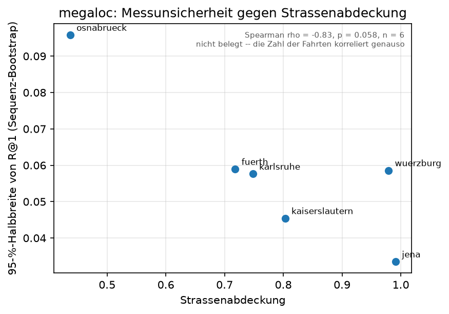

| Städte | ρ | p (exakt) |
|---:|---:|---:|
| 4 | −1.00 | 0.083 |
| 5 | −0.40 | 0.517 |
| 6 | −0.83 | 0.058 |

- Für die fünfte Stadt war vorab ±boot ≤ 0.045 vorhergesagt — gemessen 0.059.
- **Bei so wenigen Städten schwankt eine Rangkorrelation wild.** Mit vier Städten ist selbst perfekte Ordnung nicht
  signifikant (p = 2/4! = 0.083) — unabhängig von den Daten.
- Nicht entscheidbar: die Zahl der Fahrten liefert dasselbe ρ = −0.83 und ist sogar der plausiblere Kandidat, weil der
  Bootstrap über Fahrten zieht.

**Grenzen.** n = 6. Fünf Städte nur mit MegaLoc und EigenPlaces. `scipy.stats.spearmanr` liefert bei perfekter
Monotonie p = 0; das Skript zählt deshalb die Permutationen exakt (bis n = 8).

---

## Kosten

### Laufzeit und Speicher — `timing.py`

**Frage.** Was kostet welcher Encoder — beim Encodieren, bei der Suche, im Speicher?

**Kurz.** **Bester Kompromiss: MegaLoc auf 512 gewhitent** — 0.028 weniger R@1 als MegaLoc, aber ein 16,5-mal
kleinerer Index und eine viermal schnellere Suche.

**Methode.** Encodieren: 200 feste Bilder, inklusive Laden, nach einem Aufwärmlauf. Suche: exakter FAISS-Index über die
48.321 Referenzbilder, 1.000 Anfragen in Blöcken zu 256, Median aus fünf Runden.

```bash
python experiments/timing.py --skip-search
```

```bash
python experiments/timing.py --skip-encode
```

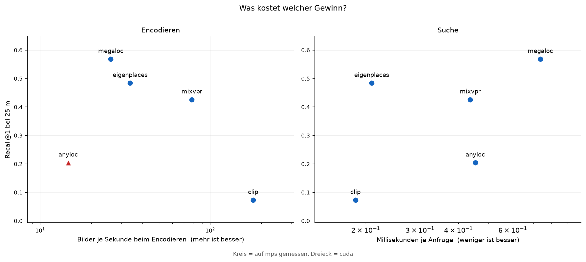

| Dim | Encoder | Suche je Anfrage | Index |
|---:|---|---:|---:|
| 512 | alle 512er Varianten, CLIP | 0,17–0,19 ms | 94 MB |
| 1024 | Verkettung EigenPlaces + MegaLoc | 0,11 ms | 189 MB |
| 2048 | EigenPlaces | 0,21 ms | 378 MB |
| 4096 | AnyLoc, MixVPR | 0,44–0,45 ms | 755 MB |
| 8448 | MegaLoc | 0,74 ms | 1.557 MB |

| Encoder | Bildgröße | Bilder/s | 332.868 Bilder |
|---|---:|---:|---:|
| CLIP | 224 px | 178,6 | 31 min |
| MixVPR | 320 px | 77,9 | 71 min |
| EigenPlaces | 512 px | 33,8 | 2,7 h |
| MegaLoc | 322 px | 26,0 | 3,6 h |
| AnyLoc (fp16, GPU) | 322 px | 14,6 | 6,3 h |

<sub>Aus [`results/osnabrueck/timing.json`](results/osnabrueck/timing.json). Suche auf der CPU mit 8 Threads;
Encodieren auf Apple M1 Pro (MPS), AnyLoc auf einer CUDA-GPU.</sub>

- **Index linear, Suche nicht:** von 512 auf 8448 Dimensionen 16,5-mal mehr Speicher, aber nur 4-mal langsamer.
- **Bei 48.321 Referenzbildern egal** (10 s gegen 39 s für alle Anfragen); bei einer Million wären es 32 GB gegen 2 GB Index.
- **Encodieren hängt am Netz und an der Bildgröße,** nicht an der PCA: die Projektion ist ein Matrixprodukt.

**Arbeitsspeicher.** Alles folgt aus `Bilder × Dimension × 4 Byte`. MegaLoc: Osnabrück 11,2 GB, Jena 23,6 GB.

| Schritt (MegaLoc) | Osnabrück | Jena |
|---|---:|---:|
| 04, Embeddings schreiben | 22,5 → entfällt | 47,2 → entfällt |
| 05, Adapter | 7,8 GB | 16,2 GB |
| 06, Suche | 5,1 GB | 11,0 GB |
| `database_density.py`, letzte Stufe | 11,2 → 6 GB | 23,6 → 8,3 GB |

Die Pfeile sind zwei Korrekturen nach einem Absturz in Jena: 04 schreibt jetzt direkt auf die Platte (memmap) statt
erst in den Speicher, und die Suche über große Referenzen läuft blockweise.

---

## Werkzeuge

### Beispielbilder — `beispielbilder.py`

Kontaktabzug je Szenentyp, dann die Auswahl für das README.

```bash
python experiments/beispielbilder.py --szenen
```

Jede gespeicherte Abbildung mit Mapillary-Bildern trägt die Urheber je Bild in
`results/<stadt>/figures/demo/QUELLEN.md` ein ([`src/quellen.py`](../src/quellen.py)).
